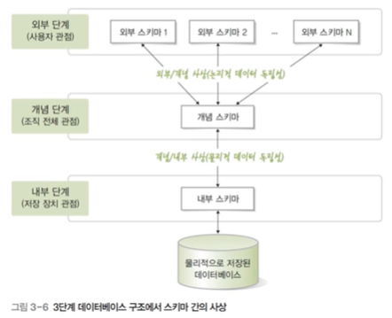
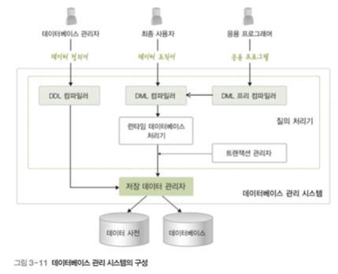
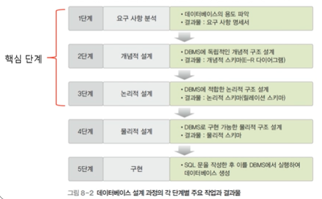
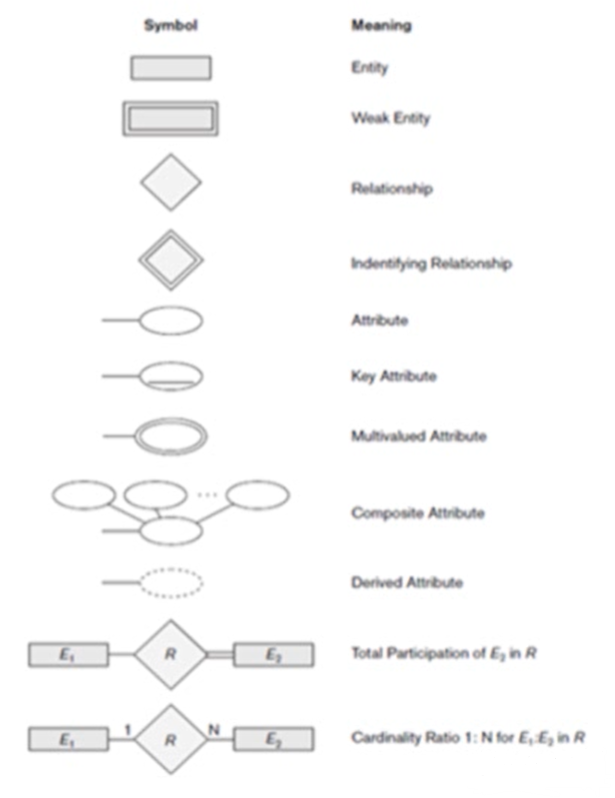
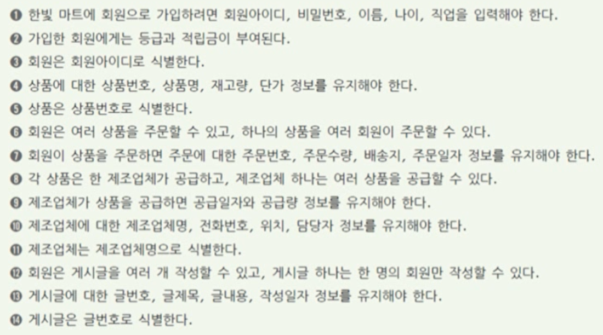
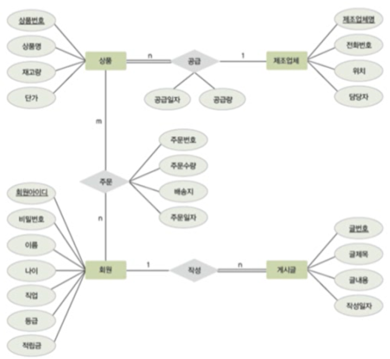

# 221201

## 1. 데이터베이스 기본 개념

### 데이터베이스의 필요성

#### 데이터와 정보

- 데이터(data) (의미 X)
  - 현실 세계에서 단순히 관찰하거나 측정해 수집한 사실이나 값
- 정보(information) (의미 O)
  - 의사 결정에 유용하게 활용할 수 있도록 데이터를 처리한 결과물

- 데이터의 이용 단계 : Data -> Information -> Knowledge -> Wisdom

#### 정보 처리(information processing)

- 데이터에서 정보를 추출하는 과정 또는 방법
- ex) 주문 내역을 가지고 분기별 총 판매액 or 제품별 총 판매액을 나타내도록 가공

#### 정보 시스템과 데이터베이스

- 정보 시스템 (information system)
  - 조직 운영에 필요한 데이터를 수집하여 저장해두었다가 필요할 때 유용한 정보를 만들어 주는 수단
- 데이터베이스
  - 정보 시스템 안에서 데이터를 저장하고 있다가 필요할 때 제공하는 역할을 담당

### 데이터베이스의 정의와 특성

#### 데이터베이스(DB: DataBase)

- 특정 조직의 여러 사용자가 **공유**하여 사용할 수 있도록 **통합**해서 **저장**한 **운영** 데이터의 집합

1. 통합 데이터 (integrated data)
   - 최소의 중복과 통제가능한 중복만 허용하는 데이터
2. 공유 데이터 (shared data)
   - 특정 조직의 여러 사용자가 함께 소유하고 이용할 수 있는 공용 데이터
3. 저장 데이터 (stored data)
   - 컴퓨터가 접근할 수 있는 매체에 저장된 데이터
4. 운영 데이터 (operational data)
   - 조직의 주요 기능을 수행하기 위해 지속적으로 유지해야 하는 데이터

#### 데이터베이스의 특성

1. 실시간 접근 (real-time accessibility)
   - 사용자의 데이터 요구에 실시간으로 응답
2. 계속 변화 (continuous evolution)
   - 데이터의 계속적인 삽입, 삭제, 수정을 통해 현재의 정확한 데이터를 유지
     - ex) 사원의 입사, 퇴사에 따른 변화를 반영
3. 동시 공유 (concurrent sharing)
   - 서로 다른 데이터의 동시 사용뿐만 아니라 같은 데이터의 동시 사용도 지원
4. 내용 기반 참조 (contents reference)
   - 데이터가 저장된 주소나 위치가 아닌 내용으로 참조
     - ex) 연봉이 5000만원 이상이며 과장급 이상인 사원을 검색하시오.

---

## 2. 데이터베이스 관리시스템

### 데이터베이스 관리 시스템의 등장 배경

#### 파일 시스템(file system)

- 데이터를 파일로 관리하기 위해 파일을 생성, 삭제, 수정, 검색하는 기능을 제공하는 소프트웨어
- 응용 프로그램마다 필요한 데이터를 별도의 파일로 관리함

#### 파일 시스템의 문제점

- 같은 내용의 데이터가 여러 파일에 **중복 저장**된다
  - 저장 공간의 낭비
  - 데이터 일관성과 데이터의 무결성을 유지하기 어려움
- 응용 프로그램이 데이터 파일에 **종속적**이다
  - 사용하는 파일의 구조를 변경하면 응용 프로그램도 함께 변경되어야 함
- 데이터 파일에 대한 동시 공유, 보안, 회복 기능이 부족하다
  - 보안 취약점이 발생하기 쉽다
- 응용 프로그램 개발이 쉽지 않다
  - 파일의 특성을 다 파악해야 되기 때문에 응용 프로그램 개발이 쉽지 않다

### 데이터베이스 관리 시스템의 정의 및 특성

#### 데이터베이스 관리 시스템

- DBMS (DataBase Management System)
- 파일 시스템의 문제를 해결하기 위해 제시된 소프트웨어
- 조직에 필요한 데이터를 데이터베이스에 통합하여 저장하고 관리

#### 데이터베이스 관리 시스템의 주요 기능

- 정의 기능
  - 데이터베이스 구조를 정의하거나 수정할 수 있다
- 조작 기능
  - 데이터를 삽입, 삭제, 수정, 검색하는 연산을 할 수 있다
- 제어 기능
  - 데이터를 항상 정확하고 안전하게 유지할 수 있다

#### 데이터베이스 관리 시스템의 장단점

|             장점             |               단점                |
| :--------------------------: | :-------------------------------: |
|    데이터 중복 통제 가능     |             비용 비쌈             |
|      데이터 독립성 확보      |      백업과 회복 방법이 복잡      |
|    데이터 동시 공유 가능     | 중앙 집중 관리로 인한 취약점 존재 |
|       데이터 보안 향상       |                                   |
|   데이터 무결성 유지 가능    |                                   |
|         표준화 가능          |                                   |
|    장애 발생 시 회복 가능    |                                   |
| 응용 프로그램 개발 비용 감소 |                                   |

### 데이터베이스 관리 시스템의 발전 과정

#### 1세대 : 네트워크 DBMS, 계층 DBMS

- 네트워크 DBMS : 데이터베이스를 그래프 형태로 구성
  - ex) IDS (Integrated Data Store)
- 계층 DBMS : 데이터베이스를 트리 형태로 구성
  - ex) IMS (Information Management System)

#### 2세대 : 관계 DBMS

- 관계 DBMS : 데이터베이스를 테이블 형태로 구성
  - ex) 오라클 (Oracle), MS SQL 서버, 액세스(Access), 인포믹스(Informix), MySQL 등

#### 3세대 : 객체지향 DBMS, 객체관계 DBMS

- 객체지향 DBMS : 객체를 이용해 데이터베이스를 구성
  - ex) 오투(O2), 온투스(ONTOS), 젬스톤(GemStone)
- 객체관계 DBMS : 객체 DBMS + 관계 DBMS

---

## 3. 데이터베이스 시스템

### 데이터베이스 시스템의 정의

#### 데이터베이스 시스템 (DBS : DataBase System)

- 데이터베이스에 데이터를 저장하고, 이를 관리하여 조직에 필요한 정보를 생성해주는 시스템

### 데이터베이스의 구조

#### 스키마와 인스턴스

- 스키마 (Schema)
  - 데이터베이스에 저장되는 데이터 구조와 제약조건을 정의한 것
- 인스턴스 (instance)
  - 스키마에 따라 데이터베이스에 실제로 저장된 값

#### 3단계 데이터베이스 구조

- 미국 표준화 기관인 ANSI/SPARC에서 제안
- 데이터베이스를 쉽게 이해하고 이용할 수 있도록 하나의 데이터베이스를 관점에 따라 세 단계로 나눈 것
  - 외부 단계 (external level) : 개별 사용자 관점
  - 개념 단계 (conceptual level) : 조직 전체의 관점
  - 내부 단계 (internal level) : 물리적인 저장 장치의 관점
- 각 단계별로 다른 추상화 (abstraction) 제공
  - 내부 단계에서 외부 단계로 갈수록 추상화 레벨이 높아짐

#### 외부 단계

- 데이터베이스를 개별 사용자 관점에서 이해하고 표현하는 단계
- 데이터베이스 하나에 외부 스키마가 여러 개 존재할 수 있음
  - 외부 스키마 (external schema)
    - 외부 단계에서 사용자에게 필요한 데이터베이스를 정의한 것
    - 각 사용자가 생각하는 데이터베이스의 모습, 즉 논리적 구조로 사용자마다 다름
    - 서브 스키마(sub schema)라고도 함

#### 개념 단계

- 데이터베이스를 조직 전체의 관점에서 이해하고 표현하는 단계
- 데이터베이스 하나에 개념 스키마가 하나만 존재함
  - 개념 스키마 (conceptual schema)
    - 개념 단계에서 데이터베이스 전체의 논리적 구조를 정의한 것
    - 조직 전체의 관점에서 생각하는 데이터베이스의 모습
    - 전체 데이터베이스에 어떤 데이터가 저장되는지, 데이터들 간에는 어떤 관계가 존재하고 어떤 제약조건이 존재하는지에 대한 정의뿐만 아니라, 데이터에 대한 보안 정책이나 접근 권한에 대한 정의도 포함

#### 내부 단계

- 데이터베이스를 저장 장치의 관점에서 이해하고 표현하는 단계
- 데이터베이스 하나에 내부 스키마 하나만 존재함
  - 내부 스키마 (internal schema)
    - 전체 데이터베이스가 저장 장치에 실제로 저장되는 방법을 정의한 것
    - 레코드 구조, 필드 크기, 레코드 접근 경로 등 물리적 저장 구조를 정의

#### 3단계 데이터베이스 구조의 사상 또는 매핑

- 스키마 사이의 대응 관계
  - 외부/개념 사상 : 외부 스키마와 개념 스키마의 대응 관계
    - 응용 인터페이스 (application interface)라고도 함
  - 개념/내부 사상 : 개념 스키마와 내부 스키마의 대응 관계
    - 저장 인터페이스 (storage interface)라고도 함
- 미리 정의된 사상 정보를 이용하여 사용자가 원하는 데이터에 접근
- 데이터베이스를 3단계 구조로 나누고 단계별로 스키마를 유지하며 스키마 사이의 대응 관계를 정의하는 궁극적인 목적 => **데이터 독립성의 실현**

#### 데이터 독립성 (data independency)

- 하위 스키마를 변경하더라도 상위 스키마가 영향을 받지 않는 특성
- 논리적 데이터 독립성 (=> 개념 스키마와 외부 스키마간의 매칭)
  - 개념 스키마가 변경되어도 외부 스키마는 영향을 받지 않음
  - 개념 스키마가 변경되면 관련된 외부/개념 사상만 정확하게 수정해주면 됨
- 물리적 데이터 독립성 (=> 개념스키마와 내부 스키마간의 매칭)
  - 내부 스키마가 변경되어도 개념 스키마는 영향을 받지 않음
  - 내부 스키마가 변경되면 관련된 개념/내 사상만 정확하 수정해주면 됨

#### 데이터 사전 (data dictionary)

- 시스템 카탈로그 (system catalog) 라고도 함
- 데이터베이스에 저장되는 데이터에 관한 정보, 즉 메타 데이터를 유지하는 시스템 데이터베이스
  - 메타 데이터 (meta data) : 데이터에 대한 데이터
- 스키마, 사상 정보, 다양한 제약조건 등을 저장
- 데이터베이스 관리 시스템이 스스로 생성하고 유지함
- 일반 사용자도 접근이 가능하지만 저장된 내용을 검색만 할 수 있음

#### 데이터 디렉토리 (data directory)

- 데이터 사전에 있는 데이터에 실제로 접근하는 데 필요한 위치 정보를 저장하는 시스템 데이터베이스
- 일반 사용자의 접근은 허용되지 않음

### 데이터베이스 사용자

#### 사용자 데이터베이스 (user database)

- 사용자가 실제로 이용하는 데이터가 저장되어 있는 일반 데이터베이스

#### 데이터베이스 사용자

- 데이터베이스를 이용하기 위해 접근한는 모든 사람
- 이용 목적에 따라 데이터베이스 관리자, 최종 사용자, 응용 프로그래머로 구분
  - 데이터베이스 관리자 : 데이터베이스 시스템을 운영하고 관리
  - 최종 사용자 (=일반 사용자) : 데이터베이스에 접근하여 데이터를 조작
  - 응용 프로그래머 : 데이터 언어를 삽입하여 응용 프로그램을 작성

#### 데이터베이스 관리자 (DBA : DataBase Administrator)

- 데이터베이스 시스템을 운영/관리하는 사람
- 주로 데이터 정의어와 데이터 제어어를 사용
- 주요 업무
  - 데이터베이스 구성 요소 선정
  - 데이터베이스 스키마 정의
  - 물리적 저장 구조와 접근 방법 결정
  - 무결성 유지를 위한 제약조건 정의
  - 보안 및 접근 권한 정책 결정
  - 백업 및 회복 기법 정의
  - 시스템 데이터베이스 관리
  - 시스템 성능 감시 및 성능 분석
  - 데이터베이스 재구성

#### 최종 사용자 (end user)

- 데이터베이스에 접근하여 데이터를 조작 (삽입, 삭제, 수정, 검색) 하는 사람
- 주로 데이터 조작어를 사용
- 캐주얼 사용자와 초보 사용자로 구분

#### 응용 프로그래머 (application programmer)

- 데이터 언어를 삽입하여 응용 프로그램을 작성하는 사람
- 주로 데이터 조작어를 사용

### 데이터 언어

- 사용자와 데이터베이스 관리 시스템 간의 통신 수단
- 사용 목적에 따라 데이터 정의어, 데이터 조작어, 데이터 제어어로 구분
  - **데이터 정의어 (DDL)** : 스키마를 정의하거나 수정 또는 삭제하기 위해 사용
  - **데이터 조작어 (DML)** : 데이터의 삽입, 삭제, 수정, 검색 등의 처리를 요구하기 위해서 사용
    - 절차적 데이터 조작어 (procedural DML)
      - 사용자가 어떤(what) 데이터를 원하고 그 데이터를 얻기 위해 어떻게(how) 처리해야 하는지도 설명
    - 비절차적 데이터 조작어 (nonprocedural DML)
      - 사용자가 어떤(what) 데이터를 원하는지만 설명
      - 선언적 언어(declarative language)라고도 함
  - **데이터 제어어 (DCL)** : 내부적으로 필요한 규칙이나 기법을 정의하기 위해 사용
    - 사용 목적
      - 무결성 : 정확하고 유효한 데이터만 유지
      - 보안 : 허가받지 않은 사용자의 데이터 접근 차단, 허가된 사용자에 권한 부여
      - 회복 : 장애가 발생해도 데이터 일관성 유지
      - 동시성 제어 : 동시 공유 지원

### 데이터베이스 관리 시스템

- 데이터베이스 관리와 사용자의 데이터 처리 요구 수행
- 주요 구성 요소
  - 질의 처리기 (query processor)
    - 사용자의 데이터 처리 요구를 해석하여 처리
    - DDL 컴파일러, DML 프리 컴파일러, DML 컴파일러, 런타임 데이터베이스 처리기, 트랜잭션 관리자 등을 포함
  - 저장 데이터 관리자 (stored data manager)
    - 디스크에 저장된 사용자 데이터베이스와 데이터 사전을 관리하고, 여기에 실제로 접근하는 역할을 담당

---

## 4. 개념적 데이터 모델링

### 데이터베이스 설계 단계

#### 데이터 모델링 (data modeling)

- 현실 세계에 존재하는 데이터를 컴퓨터 세계의 데이터베이스로 옮기는 변환 과정
- 데이터베이스 설계의 핵심 과정

#### 2단계 데이터 모델링

- 개념적 데이터 모델링 (conceptual modeling)
  - 현실 세계의 중요 데이터를 추출하여 개념 세계로 옮기는 작업
- 논리적 데이터 모델링 (logical modeling)
  - 개념 세계의 데이터를 데이터베이스에 저장하는 구조로 표현하는 작업

#### 데이터 모델 (data model)

- 데이터 모델링의 결과물을 표현하는 도구
- 개념적 데이터 모델
  - 사람의 머리로 이해할 수 있도록 현실 세계를 개념적 모델링하여 데이터베이스의 개념적 구조로 표현하는 도구
  - ex) 개체-관계 모델
- 논리적 데이터 모델
  - 개념적 구조를 논리적 모델링하여 데이터베이스의 논리적 구조로 표현하는 도구
  - ex) 관계 데이터 모델

#### 개체-관계 모델 (E-R model : Entity-Relationship model)

- 피터 첸(Peter Chen)이 제안한 개념적 데이터 모델
- 개체와 개체 간의 관계를 이용해 현실 세계를 개념적 구조로 표현
- 핵심 요소 : 개체, 속성, 관계

#### 개체-관계 다이어그램 (E-R diagram)

- 개체-관계 모델을 이용해 현실 세계를 개념적으로 모델링한 결과물을 그림으로 표현한 것
  - 사각형 : 개체
  - 이중 사각형 : 약한 개체
  - 타원 : 속성
  - 이중 타원 : 다중 값 속성
  - 점선 타원 : 유도 속성
  - 마름모 : 관계
  - 이중 마름모 : 약한 개체가 오너 개체와 맺는 관계
  - 밑줄 : 키 속성
  - 이중선 : 필수적 참여 (전체 참여)

#### 개체 (entity)

- 현실 세계에서 조직을 운영하는 데 꼭 필요한 사람이나 사물과 같이 구별되는 모든 것
- 저장할 가치가 있는 중요 데이터를 가지고 있는 사람이나 사물, 개념, 사건 등
- 각 개체만의 고유한 특성이나 상태, 즉 속성을 하나 이상 가지고 있어야 됨
- ex) 서점에 필요한 개체 : 고객, 책
- ex) 학교에 필요한 개체 : 학과, 과목
- 파일 구조의 레코드(record)와 대응됨

#### 속성 (attribute)

- 개체나 관계가 가지고 있는 고유의 특성
- 의미 있는 데이터의 가장 작은 논리적 단위
- 파일 구조의 필드(field)와 대응됨

#### 개체 타입 (entity type)

- 개체를 고유의 이름과 속성들로 정의한 것
- 파일 구조의 레코드 타입(record type)에 대응됨

#### 개체 인스턴스 (entity instance)

- 개체를 구성하고 있는 속성이 실제 값을 가짐으로써 실체화된 개체
- 개체 어커런스(entity occurrence)라고도 함
- 파일 구조의 레코드 인스턴스(record instance)에 대응됨

#### 개체 집합(entity set)

- 특정 개체 타입에 대한 개체 인스턴스들을 모아놓은 것

#### 속성의 분류

- 속성 값의 개수
  - 단일 값 속성 (single-valued attribute)
    - 값을 하나만 가질 수 있는 속성
    - ex) 고객 개체의 이름, 적립금 속성
  - 다중 값 속성
    - 값을 여러 개 가질 수 있는 속성
    - ex) 고객 개체의 연락처 속성
- 의미의 분해 가능성
  - 단순 속성 (simple attribute)
    - 의미를 더는 분해할 수 없는 속성
    - ex) 고객 개체의 적립금 속성
  - 복합 속성 (composite attribute)
    - 의미를 분해할 수 있는 속성
    - ex) 고객 개체의 주소 속성
      - 도, 시, 동, 우편번호 등으로 의미를 세분화 가능
- 유도 속성 (derived attribute)
  - 기존의 다른 속성의 값에서 유도되어 결정되는 속성
  - 값이 별도로 저장되지 않음
  - ex) 책 개체의 가격과 할인율 속성으로 계산되는 판매가격 속성
  - ex) 고객 개체의 출생연도 속성으로 계산되는 나이 속성

#### 널 속성 (null attribute)

- 널 값이 허용되는 속성

#### 널(null) 값

- 아직 결정되지 않거나 모르는 값 또는 존재하지 않는 값
- 공백이나 0과는 의미가 다름
- ex) 등급 속성이 널 값 => 등급이 아직 결정되지 않았음을 의미

#### 키 속성 (key attribute)

- 각 개체 인스턴스를 식별하는 데 사용되는 속성
- 모든 개체 인스턴스의 키 속성 값이 다름

- 둘 이상의 속성들로 구성되기도 함
- ex) 고객 개체의 고객아이디 속성

#### 관계 (relationship)

- 개체와 개체가 맺고 있는 의미 있는 연관성
- 개체 집합들 사이의 대응 관계, 즉 매핑(mapping)을 의미
- ex) 고객 개체와 책 개체 간의 구매 관계

#### 관계의 유형 : 관계에 참여하는 개체 타입의 수 기준

- 이항 관계 : 개체 타입 두 개가 맺는 관계
- 삼항 관계 : 개체 타입 세 개가 맺는 관계
- 순환 관계 : 개체 타입 하나가 자기 자신과 맺는 관계

#### 관계의 유형 : 매핑 카디널리티 기준

- 일대일 (1 : 1) 관계
- 일대다 (1 : n) 관계
- 다대다 (n : m) 관계

#### 매핑 카디널리티 (mapping cardinality)

- 관계를 맺는 두 개체 집합에서, 각 개체 인스턴스가 연관성을 맺고 있는 상대 개체 집합의 인스턴스 개수

#### 관계의 참여 특성

- 필수적 참여 (전체 참여)
  - 모든 개체 인스턴스가 관계에 반드시 참여해야 하는 것을 의미
  - ex) 고객 개체가 책 개체와의 구매 관계에 필수적으로 참여
    - 모든 고객은 책을 반드시 구매해야 함
- 선택적 참여 (부분 참여)
  - 개체 인스턴스 중 일부만 관계에 참여해도 되는 것을 의미
  - ex) 책 개체가 고객 개체와의 구매 관계에 선택적으로 참여
    - 고객이 구매하지 않은 책이 존재할 수 있음

#### 관계의 종속성

- 약한 개체 (weak entity)
  - 다른 개체의 존재 여부에 의존적인 개체
- 오너 개체 (owner entity)
  - 다른 개체의 존재 여부를 결정하는 개체

- 오너 개체와 약한 개체는 일반적으로 **일대다의 관계**를 가지고, 약한 개체는 오너 개체와의 관계에 **필수적으로 참여**하는 특징이 있음
- 약한 개체는 **오너 개체의 키를 포함하여 키를 구성**하는 특징이 있음

- ex) 직원 개체와 부양가족 개체 사이의 부양 관계
  - 직원 개체는 오너 개체, 부양가족 개체는 약한 개체

---

## 개념적 데이터 모델링 : 실습

#### 설계 1 단계 : 요구 사항 분석

- 목적
  - 사용자의 요구 사항을 수집하고 분석하여 개발할 데이터베이스의 용도를 파악
    - 업무에 필요한 데이터가 무엇인지, 그 데이터에 어떤 처리가 필요한지 등을 고려
- 결과물
  - 요구 사항 명세서
- 주요 작업
  - 데이터베이스를 실제로 사용할 주요 사용자의 범위를 결정
  - 사용자가 조직에서 수행하는 업무를 분석
  - 면담, 설문조사, 업무 관련 문서 분석 등의 방법을 이용해 요구 사항 수집
  - 수집된 요구 사항에 대한 분석 결과를 요구 사항 명세서로 작성

#### 설계 2 단계 : 개념적 설계

- 목적

  - DBMS에 독립적인 개념적 스키마 설계

  - 요구 사항 분석 결과물을 개념적 데이터 모델을 이용해 개념적 구조로 표현

    --> 개념적 모델링

    - 일반적으로 E-R 모델을 많이 이용

- 결과물

  - 개념적 스키마 : E-R 다이어그램

- 주요 작업

  - 요구 사항 분석 결과를 기반으로 중요한 개체를 추출하고 개체 간의 관계를 결정하여 E-R 다이어그램으로 표현

#### 개념적 설계 작업 과정

STEP 1) 개체 추출, 각 개체의 주요 속성과 키 속성 선별

- 개체 : 저장할만한 가치가 있는 중요 데이터를 가진 사람이나 사물 등
  - ex) 병원 데이터베이스 개발에 필요한 개체
    - 병원 운영에 필요한 사람 : 환자, 의사, 간호사 등
    - 병원 운영에 필요한 사물 : 병실, 수술실, 의료 장비 등
- 개체 추출 방법
  - 요구 사항 문장에서 업무와 관련이 깊은 의미 있는 **명사** 찾기
    - 업무와 관련이 적은 일반적이고 광범위한 의미의 명사는 제외 (ex. 한빛마트)
    - 의미가 같은 명사가 여러 개일 경우는 대표 명사 하나만 선택 (ex. 회원, 고객)
  - 찾아낸 명사를 개체와 속성으로 분류

STEP 2) 개체 간의 관계 결정

- 관계 : 개체 간의 의미 있는 연관성
- 관계 추출 방법
  - 요구 사항 문장에서 개체 간의 연관성을 의미 있게 표현한 **동사** 찾기
    - 의미가 같은 동사가 여러 개일 경우는 대표 동사 하나만 선택
  - 찾아낸 관계에 대해 매핑 카디널리티와 참여 특성을 결정
    - 매핑 카디널리티 : 일대일(1 : 1), 일대다(1 :n), 다대다(n : m)
    - 참여 특성 : 필수적 참여 / 선택적 참여

STEP 3) E-R 다이어그램으로 표현

