# 221216. 정규화

### 기본 정규형과 정규화 예제

#### 정규화 (normalization)

- **함수 종속성**을 이용해 **리레이션을** 연관성 있는 속성들로만 구성되도록 **분해**해서 **이상 현상이 발생하지 않는** 바람직한 릴레이션으로 만들어 가는 과정

- 정규화를 통해 릴레이션은 **무손실 분해 (nonloss decomposition)**되어야 함
  - 릴레이션은 의미적으로 동등한 릴레이션들로 분해되어야 하고 분해로 인한 정보의 손실이 발생하지 않아야 함
  - 분해된 릴레이션들을 자연 조인하면 분해 전의 릴레이션으로 복원 가능해야 함

#### 정규형 (NF : Normal Form)

- 릴레이션이 정규화된 정도
- 각 정규형마다 제약조건이 존재
  - 정규형의 차수가 높아질수록 요구되는 제약조건이 많아지고 엄격해짐
  - 정규형의 차수가 높아질수록 데이터 중복이 줄어 이상 현상이 발생하지 않는 바람직한 릴레이션이 됨
- 릴레이션의 특성을 고려하여 적합한 정규형을 선택

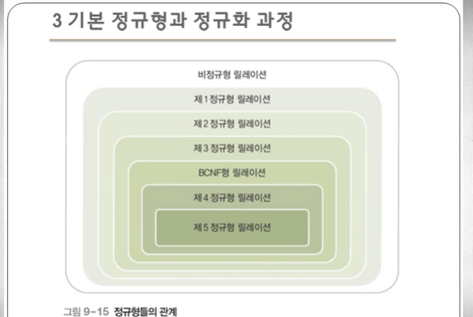

#### 제 1 정규형 (1NF : First Normal Form)

- 릴레이션의 모든 속성이 더는 분해되지 않는 원자 값(atomic value)만 가지면 제 1 정규형을 만족함
- 제 1 정규형을 만족해야 관계 데이터베이스의 릴레이션이 될 자격이 있음

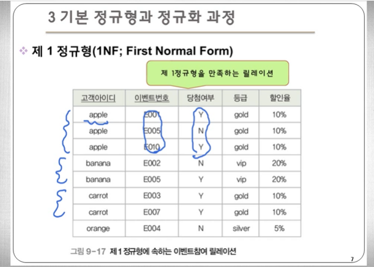

- 제 1 정규형은 만족하지만 이상 현상이 발생하는 릴레이션 예
  - 이상 현상의 발생 이유
    - 기본키인 {고객아이디, 이벤트번호}에 완전 함수 종속되지 못하고 일부분인 고객아이디에 종속되는 등급과 할인율 속성이 존재하기 때문
  - 문제 해결 방법
    - 부분함수 종속이 제거되도록 이벤트 참여 릴레이션을 분해
      - => 분해된 릴레이션은 **제 2 정규형**에 속하게 됨

#### 제 2 정규형 (2NF : Second Normal Form)

- 릴레이션이 제 1 정규형에 속하고, 기본키가 아닌 모든 속성이 기본키에 완전 함수 종속되면 제 2 정규형을 만족함

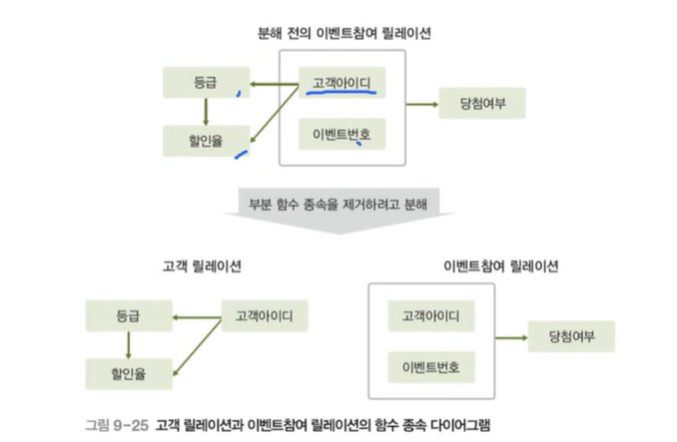

- 제 2 정규형은 만족하지만 이상 현상이 발생하는 릴레이션 예
  - 이상 현상의 발생 이유
    - 이행적 함수 종속이 존재하기 때문
  - 문제 해결 방법
    - 이행적 함수 종속이 제거되도록 고객 릴레이션을 분해
      - 분해된 릴레이션은 **제 3 정규형**에 속하게 됨

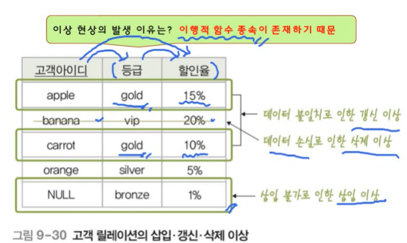

#### 제 3 정규형 (3NF : Third Normal Form)

- 릴레이션이 제 2 정규형에 속하고, 기본키가 아닌 모든 속성이 기본키에 이행적 함수 종속되지 않으면 제 3 정규형을 만족함

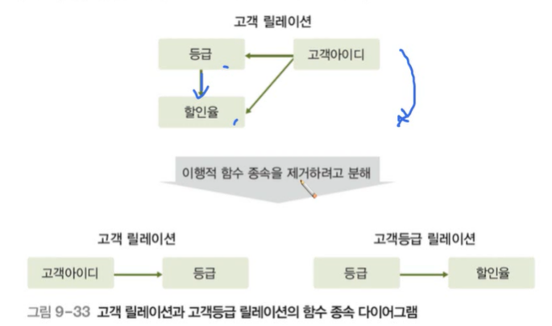

#### 정규화 예제

- ([학번](), 이름, 지도교수, 학과이름, 학과전화번호, [과목번호](), 성적, 시간, 회장이름, 동아리이름, 방번호)
- 함수 종속
  - 학번 -> 이름, 지도교수, 학과이름, 회장이름, 동아리이름, 방번호
  - 학과이름 -> 학과전화번호
  - 과목번호 -> 시간
  - 학번, 과목번호 -> 성적
  - 회장이름, 동아리이름 -> 방번호

1. 위의 릴레이션에서 발생 가능한 삽입 이상, 갱신 이상, 삭제 이상 문제를 예를 들어 설명하시오.
   - 과목번호가 기본키이기 때문에 아직 수강신청을 하지 않은 학생을 추가할 수 없다 -> 삽입 이상
   - 여러 과목을 수강한 경우에도 지도교수는 똑같아야 되는데 만약에 지도교수가 변경된다면 다 같이 변경되어야함 -> 갱신 이상 발생 가능
   - 한 과목을 신청한 학생이 한명일 경우, 이 학생이 해당 과목을 취소하면 해당 과목이 삭제되어버림 -> 삭제 이상

2. 모든 릴레이션이 제 2 정규형을 만족하도록 분해하고, 각 릴레이션의 기본키도 표시하시오.
   - 학번 -> 이름, 지도교수, 학과이름, 회장이름, 동아리이름, 방번호, 학과전화번호
   - 과목번호 -> 시간
   - 과목번호, 학번 -> 성적

3. 제 2 정규형의 릴레이션이 제 3 정규형을 만족하도록 분해하고, 각 릴레이션의 기본키도 표시하시오.
   - 학과 -> 학과전화번호
   - 회장이름, 동아리이름 -> 방번호

---

## 관계 데이터 연산

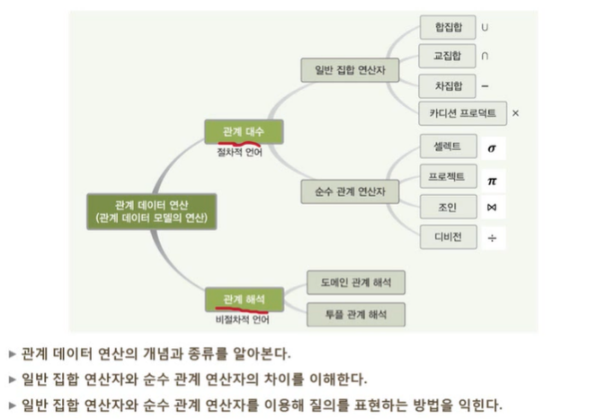

#### 관계 데이터 연산의 개념 (relational data operation)

- 데이터 모델 = 데이터 구조 + 연산 + 제약조건

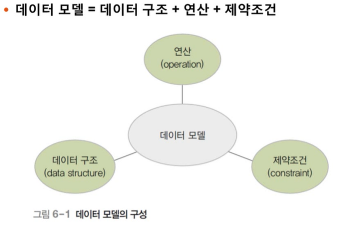

- 관계 데이터 모델의 연산
- 원하는 데이터를 얻기 위해 릴레이션에 필요한 처리 요구를 수행하는 것
- 관계 대수와 관계 해석이 있음
  - 기능과 표현력 측면에서 능력이 동등함
  - 처리절차를 얼마나 자세히 기술하느냐에 따라 차이를 보임

- 관계 데이터 연산
  - 관계 대수
    - 원하는 결과를 얻기 위해 데이터의 처리 과정을 순서대로 기술
  - 관계 해석
    - 원하는 결과를 얻기 위해 처리를 원하는 데이터가 무엇인지만 기술

#### 관계 대수 (relational algebra)의 개념

- 원하는 결과를 얻기 위해 릴레이션의 처리 과정을 순서대로 기술하는 언너
  - 절차 언어 (procedural language)
- 릴레이션을 처리하는 연산자들의 모임
  - 대표 연산자 8개
  - 일반 집합 연산자와 순수 관계 연산자로 분류됨
- 폐쇄 특성(closure property)이 존재함
  - 피연산자도 릴레이션이고 연산의 결과도 릴레이션임

#### 일반 집합 연산자 (set operation)

- 릴레이션이 튜플의 집합이라는 개념을 이용하는 연산자

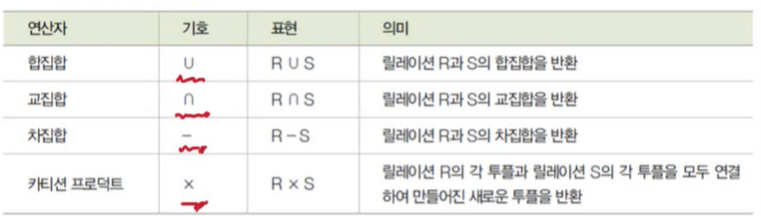

- 피연산자가 두 개 필요함
  - 두 개의 릴레이션을 대상으로 연산을 수행
- 합집합, 교집합, 차집합은 피연산자인 두 릴레이션이 합병이 가능해야 함
  - 합병 가능(union-compatible) 조건
    - 두 릴레이션의 차수가 같아야 함
    - 두 릴레이션에서 서로 대응되는 속성의 **도메인**이 같아야 함

#### 일반 집합 연산자 - 합집합 (union)

- 합병 가능한 두 릴레이션 R과 S의 합집합
  - 릴레이션 R에 속하거나 릴레이션 S에 속하는 모든 튜플로 결과 릴레이션을 구성
- 결과 릴레이션의 특징
  - 차수는 릴레이션 R과 S의 차수와 같음
  - 카디널리티는 릴레이션 R과 S의 카디널리티를 더한 것과 같거나 적어짐
- 교환적 특징 O
- 결합적 특징 O

#### 일반 집합 연산자 - 교집합 (intersection)

- 합병 가능한 두 릴레이션 R과 S의 교집합
  - 릴레이션 R과 릴레이션 S에 속하는 모든 튜플로 결과 릴레이션 구성
- 결과 릴레이션의 특성
  - 차수는 릴레이션 R과 S의 차수와 같음
  - 카디널리티는 릴레이션 R과 S의 어떤 카디널리티보다 크지 않음
- 교환적 특징 O
- 결합적 특징 O

#### 일반 집합 연산자 - 차집합 (difference)

- 합병 가능한 두 릴레이션 R과 S의 차집합
  - 릴레이션 R에는 존재하고 릴레이션 S에는 존재하지 않는 튜플로 결과 릴레이션 구성
- 결과 릴레이션의 특성
  - 차수는 릴레이션 R과 S의 차수와 같음
  - R-S의 카디널리티는 릴레이션 R의 카디널리티와 같거나 적음
  - S-R의 카디널리티는 릴레이션 S의 카디널리티와 같거나 적음
- 교환적, 결합적 특징이 없음

#### 일반 집합 연산자 - 카티션 프로덕트 (cartesian product)

- 두 릴레이션 R과 S의 카티션 프로덕트 : R x S
  - 릴레이션 R에 속한 각 튜플과 릴레이션 S에 속한 각 튜플을 모두 연결하여 만들어진 새로운 튜플로 결과 릴레이션을 구성
- 결과 릴레이션의 특성
  - 차수는 릴레이션 R과 S의 차수를 더한 것과 같음
  - 카디널리티는 릴레이션 R과 S의 카디널리티를 곱한 것과 같음
- 교환적 특징 O
- 결합적 특징 O

#### 순수 관계 연산자 (relational operation)

- 릴레이션의 구조와 특성을 이용하는 연산자

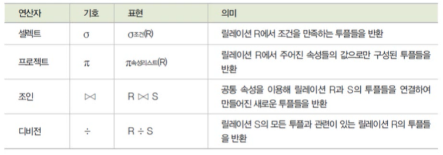

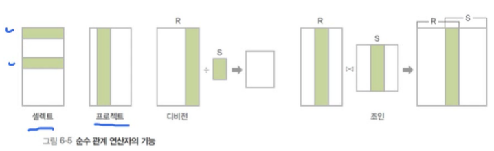

#### 순수 관계 연산자 - 셀렉트 (select)

- 릴레이션에서 조건을 만족하는 튜플만 선택하여 결과 릴레이션을 구성
- 하나의 릴레이션을 대상으로 연산을 수행
- 수학적 표현법 : (sigma) 조건 릴레이션
- 데이터 언어적 표현법 : 릴레이션 where 조건식
- 조건식
  - 비교식, 프레디킷(predicate)이라고도 함
  - 속성과 상수의 비교나 속성들 간의 비교로 표현
  - 비교연산자 (>, <, >=, <=, =, !=)와 논리연산자(^, v, -)를 이용해 작성

- 교환적 특징 O

#### 순수 관계 연산자 - 프로젝트 (project)

- 릴레이션에서 선택한 속성의 값으로 결과 릴레이션을 구성
- 하나의 릴레이션을 대상으로 연산을 수행
- 수학적 표현법 : (pie) 속성리스트 릴레이션
- 데이터 언어적 표현법 : 릴레이션[속성리스트]

#### 순수 관계 연산자 - 조인 (join)

- 조인 속성을 이용해 두 릴레이션을 조합하여 결과 릴레이션을 구성
  - 조인 속성의 값이 같은 튜플만 연결하여 생성된 튜플을 결과 릴레이션에 포함
  - 조인 속성 : 두 릴레이션이 공통으로 가지고 있는 속성
- 표현법 : 릴레이션1 l><l 릴레이션2
- 자연 조인(natural join)이라고도 함

#### 순수 관계 연산자 - 디비전 (division)

- 표현법 : 릴레이션1 / 릴레이션2
- 릴레이션2의 모든 튜플과 관련이 있는 릴레이션1의 튜플로 결과 릴레이션을 구성
  - 단, 릴레이션1이 릴레이션2의 모든 속성을 포함하고 있어야 연산이 가능함

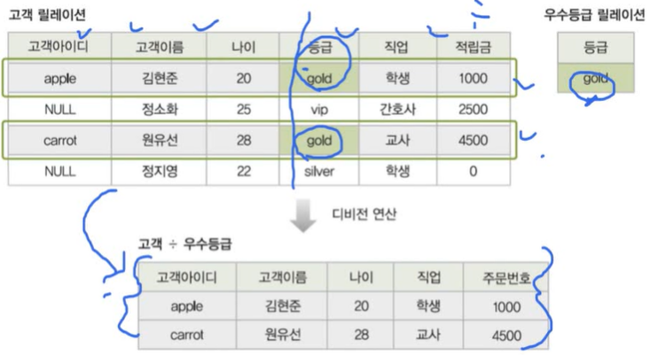

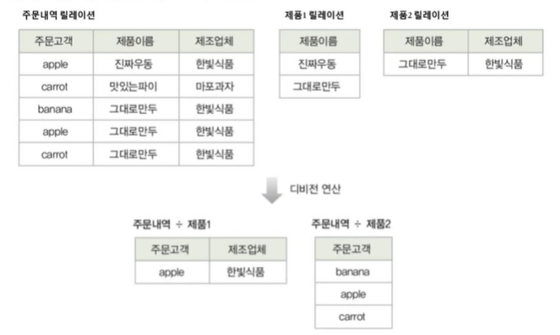

 

