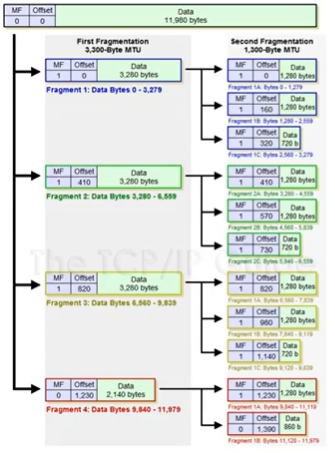

# 221022


## IPv4 프로토콜

#### IPv4가 하는 일

- 네트워크 상에서 데이터를 교환하기 위한 프로토콜
- 데이터가 **정확하게 전달될 것을 보장하지 않는다.**
- 중복된 패킷을 전달하거나 패킷의 순서를 잘못 전달할 가능성도 있다 (악의적으로 이용되면 DoS 공격이 됨)
- 데이터의 정확하고 순차적인 전달은 그보다 상위 프로토콜인 TCP에서 보장한다.


#### IPv4 프로토콜의 구조


- Version : 대부분 4 (0100, 4bit)
- IHL (Header Length) : 20 ~ 60을 나타내기 위해서 4로 나누어서 표현 -> 대부분 옵션이 안붙고, 그 길이가 20이므로 5 (0101, 4bit)로 표현
- Type of Service (TOS) : 데이터의 형식(중요도 표시 등)으로 사용했지만 지금은 사용 안함 -> 00으로 표시 (8bit = 1byte)
- Total Length : 전체 길이(헤더 + 페이로더(상위 계층에서부터 온 길이까지))
- Identification + IP Flags + Fragment Offset
  - Identification : 쪼개진 조각들의 id 값을 보고 다시 합쳐서 데이터를 만듦
  - IP Flags : 3bit로 구성(x D M), D는 쪼개지 않고 통째로 보내겠다는 의미이지만 설정해봤자 안됨 -> 거의 M(More fragment)만 사용
  - Fragment Offset : 각각의 데이터의 순서를 나타냄

- Time To Live (TTL) : 네트워크상에 사이클이 생겨 제대로 전송되지 못하고 계속 도는 것을 방지하기 위한 시간
  - 이 시간으로 상대방의 운영체제를 알아낼 수 있음
    - Window : 128
    - Linux : 64
    - 한번 이동할때마다 1씩 감소 -> 64 이상이면 Window
- Protocol : 상위 프로토콜의 타입 정보 (ICMP(01), TCP(06), UDP(17))
- Checksum : 헤더가 오류가 있는지 없는지 확인하는 곳

---


## ICMP 프로토콜

#### ICMP가 하는 일

- ICMP (Internet Control Message Protocol, 인터넷 제어 메시지 프로토콜)
- 네트워크 컴퓨터 위에서 돌아가는 운영체제에서 **오류 메시지**를 전송 받는 데 주로 쓰인다.
- 프로토콜 구조의 Type과 Code를 통해 오류 메시지를 전송 받는다.
- 상대방과 통신이 되는지 확인하는 프로토콜


#### ICMP 프로토콜의 구조


- Type

  

  - Red : 기본적인 것(0번 : 응답, 8번 : 요청)
  - Blue : 뭔가 잘못됐을 때(3번 : Destination Unreachable -> 경로상 문제, 11번 : Time Exceded -> 상대방이 문제가 있는 것(ex. 방화벽))
  - Green : 보안상(5번 : ICMP Redirect -> 원격지에 있는 상대방의 라우팅 테이블을 수정할 때 사용 -> 악용 가능성 존재)

---


## 라우팅 테이블

#### 라우팅 테이블

- 내가 보낸 패킷은 어디로 가는가

- 어디로 보내야 하는지 설정되어 있는 테이블 (like 지도)

- 내 라우팅 테이블 확인하기

  ```
  # cmd
  netstat -r
  ```

---


## 다른 네트워크와 통신 과정

#### 다른 네트워크까지 내 패킷의 이동 과정


---


## IPv4의 조각화

#### 조각화란

- 큰 IP 패킷들이 적은 **MTU (Maximum Transmission Unit, 일반적으로 1500bytes)**를 갖는 링크를 통하여 전송되려면 **여거 개의 작은 패킷으로 쪼개어/조각화 되어 전송**돼야 한다.
- 즉, 목적지까지 패킷을 전달하는 과정에 통과하는 각 라우터마다 전송에 적합한 프레임으로 변환이 필요하다.
- 일단 조각화되면, 최종 목적지에 도달할 때까지 재조립되지 않는 것이 일반적
- IPv4에서는 발신지 뿐만 아니라 중간 라우터에서도 IP 조각화가 가능
- IPv6에서는 IP 단편화가 발신지에서만 가능
- 재조립은 항상 최종 수신지에서만 가능!!




- 각 조각마다 IPv4가 붙기 때문에 MTU-20byte=1480byte 만큼 데이터를 쪼개야됨
- MF : More Fragment 부분 -> 뒤에 조각이 더 있으면 True, 없으면 False


#### 예제1

보내려는 데이터 크기 : 2379

MTU : 980

몇 개의 패킷으로 쪼개지는가? - **3개**

첫번째 패킷의 데이터의 크기는 몇인가? - **960**

마지막 패킷의 데이터의 크기는 몇인가? - **459**


#### 예제2

보내려는 데이터 크기 : 4618

MTU : 1370

몇 개의 패킷으로 쪼개지는가? - **4개**

첫번째 패킷의 데이터의 크기는 몇인가? - **1350**

마지막 패킷의 데이터의 크기는 몇인가? - **568**


#### 예제3

보내려는 데이터 크기 : 4800

MTU : 1500

몇 개의 패킷으로 쪼개지는가? - **4개**

첫번째 패킷의 데이터의 크기는 몇인가? - **1480**

마지막 패킷의 데이터의 크기는 몇인가? - **360**

