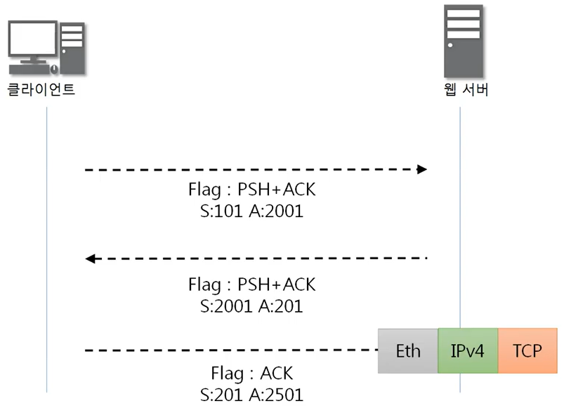

# 221029. 4계층


## 4계층 프로토콜

#### 4계층에서 하는 일

- 전송 계층 (Transport layer)은 송신자의 **프로세스와** 수신자의 **프로세스를 연결하는 통신 서비스**를 제공한다.
- 전송 계층은 연결 지향 데이터 스트림 지원, 신뢰성, 흐름 제어, 그리고 다중화와 같은 편리한 서비스를 제공한다.
- 전송 프로토콜 중 가장 잘 알려진 것은 연결 지향 전송 방식을 사용하는 전송 제어 프로토콜 (TCP)이다. 보다 단순한 전송에 사용되는 사용자 데이터그램 프로토콜 (UDP)도 있다.

---


## 포트 번호

#### 포트 번호의 특징

- 특정 프로세스와 특정 프로세스가 통신을 하기 위해 사용한다.
- **자신의 컴퓨터 내에서 하나의 프로그램(프로세스)은 하나의 포트만 사용 가능**
- 포트 번호는 일반적으로 정해져 있지만 **무조건 지켜야 하는 것은 아니다.**
- ex) 일반적으로 웹 서비스는 80번 포트를 사용하지만 웹 서비스가 항상 80번 포트를 사용해야만 하는 것은 아니다.


#### Well-Known 포트

: 전 세계적으로 유명한 포트

| 서비스 이름 | 포트 번호  |
| :---------: | :--------: |
|     FTP     | 20번, 21번 |
|     SSH     |    22번    |
|   TELNET    |    23번    |
|     DNS     |    53번    |
|    DHCP     | 67번, 68번 |
|    TFTP     |    69번    |
|    HTTP     |    80번    |
|    HTTPS    |   443번    |


#### Registered 포트

: 알려진 기업이나 프로그램이 사용하는 포트

|   서비스 이름    | 포트 번호 |
| :--------------: | :-------: |
|  오라클 DB 서버  |  1521번   |
|    MySQL 서버    |  3306번   |
| MS 원격 데스크탑 |  3389번   |


#### Dynamic 포트

: 일반 사용자들이 사용하는 포트

| 시작 포트 번호 | 마지막 포트 번호 |
| :------------: | :--------------: |
|    49152번     |     65535번      |


```
# cmd
netstat -ano	# 연결된 포트 번호 확인하기 (PID를 통해서)
```

---


## UDP 프로토콜

#### UDP가 하는 일

- 사용자 데이터그램 프로토콜 (User Datagram Protocol, UDP)은 유니버셜 데이터그램 프로토콜 (Universal Datagram Protocol)이라고 일컫기도 한다.
- UDP의 **전송 방식은 너무 단순**해서 서비스의 **신뢰성이 낮고,** 데이터그램 도착 순서가 바뀌거나, 중복되거나, 심지어는 통보 없이 누락시키기도 한다.
- UDP는 일반적으로 **오류의 검사와 수정이 필요 없는 프로그램**에서 수행할 것으로 가정한다.


#### UDP 프로토콜을 사용하는 대표적인 프로그램들

#### DNS 서버

- 도메인을 물으면 IP를 알려주는 서버


#### tftp 서버

- UDP로 파일을 공유하는 서버


#### RIP 프로토콜

- 라우팅 정보를 공유하는 프로토콜


---


## TCP 프로토콜

#### TCP가 하는 일

- 전송 제어 프로토콜 (Transmission Control Protocol, TCP)은 인터넷에 연결된 컴퓨터에서 실행되는 프로그램 간에 통신을 **안정적으로, 순서대로, 에러없이** 교환할 수 있게 한다.
- TCP의 안정성을 필요로 하지 않는 애플리케이션의 경우 일반적으로 TCP 대신 비접속형 사용자 데이터그램 프로토콜 (User Datagram Protocol)을 사용한다.
- TCP는 UDP보다 느리지만 안전하다.


#### TCP 프로토콜의 구조


- Window : 상대방과 계속 통신을 하면서 데이터를 얼마나 더 보내면 되는지, 보내도 되는지 확인하는 용도
- Urgent Pointer : 어디서부터가 긴급 데이터인지 알려주는 포인터


#### TCP Flags

- 데이터를 보내도 되는지 안되는지 이런 상태를 확인하는 값
- TCP의 주된 기능이 Flags로 나뉨
  - U : Urgent - 긴급 비트
    - 우선순위가 높은 데이터가 포함되어 있다 : 1
  - **A** : Acknowledgment - 승인 비트
    - 데이터나 연결 승인
  - P : Push - 밀어넣기 비트
    - TCP 버퍼(내가 받을 수 있는 공간)가 일정 크기만큼 쌓여야 되는데 이런 공간 상관없이 무작정 밀어넣겠다는 의미
  - **R** : Reset - 초기화 비트
    - 문제가 생겨서 연결관계를 초기화
  - **S** : Sync - 동기화 비트
    - 상대방과 연결을 시작할 때 무조건 사용하는 flag로서 얘가 보내져야 둘 사이가 동기화되기 시작
    - 서로 상태를 주고받으면서 동기화
  - **F** : Fin - 종료 비트
    - 데이터를 다 주고 받은 뒤 연결을 끊을 때 사용하는 플래그


### TCP를 이용한 통신과정

#### 연결 수립 과정

- TCP를 이용한 데이터 통신을 할 때 프로세스와 프로세스를 연결하기 위해 **가장 먼저 수행되는 과정**
  1. 클라이언트가 서버에게 요청 패킷을 보내고
  2. 서버가 클라이언트의 요청을 받아들이는 패킷을 보내고
  3. 클라이언트는 이를 최종적으로 수락하는 패킷을 보낸다.
- **위의 3개의 과정을 3Way Handshake라고 부른다.**


#### 데이터 송수신 과정

- TCP를 이용한 데이터 통신을 할 때 단순히 TCP 패킷만을 캡슐화해서 통신하는 것이 아닌 페이로드를 포함한 패킷을 주고 받을 때의 일정한 규칙
  1. 보낸 쪽에서 또 보낼 때는 SEQ번호와 ACK 번호가 그대로다.
  2. 받는 쪽에서 SEQ번호는 받은 ACK 번호가 된다.
  3. 받는 쪽에서 ACK 번호는 받은 SEQ 번호 + 데이터의 크기




### TCP 상태전이도

#### TCP 연결 상태의 변화


- LISTEN 상태
  - 포트 번호를 열어놓은 상태
    (=포트번호를 프로그램이 사용하고 있는 상태(서버쪽에서))
  - 클라이언트의 요청을 계속 듣고 있는 상태 (->항상 응답 가능)

- ESTABLISHED
  - 3Way Handshake가 끝난 뒤 (연결이 된 후)
  - 데이터 전달 상태
  - 통신이 가능해진 상태


