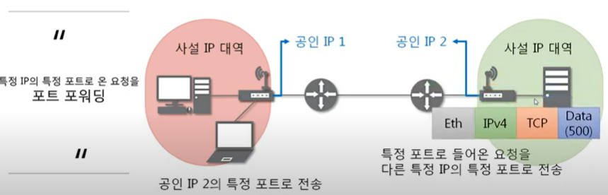

# 221105. NAT / HTTP

## NAT와 포트포워딩

#### NAT(Network Address Translation)

- IP 패킷의 TCP/UDP 포트 숫자와 소스 및 목적지의 IP 주소 등을 재기록하면서 라우터를 통해 네트워크 트래픽을 주고 받는 기술을 말한다.
- 패킷에 변화가 생기기 때문에 IP나 TCP/UDP의 체크섬(checksum)도 다시 계산되어 재기록해야 한다.
- NAT를 이용하는 이유는 대개 사설 네트워크에 속한 여러 개의 호스트가 하나의 공인 IP 주소를 사용하여 인터넷에 접속하기 위함이다.
- 하지만 꼭 사설 IP를 공인 IP로 변환하는데에만 사용하는 기술은 아니다.

- **특정 IP주소의 특정 포트번호로 가는 주소를 다른 IP주소의 다른 포트번호로 바꿔주는 기술**

#### 포트포워딩 (=포트 매핑)

- 패킷이 라우터나 방화벽과 같은 네트워크 장비를 가로지르는 동안 **특정 IP 주소와 포트 번호의 통신 요청을 특정 다른 IP와 포트 번호로 넘겨주는** 네트워크 주소 변환(NAT)의 응용
- 게이트웨이(외부망)의 반대쪽에 위치한 사설네트워크에 상주하는 호스트에 대한 서비스를 생성하기 위해 흔히 사용됨

---

## HTTP 프로토콜

- HyperText Transfer Protocol

- 웹 표준을 가져오는 프로토콜
- 프론트엔드 : HTML, Javascript, CSS
- 백엔드 : ASP/ASP.NET, JSP, PHP

- www에서 쓰이는 핵심 프로토콜로 문서의 전송을 위해 쓰이며, 오늘날 거의 모든 웹 애플리케이션에서 사용되고 있다.
  - 음성, 화상 등 여러 종류의 데이터를 MIME로 정의하여 전송 가능
- HTTP 특징
  - Request / Response (요청 / 응답) 동작에 기반하여 서비스 제공

#### HTTP 요청 프로토콜의 구조

| Request Line |
| :----------: |
| **Headers**  |
|   **공백**   |
|   **Body**   |

#### Request

요청 타입 - 공백 - URI - 공백 - HTTP 버전

| 메소드 종류 |                            설명                             |
| :---------: | :---------------------------------------------------------: |
|     GET     |      Client가 Server로부터 문서를 읽어오려 할 때 사용       |
|    POST     |       Client가 Server에게 어떤 정보를 전송할 때 사용        |
|    HEAD     | Client가 문서가 아닌 문서에 대한 특정 정보를 원할 경우 사용 |
|     PUT     |       Client가 Server에 특정 자원을 업로드 할 때 사용       |
|    PATCH    |         PUT과 비슷, 기존 파일에서 변경사항만을 포함         |
|    COPY     |            파일을 다른 위치로 복사하기 위해 사용            |
|    MOVE     |            파일을 다른 위치로 이동하기 위해 사용            |
|   DELETE    |            Server에서 문서를 제거하기 위해 사용             |
|    LINK     |      문서에서 다른 위치로의 링크를 생성하기 위해 사용       |
|   UNLINK    |     LINK Method에 의해 생성된 링크를 삭제하기 위해 사용     |
|   OPTION    |  Client가 Server에게 사용 가능한 옵션을 질의하기 위해 사용  |

#### URI의 구조

- 인터넷 상에서 특정 자원(파일)을 나타내는 유일한 주소
- scheme :`//host[:port][/path][?query]`
  - ex) ftp `://IP주소:포트 /파일이름`
  - ​      http `://IP주소 :포트 /폴더이름 /파일이름 도메인주소`

#### HTTP 응답 프로토콜의 구조

| Status Line |
| :---------: |
| **Headers** |
|  **공백**   |
|  **Body**   |

HTTP 버전 - 공백 - 상태 코드 - 공백 - 상태 문구

#### 상태 코드

| 상태 코드 종류 |                       설명                       |
| :------------: | :----------------------------------------------: |
|   100 ~ 199    |                   단순한 정보                    |
|   200 ~ 299    |               client의 요청이 성공               |
|   300 ~ 399    | client의 요청이 수행되지 않아 다른 URL로 재지정  |
|   400 ~ 499    |   clinet의 요청이 불완전하여 다른 정보가 필요    |
|   500 ~ 599    | server의 오류를 만나거나 client의 요청 수행 불가 |

#### HTTP 헤더 구조

- 일반 헤더

|   헤더 종류    |                             설명                             |
| :------------: | :----------------------------------------------------------: |
| Content-Length |             메시지 바디 길이를 나타낼 때 쓰인다              |
|  Content-Type  | 메시지 바디에 들어있는 컨텐츠 종류 (Ex: HTML 문서는 text/html) |

- 요청 헤더 : 클라이언트 정보를 담고 있는 헤더

| 헤더 종류  |                             설명                             |
| :--------: | :----------------------------------------------------------: |
|   Cookie   |      서버로부터 받은 쿠키를 다시 서버에게 보내주는 역할      |
|    Host    | 요청된 URL에 타나난 호스트명을 상세하게 표시 (HTTP 1.1은 필수) |
| User-Agent |         Client Program에 대한 식별 가능 정보를 제공          |

- 응답 헤더 : 서버 정보를 담고 있는 헤더

| 헤더 종류  |                             설명                             |
| :--------: | :----------------------------------------------------------: |
|   Server   |     사용하고 있는 웹서버의 소프트웨어에 대한 정보를 포함     |
| Set-Cookie | 쿠키를 생성하고 브라우저에 보낼 때 사용. 해당 쿠키 값을 브라우저가 서버에게 다시 보낼 때 사용 |

