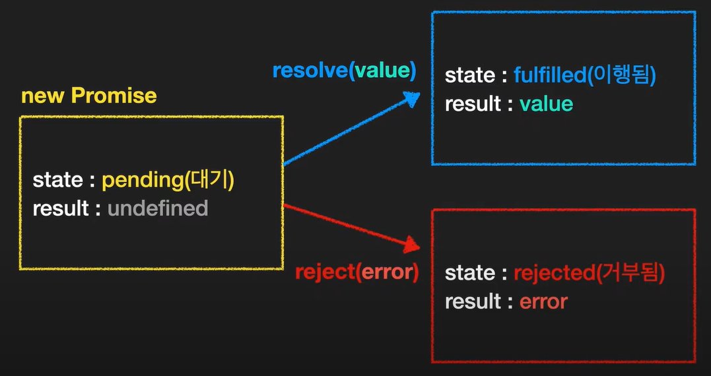

# 면접 준비


#### 심볼 (Symbol)

- 유일한 식별자 => 유일성 보장

```js
const a = Symbol();		// new를 붙이지 않는다!!
const b = Symbol();

console.log(a);			// Symbol()
console.log(b);			// Symbol()

console.log(a === b);	// false
console.log(a == b);	// false
```

```js
const id = Symbol('id');
const id2 = Symbol('id');

console.log(id);			// Symbol(id)
console.log(id2);			// Symbol(id)
```


**Symbol.for() : 전역 심볼**

- 하나의 심볼만 보장받을 수 있음
- 없으면 만들고, 있으면 가져오기 때문
- Symbol 함수는 매번 다른 Symbol 값을 생성
- Symbol.for 메서드는 하나를 생성한 뒤 키를 통해 같은 Symbol을 공유


#### 실행 컨텍스트 (execution context)

- 실행하고 있는 함수를 트래킹하기 위한 특별한 자료 구조
- 현재 실행하고 있는 함수 내의 현재 변수 상태와 this의 값 등을 저장하고 있고, 현재 실행 중인 line을 기억하고 있다
- 실행 컨텍스트가 현재 실행하고 있는 함수 내의 변수 상태를 렉시컬 환경이라는 객체에 저장해두고 변경이 있을 때마다 업데이트하고 필요할 때 접근해서 갖다 쓴다고 보면 됨


#### 렉시컬 환경 (Lexical Environment)

- `code block`, `function`, `script`를 실행하기 앞서 생성되는 특별한 객체로, 실행할 스코프 범위 안에 있는 변수와 함수를 프로퍼티로 저장하는 객체
- 즉, 소스 코드를 실행하면서 참조가 필요한 변수의 값을 이 Lexical Environment라는 객체에서 식별자 이름을 키로 찾는다고 보면 됨
- 


#### 자바스크립트 클로저 (Closure)

- 함수와 렉시컬 환경의 조합
- 함수가 생성될 당시의 외부 변수를 기억
- 생성 이후에도 계속 접근 가능

```js
function makeAdder(x) {
  return function(y) {
    return x + y;
  }
}

const add3 = makeAdder(3);
console.log(add3(2));		// 5

const add10 = makeAdder(10);
console.log(add10(5));		// 15
console.log(add3(1));		// 4
```

- 은닉화도 가능

```js
function makeCounter() {
  let num = 0;
    
  return function() {
    return num++;
  };
}

let counter = makeCounter();

console.log(counter());	// 0
console.log(counter());	// 1
```


#### call, apply, bind => 함수에서 this 값을 바꿀 수 있는(지정할 수 있는) 방법

- call, apply 예제

```js
const nums = [3, 10, 1, 6, 4];

// call(this에 들어갈 객체, 나머지 인자1, 인자2, ...)
const minNum = Math.min.call(null, ...nums);

// apply(this에 들어갈 객체, [나머지 인자들])
const maxNum = Math.max.apply(null, nums);
```

- call, apply, bind 예제

```js
const user = {
  name: "Mike",
  showName: function () {
    console.log(`hello, ${this.name}`);
  },
};

user.showName();			// hello, Mike

let fn = user.showName;
fn();						// hello,		=>		this가 할당하면서 없어짐

fn.call(user);				// hello, Mike
fn.apply(user);				// hello, Mike

let boundFn = fn.bind(user);
boundFn();					// hello, Mike
```


#### 프로토타입 (Prototype)

- 상속의 개념

```js
const car = {
  wheels: 4,
  drive() {
    console.log("drive..");
  },
};

const bmw = {
  color: "red",
  navigation: 1,
};

bmw.__proto__ = car;

const x5 = {
  color: "white",
  name: "x5",
};

x5.__proto__ = bmw;
```

- 생성자와 함께 사용할 경우

```js
const Bmw = function (color) {
  this.color = color;
}

Bmw.prototype = {
  constructor: Bmw,
  wheels: 4,
  drive() {
    console.log("drive..");
  },
  navigation: 1,
  stop() {
    console.log("STOP!");
  },
};

const x5 = new Bmw("red");
const z4 = new Bmw("blue");

z4.constructor === Bmw;		// true
// 하지만 위 코드는 은닉화가 안됨 -> 누구나 색상을 바꿀 수 있음
//
// 클로저를 사용해서 은닉화 가능
const Bmw = function (color) {
  const c = color;
  this.getColor = function () {
    console.log(c);
  };
};

const x5 = new Bmw("red");
```


#### 클래스

```js
// 오버라이딩(overriding)

class Car {
  constructor(color) {
    this.color = color;
    this.wheels = 4;
  }
  drive() {
    console.log("drive..");
  }
  stop() {
    console.log("STOP!");
  }
}

class Bmw extends Car {
  constructor(color) {
    super(color);
  }
  park() {
    console.log("PARK");
  }
}

const z4 = new Bmw("blue");
```


#### 프로미스 (Promise)



```js
const pr = new Promise((resolve, reject) => {
  setTimeout(() => {
    resolve('OK')
  }, 3000)
})

// state: pending(대기)					state: fulfilled(이행됨)				 	 state: rejected(거부됨)
//							== 3s =>									or 
// result: undefined					 result: 'OK'								result: error
```

- `then`, `catch`, `finally` 를 이용해 `Promise` 객체를 처리


#### Promise.all([...args])

- 한꺼번에 시작하고, 모두 다 이행(fulfilled)되면 끝
- 하나라도 거부(rejected)되면 아무것도 반환 X
- ex) 트랜잭션을 만들 때 사용하면 좋을 듯

```js
console.time("x");
Promise.all([f1(), f2(), f3()]).then((res) => {
  console.log(res);
  console.timeEnd("x");
});
```


#### Promise.race([...args])

- 인자로 받은 콜백함수 중 하나라도 완료되면 해당 값만 반환하고 나머지 중지 (**이행/거부 상관 없이**)
- ex) 용량이 큰 이미지들을 받아올 때 하나라도 완료되면 해당 이미지를 띄울 때 사용

```js
console.time("x");
Promise.race([f1(), f2(), f3()]).then((res) => {
  console.log(res);
  console.timeEnd("x");
});
```


#### Promise.any([...args])

- 프로미스 중에 가장 먼저 **이행된** 객체 반환

```js
const rejPromise = new Promise((res, rej) => {
  setTimeout(() => {
    rej("fail..");
  }, 1000);
});

const resPromise = new Promise((res, rej) => {
  setTimeout(() => {
    res("success");
  }, 2000);
});

Promise.race([rejPromise, resPromise])
  .then(() => console.log("성공"))
  .catch(e => console.log(e));				// fail..

Promise.any([rejPromise, resPromise])
  .then(() => console.log("성공"))
  .catch(e => console.log(e));				// 성공
```


#### async / await

```js
async function order() {
  try {
    const result = await Promise.all([f1(), f2(), f3()]);
    console.log(result);
  } catch (e) {
    console.log(e);
  }
  console.log("종료");
}
order();
```


#### Generator 함수

- 함수의 실행을 중간에 멈췄다가 재개할 수 있는 기능
- 다른 작업을 하다가 다시 돌아와서 `next()` 해주면 진행이 멈췄던 부분부터 이어서 실행
  - `Redux-Saga`에서 주로 사용
- `next()`, `return()`, `throw()`

```js
function* fn() {
  const num1 = yield "첫번째 숫자를 입력해주세요";
  console.log(num1);
    
  const num2 = yield "두번째 숫자를 입력해주세요";
  console.log(num2);
    
  return num1 + num2;
}

const a = fn();

a.next();			// {value: "첫번째 숫자를 입력해주세요", done: false}
a.next(2);			// 2
					// {value: "두번째 숫자를 입력해주세요", done: false}
a.next(5);			// 5
					// {value: 7, done: true}
```


**iterable**

- `Symbol.iterator` 메서드가 있다
- `Symbol.iterator`는 `iterator`를 반환해야 한다


**iterator**

- `next` 메서드를 가진다
- `next` 메서드는 value와 done 속성을 가진 객체를 반환한다
- 작업이 끝나면 done은 true가 된다


**Generator 안에서 다른 Generator 호출하기**

```js
function* gen1() {
  yield "W";
  yield "o";
  yield "r";
  yield "l";
  yield "d";
}

function* gen2() {
  yield "Hello,";
  yield* gen1();
  yield "!";
}

console.log(...gen2());			// 구조분해할당 == for of 구문 -> done: true일 때까지 값을 펼쳐줌
```


#### 논리연산자

- `||` : 0, NaN, null, undefined 등 웬만한거 다 false
- `??` : null이나 undefined만 false

```js
let num = 0;

let a = num || 3;
console.log(a);			// 3

let b = num ?? 3;
console.log(b);			// 0
```

