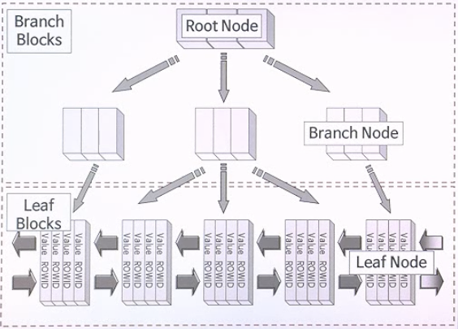
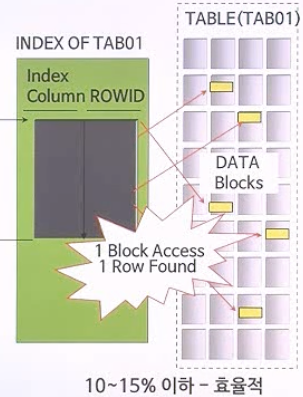

# 인덱스

---

## 1. 인덱스의 필요성

> 데이터베이스에 저장된 자료를 더욱 빠르게 조회하기 위해 인덱스를 생성하여 사용함
>
> 일반적으로, 인덱스는 테이블의 전체 데이터 중에서 10~15% 이하의 데이터를 처리하는 경우에 효율적이며, 그 이상의 데이터를 처리할 땐 인덱스를 사용하지 않는 것이 더 나음


## 2. B*Tree 구조

- 가장 많이 사용되는 인덱스의 구조라 할 수 있으며, 인덱스의 데이터 저장 방식이기도 함

- Root(기준) / Branch(중간) / Leaf(말단) Node로 구성됨

  - Branch 노드는 Leaf 노드에 연결되어 있으며, 조회하려는 값이 있는 Leaf 노드까지 도달하기 위해 비교/분기해야 될 값들이 저장됨

  ```
  Leaf 노드 = 인덱스 칼럼의 값 + ROWID
  ```

  - Leaf 노드 : 실제 데이터가 저장되는 위치
  - 인덱스 칼럼의 값 : 오름(내림)차순으로 Sort되어 저장됨
  - ROWID : 테이블에 있는 해당 row를 찾기 위해 사용되는 논리적인 (저장위치) 정보

  


- B*Tree 구조의 핵심은 Sort!
  1) ORDER BY에 의한 Sort를 피할 수 있음
     - ORDER BY는 메모리에 의해 수행되는데, 데이터가 메모리보다 큰 경우 Disk I/O도 추가로 발생되기 때문에 피할 수 있으면 피하는게 성능면에서 유리
  2) MAX / MIN의 효율적인 처리가 가능


- B*Tree 구조 활용 예 1)

  - 인덱스 EC_COURSE_SQ_PK : (COURSE_CODE, YEAR, COURSE_SQ_NO)

  ```SQL
  SELECT COURSE_CODE, YEAR, COURSE_SQ_NO
    FROM EC_COURSE_SQ
   WHERE COURSE_CODE = 1960
     AND YEAR = '2002'
  ORDER BY COURSE_SQ_NO DESC;
  ```

  ```
  ---------------------------------------------------------
  |  ID  | Operation										|	Name 						|
  ---------------------------------------------------------
  |		0	 | SELECT STATEMENT							|									|
  |*	1  |  INDEX RANGE SCAN DESCENDING |	EC_COURSE_SQ_PK	|
  ---------------------------------------------------------
  ```

  - INDEX에 대한 ORDER BY 절은 옵티마이저가 인덱스에 대한 Sort에서 바로 처리


- B*Tree 구조 활용 예 2)

  - 인덱스 EC_COURSE_SQ_PK : (COURSE_CODE, YEAR, COURSE_SQ_NO)

  ```sql
  SELECT MAX(COURSE_SQ_NO)
    FROM EC_COURSE_SQ
   WHERE COURSE_CODE = 1960
     AND YEAR = '2002';
  ```

  ```
  ---------------------------------------------------------
  |  ID  | Operation										|	Name 						|
  ---------------------------------------------------------
  |		0	 | SELECT STATEMENT							|									|
  | 	1  |  SORT AGGREGATE						 	|									|
  |   2  |   FIRST ROW									|									|
  |*	3  |    INDEX RANGE SCAN (MIN/MAX)|	EC_COURSE_SQ_PK	|
  ---------------------------------------------------------
  ```

  - INDEX에 대한 MAX가 아닌 경우 : WHERE절에 의한 데이터를 찾은 뒤 정렬한 후 값을 찾음 -> 비용이 많이 들어감
  - INDEX에 대한 MAX인 경우 : 이미 정렬된 INDEX내의 값에서 바로 찾음


## 3. 인덱스 선정 절차

1. 프로그램 개발에 이용된 모든 테이블에 대하여 Access Path 조사

   (Access Path : 각 테이블 중심으로 WHERE ~ ORDER BY 까지 다 조사하는 과정)

2. 인덱스 컬럼 선정 및 분포도 조사

3. Critical Access Path 결정 및 우선 순위 선정

4. 인덱스 컬럼의 조합 및 순서 결정 (결합 인덱스 생성 검토)

5. 시험 생성 및 테스트

6. 결정된 인덱스를 기준으로 프로그램 반영

7. 실제 적용


## 4. 인덱스 생성 및 변경 시 고려할 사항

1. **기존 프로그램의 동작에 영향성 검토**
2. 필요할 때마다 인덱스 생성으로 인한 인덱스 개수의 증가와 이로 인한 DML 작업의 속도
3. 비록 개별 컬럼의 분포도가 좋지 않을지라도 다른 컬럼과 결합하여 자주 사용되고, 결합할 경우에 분포도가 양호하다면 결합 인덱스 생성을 긍정적으로 검토


## 5. 인덱스 스캔의 원리

- 옵티마이저가 인덱스 사용을 위한 실행계획을 수립
  1. 조건을 만족하는 최초의 인덱스 row를 찾음
  2. Access된 인덱스 row의 ROWID를 이용해서 테이블에 있는 row를 찾음 (Random Access)
  3. 처리 범위가 끝날 때까지 차례대로 다음 인덱스 row를 찾으면서 Scan 및 2번을 반복
- 1번에서 조건을 만족하는 데이터가 많을 경우 1~3번을 반복해서 계속 스캔
- 인덱스 스캔 시에는 한 번의 I/O가 발생할 때 마다 한 개의 Block씩 처리



- ROWID의 분해

  ```sql
  SELECT ENAME, 
  			 ROWID,
  			 DBMS_ROWID.ROWID_OBJECT(ROWID)						AS TAB_NO,	 -- 탭 정보
  			 DBMS_ROWID.ROWID_RELATIVE_FNO(ROWID)			AS FILE_NO,	 -- 테이블 정보
  			 DBMS_ROWID.ROWID_BLOCK_NUMBER(ROWID)			AS BLOCK_NO, -- 블락 정보
  			 DBMS_ROWID.ROWID_ROW_NUMBER(ROWID)				AS ROW_NO    -- 데이터 위치 정보
    FROM EMP;
  ```


## 6. 인덱스 사용 연산자

- 고유(Unique) 인덱스의 Equal (=) 검색

  ```sql
  SELECT * FROM EMP WHERE EMPNO = 7788;
  ```

- 고유(Unique) 인덱스의 범위 (Range) 검색

  ```sql
  SELECT * FROM EMP WHERE EMPNO >= 7654;
  ```

- 중복(Non-Unique) 인덱스의 범위 (Range) 검색

  ```sql
  CREATE INDEX JOB_INDEX ON EMP (JOB);
  
  SELECT * FROM EMP WHERE JOB LIKE 'SALE%'
  SELECT * FROM EMP WHERE JOB = 'SALE'
  ```

- OR & IN 조건 - 결과의 결합

  ```sql
  SELECT * FROM EMP WHERE EMPNO IN (7654, 7788);
  
  SELECT * FROM EMP WHERE EMPNO = 7654 OR EMPNO = 7788;
  ```

- NOT BETWEEN 검색

  ```sql
  SELECT /*+ USE_CONCAT */
  			 *
  	FROM EMP
  WHERE EMPNO NOT BETWEEN 7654 AND 7788;
  ```

  - NOT은 인덱스를 사용할 수 없다고 생각할 수 있지만, NOT BETWEEN은 OR로 풀어서 수행되기 때문에 인덱스 사용 가능

    (`NOT BETWEEN A AND B ======> EMPNO < A OR EMPNO > B`)


## 7. MIN / MAX 동시 검색

- INDEX
  - EC_COURSE_SQ_PK	:  COURSE_CODE + YEAR + COURSE_SQ_NO
  - EC_COURSE_SQ_IDX_01 :  YEAR (Non Unique)

```sql
SELECT MIN(COURSE_SQ_NO) AS MIN_SQ,
			 MAX(COURSE_SQ_NO) AS MAX_SQ
	FROM EC_COURSE_SQ
 WHERE COURSE_CODE = 1960
   AND YEAR = '2002';
```

- 위 경우 최대, 최소값 빼고는 필요가 없지만 전체 스캔을 하게 됨
- 이런 경우, 인덱스를 사용해 각각 최대, 최소값 한개씩만 찾게 하려면 분리할 수 밖에 없음

```sql
SELECT SUM(MIN_SQ) AS MIN_SQ,
			 SUM(MAX_SQ) AS MAX_SQ
	FROM (
  				SELECT /*+INDEX_ASC(A EC_COURSE_SQ_PK) */
    						 A.COURSE_SQ_NO AS MIN_SQ,
    						 0 AS MAX_SQ
    			  FROM EC_COURSE_SQ A
    			 WHERE A.COURSE_CODE = 1960
    				 AND A.YEAR = '2002'
    				 AND ROWNUM = 1
    
    			UNION ALL
    
    			SELECT /*+INDEX_DESC(A EC_COURSE_SQ_PK) */
    						 0 AS MIN_SQ,
    						 A.COURSE_SQ_NO AS MAX_SQ
    			  FROM EC_COURSE_SQ A
    			 WHERE A.COURSE_CODE = 1960
    				 AND A.YEAR = '2002'
    				 AND ROWNUM = 1
  );
```

---


## Summary

#### 1. 인덱스의 필요성

- 일반적으로 테이블이 갖고 있는 데이터 중에서 10 ~ 15% 이하를 처리할 경우에 인덱스를 사용해야 함
- 테이블마다 저장해 둔 데이터 수가 다르기 때문에 그 기준은 절대적이라 할 수는 없음


#### 2. B*Tree 구조

- B*Tree 인덱스의 데이터 저장 방식의 핵심은 정렬(Sort)임
- ORDER BY에 의한 정렬 작업을 대체할 수 있는 수단이 될 수 있음
- MIN / MAX 함수의 최적화가 가능함


#### 3. 인덱스 선정 절차

1. 프로그램 개발에 이용된 모든 테이블에 대해 Access Path 조사
2. 인덱스 컬럼 선정 및 분포도 조사
3. Critical Access Path 결정 및 우선 순위 선정
4. 인덱스 컬럼의 조합 및 순서 결정
5. 시험 생성 및 테스트
6. 결정된 인덱스를 기준으로 프로그램 반영
7. 실제 적용


#### 4. 인덱스 생성 및 변경 시 고려 사항

1. 인덱스가 추가 될 경우 기존 프로그램 동작의 영향성 검토
2. 필요할 때마다 인덱스를 생성할 경우, DML 작업속도는 저하됨
3. 개별 컬럼의 분포도가 좋지 않더라도 다른 컬럼과 결합하여 자주 사용된다면 결합 인덱스 생성을 검토함


#### 5. 인덱스 스캔의 원리

- 인덱스 스캔 시에는 한 번의 I/O가 발생할 때마다 한 개의 Block씩을 처리함


#### 6. 인덱스의 필요성

- 고유(Unique) 인덱스의 Equal(=)과 범위(Range) 검색
- 중복(Non-Unique) 인덱스의 범위(Range) 검색
- OR & IN 조건 - 결과의 결합
- NOT BETWEEN 검색

