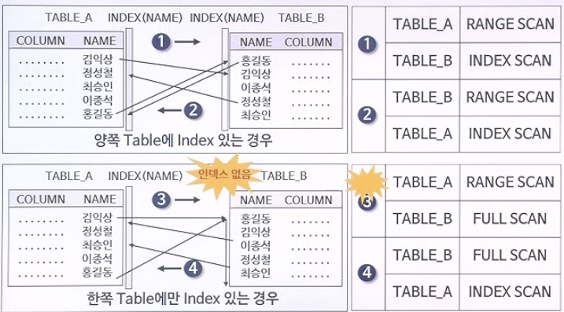

# 6. NESTED LOOPS 조인

---

## 1. NESTED LOOPS JOIN

- 옵티마이저가 Driving Table을 결정함 (Outer Table)
- Driving Table이 아닌 테이블은 Driven Table로 지정함 (Inner Table)
- Driving Table의 각 row에 대해 이들이 추출될 때마다 Driven Table의 연관된 모든 row를 조인에 의해 액세스
- 튜닝 포인트
  - 테이블 간 조인 횟수를 최소화 할 수 있도록 Driving Table을 지정 ==> 조인 순서 제어
  - Driven Table의 연결고리 컬럼에 대한 인덱스 구성


## 2. NESTED LOOPS JOIN 수행 절차

- 가정 : joinkey_a, joinkey_b, color, size 등은 모두 인덱스임

  ```sql
  SELECT /*+ ORDERED USE_NL(A B) */
  			 A.COLOR, ..., B.SIZE, ...
  	FROM TABLE_A A, TABLE_B B
   WHERE A.JOINKEY_A = B.JOINKEY_B
     AND A.COLOR = 'RED'
     AND B.SIZE = 'MED';
  ```

  1. ORDERED 힌트에 의해 먼저 기술된 A가 Driving Table이 됨, USE_NL 힌트에 의해 NESTED LOOPS JOIN 수행
  2. A.COLOR 인덱스로 A.COLOR = 'RED'인 데이터를 찾음
  3. 하나씩 찾을때마다 TABLE_B와 JOINKEY로 조인을 수행 
  4. 조인 후 나온 데이터들에 대해 B.SIZE = 'MED'인 값을 찾음

- Driving Table이 10만건이면 10만번 조인, 1000만건이면 1000만건 조인하기 때문에 Driving Table이 매우 중요!!

- 또한, Driven Table은 연결 컬럼으로 구성된 인덱스를 반드시 사용해야 함!!


## 3. NESTED LOOPS JOIN의 장단점

1. 인덱스에 의한 랜덤 액세스에 기반하고 있기 때문에 대량의 데이터 처리 시 적합하지 않음
2. Driving Table로는 테이블의 데이터가 적은 마스터 테이블이거나, WHERE절 조건으로 적절하게 row를 제어할 수 있는 것이어야 함
3. Driven Table에는 조인을 위한 적절한 인덱스가 생성되어 있어야 함


## 4. DRIVING TABLE의 원리

- A : 2000건, B : 10건, C : 1건이고, 각각 다 조인키가 연결되어 있다고 가정
- A -> B -> C 순서의 조인 횟수
  - A -> B : 2000건
  - B -> C : 2000건
  - 총 : 4000건
- C -> B -> A 순서의 조인 횟수
  - C -> B : 1건
  - B -> A : 10건
  - 총 : 11건


## 5. 조인 순서 제어 방법

- 조인 순서 제어를 위한 힌트 사용

  ```sql
  /*+ ORDERED */
  ```

  - FROM 절에 기술한 테이블 순서대로 제어

  ```sql
  /*+ LEADING(table명) */
  ```

  - 힌트 내에 제시한 테이블이 드라이빙으로 채택됨
  - 주의) ORDERED와 LEADING을 같이 사용할 경우 LEADING 힌트는 무시됨

- 뷰(view) 활용

- 서프레싱(suppressing) 활용

- FROM 절의 테이블 순서 변경

  - RBO 하에서 각 테이블에 대한 규칙이 동일할 때, FROM 절로부터 멀리 있는 테이블부터 처리함
  - 주의) CBO에서는 이 방법은 의미가 없음


## 6. 연결 고리에 대한 인덱스



- 3번인 경우는 Driving Table이 A이고 Driven Table이 B인 경우로, Table_B는 인덱스가 없으므로 연결 컬럼이 인덱스가 아니기 때문에 NESTED LOOPS를 하면 안됨!
- 4번처럼 Driving Table을 B로 하고 FULL SCAN으로 찾은 다음 Table_A와 NESTED LOOPS를 해야 됨


#### 양쪽 모두 연결고리에 대한 인덱스가 없는 경우

```sql
SELECT *
  FROM TAB_A A, TAB_B B
 WHERE A.NAME = B.NAME
```

```
A			->		 B					B		->	 A
---------------				---------------
(FULL)		(FULL)			(FULL)	 (FULL)
```

- Driven 테이블에 대한 FULL TABLE SCAN 횟수는 Driving 테이블로부터 읽어 들이는 row수 만큼이 됨

  ==> 이러한 상황에서 할 수 있는 조인이 Sort Merge와 Hash 조인임

---

## SUMMARY

#### 1. Nested Loops 조인의 튜닝 포인트

- 테이블 간의 조인 횟수를 최소화를 위한 조인 순서의 최적화
- Driven 테이블의 경우 연결고리 인덱스가 반드시 사용되어야 함


#### 2. Nested Loops 조인의 장단점

- 장점
  - 인덱스를 통한 랜덤 액세스(random access)기반에서 좋은 성능을 보임
- 단점
  - 인덱스가 없는 상태에선 속도가 저하됨
  - 대용량 데이터를 처리할 경우 성능이 저하됨


#### 3. 조인 순서 제어 방법

- 조인 순서 제어를 위한 힌트 사용

  ```sql
  /*+ ORDERED */
  ```

  - FROM 절에 기술한 테이블 순서대로 제어

  ```sql
  /*+ LEADING(table명) */
  ```

  - 힌트 내에 제시한 테이블이 드라이빙으로 채택됨
  - 주의) ORDERED와 LEADING을 같이 사용할 경우 LEADING 힌트는 무시됨

- 뷰(view) 활용

- 서프레싱(suppressing) 활용

- FROM 절의 테이블 순서 변경

  - RBO 하에서 각 테이블에 대한 규칙이 동일할 때, FROM 절로부터 멀리 있는 테이블부터 처리함
  - 주의) CBO에서는 이 방법은 의미가 없음


#### 4. 연결고리 컬럼에 대한 인덱스의 중요성

- 양쪽 모두 인덱스가 있는 경우
  - 두 테이블 중 조회되는 결과가 적은 테이블을 선택하여 드라이빙 테이블로 선택함
- 한쪽만 인덱스가 있는 경우
  - 인덱스가 없는 쪽 테이블을 드라이빙 테이블로 사용함
- 양쪽 모두 인덱스가 없는 경우
  - Nested Loops 조인방식으로 조인이 이뤄지지 않음


