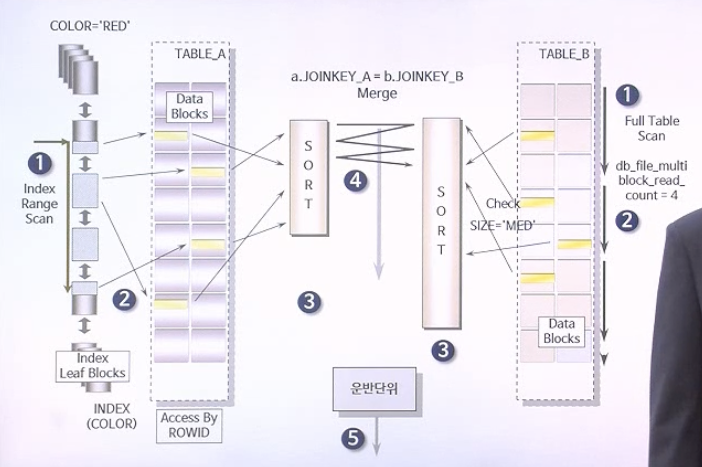
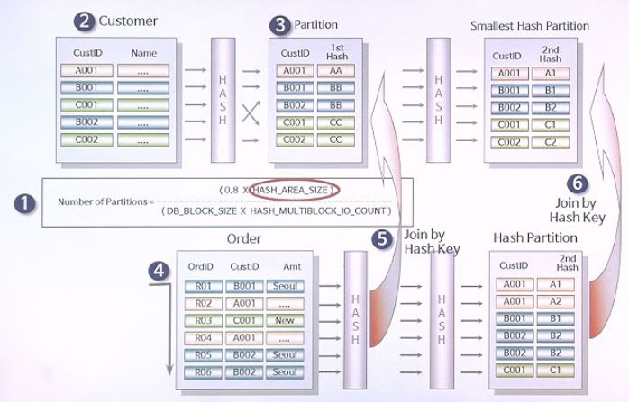

# 7. SORT/MERGE / HASH 조인

---

## 1. SORT/MERGE JOIN

- NESTED LOOPS 대신 SORT/MERGE JOIN의 사용하는 경우
  1. 연결 고리에 인덱스가 전혀 없는 경우
  2. 대용량의 자료를 조인해야 함으로써 인덱스 사용에 따른 랜덤 액세스의 오버헤드가 많은 경우
- SORT/MERGE JOIN 동작 원리
  1. 각 테이블에 대해 동시에 독립적으로 데이터를 먼저 읽어 들임
     - NESTED LOOPS는 Driving Table이 있는 것과 달리 각 테이블에 대해 동시에 스캔
  2. 읽혀진 각 테이블의 데이터를 조인을 위한 연결 고리에 대하여 정렬을 수행함
  3. 정렬이 모두 끝난 후에 조인 작업이 수행됨
- 튜닝 포인트
  - 각 테이블로부터 데이터를 빨리 읽어 들이도록 함
  - 메모리(SORT_AREA_SIZE)를 최적화함


## 2. SORT/MERGE JOIN의 수행 절차

- 가정 : color만 인덱스임

```sql
SELECT /*+ USE_MERGE(A B) */
			 A.COLOR, ..., B.SIZE, ...
	FROM TABLE_A A, TABLE_B B
 WHERE A.JOINKEY_A = B.JOINKEY_B
 	 AND A.COLOR = 'RED'
 	 AND B.SIZE = 'MED';
```

- A 테이블은 INDEX RANGE SCAN, B 테이블은 FULL TABLE SCAN을 진행 
- A 테이블은 JOINKEY_A를 통해서 정렬, B 테이블은 JOINKEY_B를 통해서 정렬을 진행
- 두 테이블 모두 연결컬럼에 대해 정렬이 끝난 뒤 해당 컬럼으로 데이터 연결(Merge) 수행


## 3. SORT/MERGE JOIN이 불리한 경우



- 한쪽의 테이블이 매우 큰 경우 (= 정렬이 오래 걸리는 경우) 성능상 불리함


## 4. SORT/MERGE JOIN의 장단점

- 연결고리에 인덱스가 생성되어 있지 않은 경우에 빠른 조인을 위해 사용됨
- 조인하고자 하는 각 테이블에 대해서 **독립적으로 데이터를 읽어 들일 때, 이를 얼마나 빠르게 할 것인가**가 중요함
- 각 테이블로부터 읽혀진 데이터를 **연결고리에 대해 정렬을 수행할 때 이를 얼마나 빠르게 할 것인가**가 중요함


## 5. HASH JOIN

| NESTED LOOPS JOIN                                | SORT/MERGE JOIN                    |
| ------------------------------------------------ | ---------------------------------- |
| 단점 : 인덱스 사용에 의한 랜덤 액세스의 오버헤드 | 단점 : 정렬 작업으로 인한 오버헤드 |

- SORT/MERGE 조인과 비교해보면, 각 테이블에 대한 처리를 독립적으로 하는 것은 같지만, **HASH JOIN에서는 Driving Table이 있음**

- 읽어 들인 각 테이블의 데이터를 서로 조인하기 위해 **해싱(Hashing)을 이용해서 해시 값을 만듦**

  => 해시 값으로 조인을 수행함

- 튜닝 포인트

  - Driving Table을 결정함
    - 데이터 용량이 작은 테이블로 결정하는게 일반적이지만, 메모리(HASH_AREA_SIZE)의 용량이 큰 경우 큰 테이블로 결정할 수 있음
  - 각 테이블로부터 데이터를 읽어 들일 때, 빨리 읽을 수 있도록 함
  - 메모리(HASH_AREA_SIZE)를 최적화함
    - 기본적으로 SORT_AREA_SIZE의 2배로 설정


## 6. HASH JOIN의 수행 절차



1. 옵티마이저가 상대적으로 크기가 작은 Customer 테이블을 Driving Table로 설정
2. Customer 테이블을 스캔하면서 해시값을 파티션에 저장(메모리에 저장)
3. Order 테이블을 스캔하면서 해시값을 파티션에 저장(메모리에 저장) 후 Customer 파티션과 해시값을 '='로 비교
4. 해시값 간에 충돌(중복값)이 있을 경우 2차 해싱을 수행
5. 각 해시 파티션을 '='로 비교하여 JOIN 수행

- Hash Bucket이 조인 집합에 구성되어 해시 함수 결과를 저장해야 하는데, 이러한 처리에는 **많은 메모리와 CPU 자원**을 소모하게 됨

- 기본적으로 **HASH_AREA_SIZE에 지정된 크기만큼의 메모리가 할당되어 사용됨**

  - 조인을 수행하기에 메모리가 부족하다면 가장 큰 순서대로 Hash Bucket이 Temporary Tablespace로 내려가서 구성됨

    => 디스크로 내려간 Hash Bucket에 변경이 일어날 때마다 디스크 I/O가 발생하게 되어 성능이 현저하게 저하됨

  - **하드웨어 자원이 넉넉한 상황에서는** 다른 조인에 비해 보다 효율적인 수행이 가능하지만, 부족한 상황에서는 다른 조인 방법보다 오히려 느려질 수도 있음

---

## SUMMARY

#### 1. SORT/MERGE JOIN

- SORT/MERGE JOIN을 사용해야 하는 경우
  - 연결 고리에 인덱스가 없는 경우
  - 대용량의 자료를 조인해야 함으로써 인덱스 사용에 따른 랜덤 액세스의 오버헤드가 많은 경우
- 튜닝포인트
  - 각 테이블로부터 데이터를 빨리 읽어 들이도록 함
  - 각 테이블로부터 읽어 들인 데이터를 조인하기 전에 정렬(Sort)을 하는데, 이러한 정렬 작업을 빨리 끝낼 수 있도록 함


#### 2. SORT/MERGE JOIN의 수행 절차

1. 각 테이블에 대해 동시에 독립적으로 데이터를 먼저 읽어 들임
2. 읽혀진 각 테이블의 데이터를 조인을 위한 연결고리에 대하여 정렬을 수행함
3. 정렬이 모두 끝난 후에 조인 작업이 수행됨


#### 3. SORT/MERGE JOIN이 불리한 경우

- 각 테이블로부터 읽어 들인 데이터를 조인하기 전에 정렬(Sort)하게 되는데, 이때 정렬할 데이터가 지나치게 큰 경우
- 각 테이블로부터 읽어 들인 데이터의 크기가 매우 큰 경우


#### 4. SORT/MERGE JOIN의 장단점

- 장점 : 연결고리에 인덱스가 생성되어 있지 않은 경우에도 빠른 조회를 수행할 수 있음

- 단점 : 각 테이블로부터 읽어 들인 데이터의 크기가 매우 큰 경우 성능상 불리함

  ​	(데이터 정렬 소요시간, 데이터 스캔 소요시간)


#### 5. HASH JOIN

- 각 테이블에 대한 처리를 독립적으로 하지만, Hash Join은 Driving Table이 있음
- 읽어 들인 각 테이블의 데이터를 서로 조인하기 위해 해싱을 이용해서 해시 값을 만들어 조인을 수행함
- 튜닝포인트
  - Driving Table의 결정
  - 각 테이블로부터 독립적으로 데이터를 읽어 들일 때 빨리 처리하도록 함
  - 해시 조인을 위한 메모리를 최적화함


#### 6. HASH JOIN의 수행 절차

1. Driving Table 결정

2. Driving Table의 연결조건 컬럼 해싱 및 해시 값 생성

3. 읽어 들인 데이터와 해싱에서 만들어진 해시 값을 메모리에 저장

4. Hash Join이 적용될 테이블의 연결조건 컬럼 해싱 및 해시 값 생성

5. 읽어 들인 데이터와 해싱에서 만들어진 해시 값을 메모리에 저장

6. 각 테이블에 조인할 데이터가 있는지, 조인하고자 만들었던 해시 값 간에 충돌이 있는지 확인

   -> 충돌이 발생할 경우, 2차 해싱 수행

7. 각 테이블의 해시값을 "="로 조인을 수행함


#### 7. HASH JOIN의 장단점

- 장점 : 하드웨어 자원이 넉넉한 상황에서는 다른 조인에 비해 보다 효율적인 수행이 가능함
- 단점 : 하드웨어 자원이 부족한 상황에서는 다론 조인 방법보다 비효율적임


