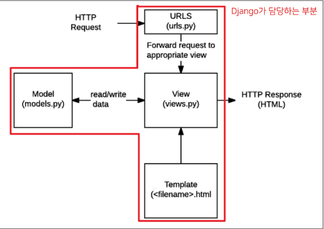

# Django


#### Framework

- 서비스 개발에 필요한 기능들을 미리 구현해서 모아 놓은 것
- 웹 서비스 개발에 있어서 모든 것들을 하나부터 열까지 직접 개발할 필요 없이, 내가 만들고자 하는 본질(로직)에 집중해 개발할 수 있음
- 소프트웨어의 생산성과 품질을 높임


#### 클라이언트-서버 구조

​					       request
클라이언트 <==========> 서버
​						 responses

- 클라이언트
  - 웹 사용자의 인터넷에 연결된 장치 (ex. wi-fi에 연결된 컴퓨터 또는 모바일)
  - 웹 브라우저
  - 서비스를 요청하는 주체
- 서버
  - 웹 페이지, 사이트 또는 앱을 저장하는 컴퓨터
  - 클라이언트가 웹 페이지에 접근하려고 할 때 서버에서 클라이언트 컴퓨터로 웹 페이지 데이터를 응답해 사용자의 웹 브라우저에 표시됨
  - 요청에 대해 서비스를 응답하는 주체

- Django : 서버를 구현하는 웹 프레임워크


#### 웹 브라우저

- 웹에서 페이지를 찾아 보여주고, 사용자가 하이퍼링크를 통해 다른 페이지로 이동할 수 있도록 하는 프로그램
- 웹 페이지 파일을 우리가 보는 화면으로 바꿔주는(렌더링, rendering) 프로그램


#### 정적 웹 페이지

- 있는 그대로를 제공하는 것(served as-is)을 의미
- 서버에 미리 저장된 HTML 파일 그대로 전달된 웹 페이지
- 같은 상황에서 모든 사용자에게 동일한 정보를 표시


#### 동적 웹 페이지

- 사용자의 요청에 따라 웹 페이지에 추가적인 수정이 되어 클라이언트에게 전달되는 웹 페이지
- 웹 페이지의 내용을 바꿔주는 주체 == **서버**


#### Design Pattern

- 자주 사용되는 구조를 일반화해서 하나의 공법으로 만들어 둔 것

- 특정 문맥에서 공통적으로 발생하는 문제에 대해 재사용 가능한 해결책을 제시
- 다수의 엔지니어들이 일반화된 패턴으로 소프트웨어 개발을 할 수 있도록 한 규칙, 커뮤니케이션의 효율성을 높이는 기법


#### Django's Design Pattern

- **MVC 패턴**
  - Model - View - Controller
  - 데이터 및 논리 제어를 구현하는데 널리 사용되는 디자인 패턴
    - Model : 데이터와 관련된 로직을 관리
    - View : 레이아웃과 화면을 처리
    - Controller : 명령을 model과 view 부분으로 연결
  - 목적
    - "관심사 분리"
    - 각 부분을 독립적으로 개발 가능 -> 하나를 수정하고 싶을 때 모두 건들지 않아도 됨!!!
      - **개발 효율성 및 유지보수가 쉬워짐**
      - **다수의 멤버로 개발하기 용이함**
- **MTV 패턴**
  - Model
    - MVC 패턴에서 Model 역할
    - **데이터와 관련된 로직을 관리**
    - 응용프로그램의 데이터 구조를 정의하고 데이터베이스의 기록을 관리
  - Template
    - MVC 패턴에서 View의 역할에 해당
    - 화면상의 **사용자 인터페이스 구조와 레이아웃을 정의(화면 관련)**
    - 레이아웃과 화면을 처리
  - View
    - MVC 패턴에서 Controller의 역할에 해당
    - **Model & Template과 관련한 로직을 처리해서 응답을 반환**
    - 클라이언트의 요청에 대해 처리를 분기하는 역할
    - 동작 예시
      - 데이터가 필요하다면 model에 접근해서 데이터를 가져오고 가져온 데이터를 template로 보내 화면을 구성하고 구성된 화면을 응답으로 만들어 클라이언트에게 반환




#### LTS (Long Term Support, 장기 지원 버전)

- 일반적인 경우보다 장기간에 걸쳐 지원하도록 고안된 소프트웨어의 버전
- 컴퓨터 소프트웨어의 제품 수명주기 관리 정책
- 배포자는 LTS 확정을 통해 장기적이고 안정적인 지원을 보장함


#### 요청과 응답

- `render(request, template_name, context)` 

  - 주어진 템플릿을 주어진 컨텍스트 데이터와 결합하고 렌더링 된 텍스트와 함께 HttpResponse(응답) 객체를 반환하는 함수

  1. request : 응답을 생성하는 데 사용되는 요청 객체
  2. template_name : 템플릿의 전체 이름 또는 템플릿 이름의 경로
  3. context : 템플릿에서 사용할 데이터 (딕셔너리 타입으로 작성)


#### 추가 설정

- LANGUAGE_CODE
  - 모든 사용자에게 제공되는 번역을 결정
  - 이 설정이 적용 되려면 USE_I18N이 활성화되어 있어야 함
- TIME_ZONE
  - 데이터베이스 연결의 시간대를 나타내는 문자열 지정
  - USE_TZ가 True이고 이 옵션이 설정된 경우 데이터베이스에서 날짜 시간을 읽으면, UTC 대신 새로 설정한 시간대의 인식 날짜&시간이 반환 됨
  - USE_TZ이 False인 상태로 이 값을 설정하는 것은 error가 발생하므로 주의

- USE_I18N
  - Django의 번역 시스템을 활성화해야 하는지 여부를 지정
- USE_L10N
  - 데이터의 지역화 된 형식(localized formatting)을 기본적으로 활성화할지 여부를 지정
  - True일 경우, Django는 현재 locale의 형식을 사용하여 숫자와 날짜를 표시
- USE_TZ
  - datetimes가 기본적으로 시간대를 인식하는지 여부를 지정
  - True일 경우 Django는 내부적으로 시간대 인식 날짜 / 시간을 사용


#### Django Template Language (DTL)

- Django template에서 사용하는 built-in template system
- 조건, 반복, 변수 치환, 필터 등의 기능을 제공
  - python처럼 일부 프로그래밍 구조(if, for 등)를 사용할 수 있지만 python 코드로 실행되는 것은 아님
  - Django 템플릿 시스템은 단순히 Python이 HTML에 포함된 것이 아니니 주의!
- 프로그래밍적 로직이 아니라 프레젠테이션을 표현하기 위한 것임을 명심!

1. Variable `{{ variable }}`
   - 변수명은 영어, 숫자와 밑줄(_)의 조합으로 구성
   - dot(.)를 사용하여 변수 속성에 접근할 수 있음
   - render()의 세번째 인자로 {'key':value}와 같이 딕셔너리 형태로 넘겨주며, 여기서 정의한 key에 해당하는 문자열이 template에서 사용 가능한 변수명이 됨
2. Filter `{{ variable|filter }}`
   - ex. name 변수를 모두 소문자로 출력 `{{ name|lower }}`
3. Tags ``
   - 출력 텍스트를 만들거나, 반복 또는 논리를 수행하여 제어 흐름을 만드는 등 변수보다 복잡한 일들을 수행
   - 일부 태그는 시작과 종료 태그가 필요 ``
4. Comments 
   - `{# #}` : 한 줄 주석
   - `` : 여러 줄 주석


#### Template inheritance

- 템플릿 상속은 기보적으로 코드의 재사용성에 초점을 맞춤
- ``
  - 자식(하위)템플릿이 부모 템플릿을 확장한다는 것을 알림
  - 반드시 템플릿 최상단에 작성 되어야 함 (즉, 2개 이상 사용할 수 없음)
- ``
  - 하위 템플릿에서 재지정(overridden)할 수 있는 블록을 정의
  - 가독성을 높이기 위해 선택적으로 endblock 태그에 이름을 지정할 수 있음


#### BASE_DIR

```python
# settings.py
BASE_DIR = Path(__file__).resolve().parent.parent
```

- settings.py에서 특정 경로를 절대 경로로 편하게 작성할 수 있또록 Django에서 미리 지정해둔 경로 값
- "객체 지향 파일 시스템 경로"
  - 운영체제별로 파일 경로 표기법이 다르기 때문에 어떤 운영체제에서 실행되더라도 각 운영체제 표기법에 맞게 해석될 수 있도록 하기 위해 사용


#### Client & Server architecture

- 클라이언트(일반적으로 웹 브라우저)가 서버에 요청을 보내고, 서버는 클라이언트의 요청에 응답
- 클라이언트 측에서 HTML form은 HTTP 요청을 서버에 보내는 가장 편리한 방법
- 이를 통해 사용자는 HTTP 요청에 전달할 정보를 제공할 수 있음


#### Sending form data (Client)

- HTML `<form>` element
  - 데이터가 전송되는 방법을 정의
  - 웹에서 사용자 정보를 입력하는 여러 방식(text, button, submit 등)을 제공하고, **사용자로부터 할당된 데이터를 서버로 전송**하는 역할
  - "데이터를 어디(action)로 어떤 방식(method)으로 보낼지"
  - 핵심 속성
    - action
    - method


#### HTML form's attributes

1. action
   - 입력 데이터가 전송될 URL을 지정
   - 데이터를 어디로 보낼 것인지 지정하는 것이며 이 값은 반드시 유효한 URL이어야 함
   - 만약 이 속성을 지정하지 않으면 데이터는 현재 form이 있는 페이지의 URL로 보내짐

2. method
   - 데이터를 어떻게 보낼 것인지 정의
   - 입력 데이터의 HTTP request methods를 지정
   - HTML form 데이터는 오직 2가지 방법 - GET 방식, POST 방식


#### HTTP request methods

- HTTP : HTML 문서와 같은 리소스(데이터, 자원)들을 가져올 수 있도록 해주는 프로토콜(규칙, 규약)
- 웹에서 이루어지는 모든 데이터 교환의 기초
- HTTP는 주어진 리소스가 수행 할 원하는 작업을 나타내는 request methods를 정의

- HTTP Method 예시 : GET, POST, PUT, DELETE


#### GET

- 서버로부터 정보를 조회하는 데 사용 (즉, 서버에서 리소스를 요청하기 위해 사용)
- 데이터를 가져올 때만 사용
- 데이터를 서버로 전송할 때 Query String Parameters를 통해 전송
  - 데이터는 URL에 포함되어 서버로 보내짐


#### Query String Parameters

- 사용자가 입력 데이터를 전달하는 방법 중 하나로, url 주소에 데이터를 파라미터를 통해 넘기는 것
- &로 연결된 key=value 쌍으로 구성되며 기본 URL과 물음표(?)로 구분됨
  - ex. http://host:port/path**?key=value&key=value**
- Query String이라고도 함


#### Retrieving the data (Server)

- 데이터 가져오기(검색하기)
- 서버는 클라이언트로 받은 key-value 쌍의 목록과 같은 데이터를 받게 됨


#### Request and Response objects

- 요청과 응답 객체 흐름
  1. 페이지가 요청되면 Django는 요청에 대한 메타데이터를 포함하는 HttpRequest object를 생성
  2. 그리고 해당하는 적절한 view 함수를 로드하고 HttpRequest를 첫번째 인자로 전달
  3. 마지막으로 view 함수는 HttpResponse object를 반환


#### Variable routing

- URL 주소를 변소루 사용하는 것을 의미
- URL의 일부를 변수로 지정하여 view 함수의 인자로 넘길 수 있음
- 즉, 변수 값에 따라 하나의 path()에 여러 페이지를 연결 시킬 수 있음
- 변수는 `<>`에 정의하며 view 함수의 인자로 할당됨
- 타입 : str, int, slug, uuid, path

```python
context = {
    'name':name,
}
return render(request, '~.html', context)

<!-- articles/templates/~.html -->
안녕 {{ name }}                           --> varialbe routing
```


#### App URL mapping

- 앱이 많아졌을 때 urls.py를 각 app에 매핑하여 관리하면 유지보수가 용이

```python
from django.contrib import admin
from django.urls import path, include

urlpatterns = [
    path('admin/', admin.site.urls),
    path('articles/', include('articles.urls')),
    path('pages/', include('pages.urls')),
]
```


#### include()

- 다른 URLconf(app1/urls.py)들을 참조할 수 있도록 돕는 함수
- 함수 include()를 만나게 되면 URL의 그 시점까지 일치하는 부분을 잘라내고, 남은 문자열 부분을 후속 처리를 위해 include된 URLconf로 전달


#### Naming URL patterns

- DTL의 Tag 중 하나인 **URL 태그**를 사용해서 "path()" 함수에 작성한 name을 사용할 수 있음

```python
# articles/urls.py

urlpatterns = [
    path('index/', views.index, name='index'),
]
```


#### Built-in tag - 'url' ``

- 주어진 URL 패턴 이름 및 선택적 매개 변수와 일치하는 절대 경로 주소를 반환
- 템플릿에 URL을 하드 코딩하지 않고도 DRY 원칙을 위반하지 않으면서 링크를 출력하는 방법


#### DRY 원칙

- Don't Repeat Yourself 의 약어
- 더 품질 좋은 코드를 작성하기 위해 '소스 코드에서 동일한 코드를 반복하지 말자'는 의미
- 동일한 코드 반복 -> 잠재적인 버그의 위협 증가, 수정이 어려움 -> 유지보수 비용 증가


### 1장 마무리

#### Django의 설계 철학(Templates System)

1. 표현과 로직(view)을 분리
   - 템플릿 시스템은 표현을 제어하는 도구이자 표현에 관련된 로직일 뿐
2. 중복을 배제
   - 템플릿 상속의 기초가 되는 철학

#### Framework의 성격

- 독선적(Opinionated)
- 관용적(Unopinionated)

---


#### URL namespace

- 서로 다른 앱에서 동일한 URL 이름을 사용하는 경우에도 이름이 지정된 URL을 고유하게 사용할 수 있음

- **app_name** attribute를 작성해 URL namespace를 설정

  - URL tag의 변화 `` --> ``

  - 템플릿 경로 변경
    ```python
    # articles/views.py
    return render(request, 'articles/index.html')
    
    # pages/views.py
    return render(request, 'pages/index.html')
    ```


#### Database

- 체계화된 데이터의 모임
- 검색 및 구조화 같은 작업을 보다 쉽게 하기 위해 조직화된 데이터를 수집하는 저장 시스템


#### 스키마(Schema)

- 뼈대(Structure)
- 데이터베이스에서 자료의 구조, 표현 방법, 관계 등을 정의한 구조


#### 테이블(Table)

- 필드와 레코드를 사용해 조직된 데이터 요소들의 집합
- 관계(Relation)라고도 부름

1. 필드(field) : 속성, 컬럼(Column)
2. 레코드(record) : 튜플, 행(Row)


#### PK (Primary Key)

- 기본 키
- 각 레코드의 고유한 값 (식별자로 사용)
- 기술적으로 다른 항목과 절대로 중복되어 나타날 수 없는 단일 값(unique)을 가짐
- 데이터베이스 관리 및 테이블 간 관계 설정 시 주요하게 활용됨


#### 쿼리(Query)

- 데이터를 조회하기 위한 명령어를 일컬음
- 조건에 맞는 데이터를 추출하거나 조작하는 명령어
- "Query를 날린다" = "데이터베이스를 조작한다"


#### Model

- Django는 Model을 통해 데이터에 접속하고 관리
- 저장된 데이터베이스의 구조 (layout)
- 일반적으로 각각의 모델은 하나의 데이터베이스 테이블에 매핑(mapping)
  - 모델 클래스 1개 == 데이터베이스 테이블 1개


#### Migrations

- 모델에 대한 청사진(blueprint)을 만들고 이를 통해 테이블을 생성하는 일련의 과정
- Django가 모델에 생긴 변화(필드 추가, 모델 삭제 등)를 DB에 반영하는 방법


#### makemigrations

- 모델을 작성 혹은 변경한 것에 기반한 새로운 migration(설계도, 청사진 이하 마이그레이션)을 만들 때 사용
- "테이블을 만들기 위한 설계도를 생성하는 것"
- `$ python manage.py makemigrations`


#### migrate

- makemigrations로 만든 설계도를 실제 db.sqlite3 DB 파일에 반영하는 과정
- "모델과 DB의 동기화"
- `$ python manage.py migrate`


#### ORM (Object-Relational-Mapping)

- 객체 지향 프로그래밍 언어를 사용하여 호환되지 않는 유형의 시스템 간에 (Django <-> SQL)데이터를 변환하는 프로그래밍 기술
- 객체 지향 프로그래밍에서 데이터베이스를 연동할 때, 데이터베이스와 객체 지향 프로그래밍 언어 간의 호환되지 않는 데이터를 변환하는 프로그래밍 기법


#### ORM 장단점

- 장점
  - SQL을 잘 알지 못해도 객체지향 언어로 DB 조작이 가능
  - 객체 지향적 접근으로 인한 높은 생산성
- 단점
  - ORM 만으로 완전한 서비스를 구현하기 어려운 경우가 있음


```python
# articles/models.py

class Article(models.Model):
    title = models.CharField(max_length=10)
    content = models.TextField()
    created_at = models.DateTimeField(auto_now_add=True)  # 처음 저장한 시간
    updated_at = models.DateTimeField(auto_now=True)	  # 새로 저장한 시간
```


#### 반드시 기억해야 할 migration 3단계

1. models.py에서 변경사항이 발생하면
2. migrations 파일 생성 (설계도 생성) : `makemigrations`
3. DB 반영 (모델과 DB의 동기화) : `migrate`


#### DateTimeField()

- auto_now_add
  - 최초 생성 일자
  - Django ORM이 최초 insert시에만 현재 날짜와 시간으로 갱신
- auto_now
  - 최종 수정 일자
  - Django ORM이 save를 할 때마다 현재 날짜와 시간으로 갱신


#### Shell

- 운영체제 상에서 다양한 기능과 서비스를 구현하는 인터페이스를 제공하는 프로그램
- 셸(껍데기)은 사용자와 운영체제의 내부사이의 인터페이스를 감싸는 층
- "사용자 <-> 셸 <-> 운영체제"


#### Database API

- Django가 기본적으로 ORM을 제공함에 따른 것으로 DB를 편하게 조작할 수 있도록 도움
- Model을 만들면 Django는 객체들을 만들고 읽고 수정하고 지울 수 있는 DB API를 자동으로 만듦

- Modelclass.Manager.QuerysetAPI : Article.objects.all()


#### "objects" manager

- Django 모델이 데이터베이스 쿼리 작업을 가능하게 하는 인터페이스
- "DB를 Python class로 조작할 수 있도록 여러 메서드를 제공하는 manager"


#### Query

- 데이터베이스에 특정한 데이터를 보여 달라는 요청
- 파이썬으로 작성한 코드가 ORM에 의해 SQL로 변환되어 데이터베이스에 전달되며, 데이터베이스의 응답 데이터를 ORM이 QuerySet이라는 자료 형태로 변환하여 우리에게 전달


#### QuerySet

- 데이터베이스에게서 전달 받은 객체 목록(데이터 모음)
  - 순회가 가능한 데이터로써 1개 이상의 데이터를 불러와 사용할 수 있음
- Django ORM을 통해 만들어진 자료형이며, 필터를 걸거나 정렬 등을 수행할 수 있음
- "objects" manager를 사용하여 복수의 데이터를 가져오는 queryset method를 사용할 때 반환되는 객체
- 단, 데이터베이스가 단일한 객체를 반환할 때는 QuerySet이 아닌 모델(Class)의 인스턴스로 반환됨


#### QuerySet API

- **CRUD (Create / Read / Update / Delete)**


#### Create

- `article = Article(title='second', content='django!')`
- `.save()`
  - 객체를 데이터베이스에 저장

#### Read

- QuerySet API method를 사용해 데이터를 다양하게 조회하기
- `all()` : QuerySet return, 전체 데이터 조회
- `get()` : 단일 데이터 조회, 고유성을 보장하는 조회에서 사용해야 함
- `filter()` : 지정된 조회 매개 변수와 일치하는 객체를 포함하는 새 QuerySet을 반환

#### Update

- `article.title = 'byebye'
  article.save()`

#### Delete

- `article.delete()`


#### HTTP response status code

1. Informational responses (1xx)
2. Successful responses (2xx)
3. Redirection messages (3xx)
4. Client error responses (4xx)
5. Server error responses (5xx)


#### HTTP request method

- GET
  - 특정 리소스를 가져오도록 요청할 때 사용
  - 반드시 데이터를 가져올 때만 사용해야 함
  - DB에 변화를 주지 않음
  - CRUD에서 R 역할을 담당
- POST
  - 서버로 데이터를 전송할 때 사용
  - 서버에 변경사항을 만듦
  - 리소스를 생성/변경하기 위해 데이터를 HTTP body에 담아 전송
  - GET의 쿼리 스트링 파라미터와 다르게 URL로 보내지지 않음
  - CRUD에서 C/U/D 역할을 담당


#### CSRF (Cross-Site-Request-Forgery)

- "사이트 간 요청 위조"
- 사용자가 자신의 의지와 무관하게 공격자가 의도한 행동을 하여 특정 웹페이지를 보안에 취약하게 하거나 수정, 삭제 등의 작업을 하게 만드는 공격 방법


#### CSRF 공격 방어

- "Security Token 사용 방식 (CSRF Token)"

  - 사용자의 데이터에 임의의 난수 값(token)을 부여해 매 요청마다 해당 난수 값을 포함시켜 전송 시키도록 함
  - 이후 서버에서 요청을 받을 때마다 전달된 token 값이 유효한지 검증
  - 데이터 변경이 가능한 POST, PATCH, DELETE Method 등에 적용
  - DTL에서 csrf_token 템플릿 태그 제공 ``

  - "csrf_token"은 해당 POST 요청이 내가 보낸 것 인지를 검증하는 것


#### Admin site

- automatic admin interface : Django의 가장 강력한 기능 중 하나

- "관리자 페이지"
  - 사용자가 아닌 서버의 관리자가 활용하기 위한 페이지
  - 모델 class를 admin.py에 등록하고 관리
  - 레코드 생성 여부 확인에 매우 유용하며 직접 레코드를 삽입할 수도 있음
  - `$ python manage.py createsuperuser`

```python
# articles/admin.py
from django.contrib import admin
from .models import Article

admin.site.register(Article)		# 모델의 record를 보기 위해서는 admin.py에 등록 필요
```

----


#### Django Form

- 유효성 검증!!!!!!!!!!
- Form은 Django의 유효성 검사 도구 중 하나로 외부의 악의적 공격 및 데이터 손상에 대한 중요한 방어 수단


#### Django Form Class

- 앱 폴더에 forms.py를 생성 후 ArticleForm Class 선언

```python
# articles/forms.py
from django import forms

class ArticleForm(forms.Form):
    title = forms.CharField(max_length=10)
    content = forms.CharField()
```

```python
# articles/views.py
from .forms import ArticleForm

def new(request):
    form = ArticleForm()
    context = {
        'form': form,
    }
    return render(request, 'articles/new.html', context)
```

```html
<!-- articles/new.html -->



  <h1>NEW</h1>
  <form action="" method="POST">
    
	{{ form.as_p }}
    <input type="submit">
  </form>

```


#### From rendering options

- `<label> & <input>`쌍에 대한 3가지 출력 옵션

1. as_p()
   - 각 필드가 단락(`<p>`태그)으로 감싸져서 렌더링
2. as_ul()
   - 각 필드가 목록 항목(`<li>`태그)으로 감싸져서 렌더링
   - `<ul`>태그는 직접 작성해야 한다
3. as_table()
   - 각 필드가 테이블(`<tr>`태그) 행으로 감싸져서 렌더링


#### Django의 2가지 HTML input 요소 표현

1. Form fields `forms.CharField()`
   - 입력에 대한 유효성 검사 로직을 처리
   - 템플릿에서 직접 사용됨
2. Widgets `forms.CharField(widget=forms.Textarea)`
   - 웹 페이지의 HTML input 요소 렌더링을 담당
     - input 요소의 **단순한 출력 부분**을 담당
     - 유효성 검증과 아무런 관계가 없음
   - Widgets은 반드시 form fields에 할당 됨


#### Django ModelForm

- forms 라이브러리에서 파생된 ModelForm 클래스를 상속받음
- 어떤 모델을 기반으로 form을 작성할 것인지에 대한 정보를 Meta 클래스에 지정
  - **Meta Class**
    - ModelForm의 정보를 작성하는 곳
    - ModelForm을 사용할 경우 참조할 모델이 있어야 하는데, Meta class의 model 속성이 이를 구성

```python
# articles/forms.py
from django import forms
from .models import Article

class ArticleForm(forms.ModelForm):
    
    class Meta:
        model = Article
        fields = '__all__'
```


#### "is_valid()" method

- 유효성 검사를 실행하고, 데이터가 유효한지 여부를 boolean으로 반환


#### "save()" method

- form 인스턴스에 바인딩 된 데이터를 통해 데이터베이스 객체를 만들고 저장

- ModelForm의 하위 클래스는 키워드 인자 instance 여부를 통해 생성할 지, 수정할 지를 결정

  - instance가 제공되지 않은 경우 -> CREATE

  - instance가 제공된 경우 -> UPDATE

    ```python
    # CREATE
    form = ArticleForm(request.POST)
    form.save()
    
    # UPDATE
    form = ArticleForm(request.POST, instance=article)
    form.save()
    ```

  - `request.POST` : 사용자가 form을 통해 전송한 데이터 (새로운 데이터)

  - `instatnce` : 수정이 되는 대상


#### Form과 ModelForm

- Form
  - 사용자로부터 받는 데이터가 DB와 연관되어 있지 않는 경우에 사용
  - **DB에 영향을 미치지 않고 단순 데이터만 사용되는 경우**
    (ex. 로그인, 사용자의 데이터를 받아 인증 과정에서만 사용 후 별도로 DB에 저장하지 않음)
- ModelForm
  - **사용자로부터 받는 데이터가 DB와 연관되어 있는 경우에 사용**
    (ex. 회원가입 등)
  - 데이터의 유효성 검사가 끝나면 데이터를 각각 어떤 레코드에 맵핑해야 할지 이미 알고 있기 때문에 곧바로 save() 호출이 가능


#### View Decorators

- 기존에 작성된 함수에 기능을 추가하고 싶을 때, 해당 함수를 수정하지 않고 기능을 추가해주는 함수


#### Allowed HTTP methods

- 메서드 목록
  1. require_http_methods(['GET', 'POST']) : 특정한 요청 method만 허용하도록 하는 데코레이터
  2. require_POST() : POST 요청만 허용하도록 하는 데코레이터
  3. require_safe() : GET 요청만 허용하도록 하는 데코레이터


#### 3장 마무리

- Django Form Class
  - Django 프로젝트의 주요 유효성 검사 도구
  - 공격 및 데이터 손상에 대한 중요한 방어 수단
  - 유효성 검사에 대해 개발자에게 강력한 편의를 제공
- View 함수 구조 변화
  - HTTP requests 처리에 따른 구조 변화

---


#### Django authentication system(인증 시스템)

- 인증(Authentication)과 권한(Authorization) 부여를 함께 제공(처리)하며, 인증 시스템이라고 함
- 필수 구성은 settings.py에 이미 포함되어 있으며 INSTALLED_APPS에서 확인 가능
  - django.contrib.auth


#### Authentication(인증)

- 신원 확인
- 사용자가 자신이 누구인지 확인하는 것

#### Authorization(권한, 허가)

- 권한 부여
- 인증된 사용자가 수행할 수 있는 작업을 결정


#### User model 대체하기

accounts app을 생성 후 진행

```python
# accounts/models.py
from django.contrib.auth.models import AbstractUser

class User(AbstractUser):
    pass
```

```python
# settings.py
AUTH_USER_MODEL = 'accounts.User'
```

```python
# accounts/admin.py
from django.contrib import admin
from django.contrib.auth.admin import UserAdmin
from .models import User

admin.site.register(User, UserAdmin)
```


#### HTTP (Hyper Text Transfer Protocol)

- HTML 문서와 같은 리소스들을 가져올 수 있도록 해주는 프로토콜(규칙, 규약)
- 웹(WWW)에서 이루어지는 모든 데이터 교환의 기초
- 클라이언트 - 서버 프로토콜 이라고도 부름


#### HTTP 특징

1. **비 연결 지향(connectionless)**
   - 서버는 요청에 대한 응답을 보낸 후 연결을 끊음
2. **무상태(stateless)**
   - 연결을 끊는 순간 클라이언트와 서버 간의 통신이 끝나며 상태 정보가 유지되지 않음
   - 클라이언트와 서버가 주고받는 메시지들은 서로 완전히 독립적


#### 쿠키(Cookie)

- HTTP 쿠키는 상태가 있는 세션을 만들도록 해줌
- 서버가 사용자의 웹 브라우저에 전송하는 작은 데이터 조각
  1. 브라우저(클라이언트)는 쿠키를 로컬에 KEY-VALUE의 데이터 형식으로 저장
  2. 이렇게 쿠키를 저장해 놓았다가, 동일한 서버에 재요청 시 저장된 쿠키를 함께 전송
- 즉 , 웹 페이지에 접속하면 웹 페이지를 응답한 서버로부터 쿠키를 받아 브라우저에 저장하고, 클라이언트가 같은 서버에 재요청 시마다 요청과 함께 저장해두었던 쿠키도 함께 전송


#### 쿠키 사용 목적

1. 세션 관리 (Session management)
   - 로그인, 아이디 자동완성, 공지 하루 안 보기 등
2. 개인화 (Personalization)
   - 사용자 선호, 테마 등의 설정
3. 트래킹 (Tracking)
   - 사용자 행동을 기록 및 분석


#### 세션 (Session)

- 사이트와 특정 브라우저 사이의 "state(상태)"를 유지시키는 것
- 클라이언트가 서버에 접속하면 서버가 특정 session id를 발급하고, 클라이언트는 session id를 쿠키에 저장
  - 클라이언트가 다시 동일한 서버에 접속하면 요청과 함께 쿠키(session id가 저장된)를 서버에 전달
  - 쿠키는 요청 때마다 서버에 함께 전송 되므로 서버에서 session id를 확인해 알맞은 로직을 처리
- session id는 세션을 구별하기 위해 필요하며, 쿠키에는 session id만 저장


#### 쿠키 Lifetime(수명)

1. Session cookie
   - 현재 세션(current session)이 종료되면 삭제됨
   - 브라우저 종료와 함께 세션이 삭제됨
2. Persistent cookies
   - Expires 속성에 지정된 날짜 혹은 Max-Age 속성에 지정된 기간이 지나면 삭제됨


#### AuthenticationForm

- 로그인을 위한 built-in Form
  - 로그인 하고자 하는 사용자 정보를 입력 받음
  - 기본적으로 username과 password를 받아 데이터가 유효한지 검증

```python
# accounts/urls.py
from django.urls import path
from . import views

app_name = 'accounts'
urlpatterns = [
    path('login/', views.login, name='login'),
]
```

```python
# accounts/views.py
from django.contrib.auth.forms import AuthenticationForm
from django.contrib.auth import login as auth_login

def login(request):
    if request.mehtod = "POST":
        form = AuthenticationForm(request, request.POST)
        if form.is_valid():
            auth_login(request, form.get_user())
            return redirect('articles:index')
    else:
        form = AuthenticationForm()
    context = {
        'form': form
    }
    return render(request, 'accounts/login.html', context)
```


- 로그아웃 로직

```python
# accounts/urls.py
from django.urls import path
from . import views

app_name = 'accounts'
urlpatterns = [
    path('login/', views.login, name='login'),
    path('logout/', views.logout, name='logout'),
]
```

```python
# accounts/views.py
from django.contrib.auth import logout as auth_logout

def logout(request):
    auth_logout(request)
    return redirect('articles:index')
```


#### 회원 가입

- UserCreationForm

```python
# accounts/urls.py

app_name = 'accounts'
urlpatterns = [
    ...,
    path('signup/', views.signup, name='signup'),
]
```

```python
# accounts/views.py
from django.contrib.auth.forms import AuthenticationForm, UserCreationForm

def signup(request):
    if request.method == 'POST':
        form = CustomUserCreationForm(request.POST)
        if form.is_valid():
            form.save()
            return redirect('articles:index')
        else:
            form = CustomUserCreationForm()
        context = {
            'form': form,
        }
    return render(request, 'accounts/signup.html', context)
```


#### AbstractBaseUser의 모든 subclass와 호환되는 forms

- User 모델을 대체하더라도 커스텀 하지 않아도 사용 가능한 클래스들
  - AuthenticationForm
  - SetPasswordForm
  - PasswordChangeForm
  - AdminPasswordChangeForm
- 기존 User 모델을 참조하는 Form이 아니기 때문


#### 커스텀 유저 모델을 사용하려면 다시 작성하거나 확장해야 하는 forms

- UserCreationForm
- UserChangeForm
- 두 form 모두 class Meta: model = User가 등록된 form이기 때문에 반드시 커스텀(확장)해야 함

```python
# accounts/forms.py
from django.contrib.auth import get_user_model
from django.contrib.auth.forms import UserCreationFrom, UserChangeForm

class CustomUserCreationForm(UserCreationForm):
    
    class Meta(UserCreationForm.Meta):
        model = get_user_model()
        
class CustomUserChangeForm(UserChangeForm):
    
    class Meta(UserChangeForm.Meta):
        model = get_user_model()
```


#### get_user_model()

- "현재 프로젝트에서 활성화된 사용자 모델(active user model)"을 반환
- 직접 참조하지 않는 이유
  - 기존 User 모델이 아닌 User 모델을 커스텀 한 상황에서는 커스텀 User 모델을 자동으로 반환해주기 때문


#### is_authenticated

- User model의 속성(attributes) 중 하나
- 사용자가 인증 되었는지 여부를 알 수 있는 방법
- 모든 User 인스턴스에 대해 항상 True인 읽기 전용 속성
  - AnonymousUser에 대해서는 항상 False
- 일반적으로 request.user에서 이 속성을 사용 (request.user.is_authenticated)
- 권한(permission)과는 관련이 없으며, 사용자가 활성화 상태(active)이거나 유효한 세션(valid session)을 가지고 있는지도 확인하지 않음


