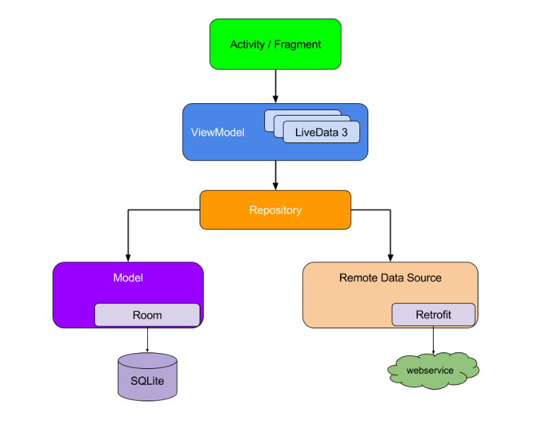
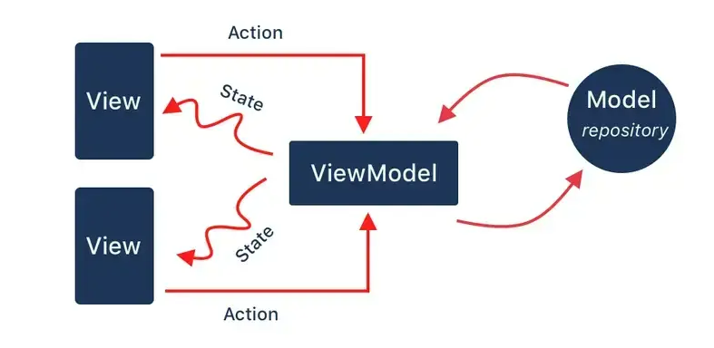
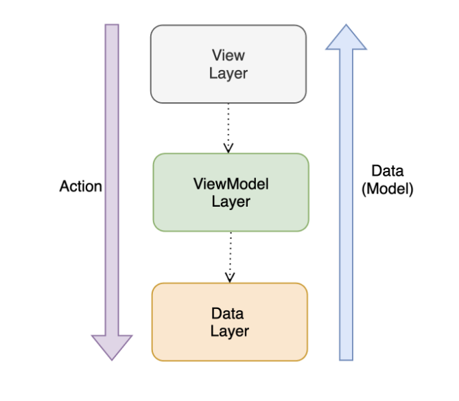
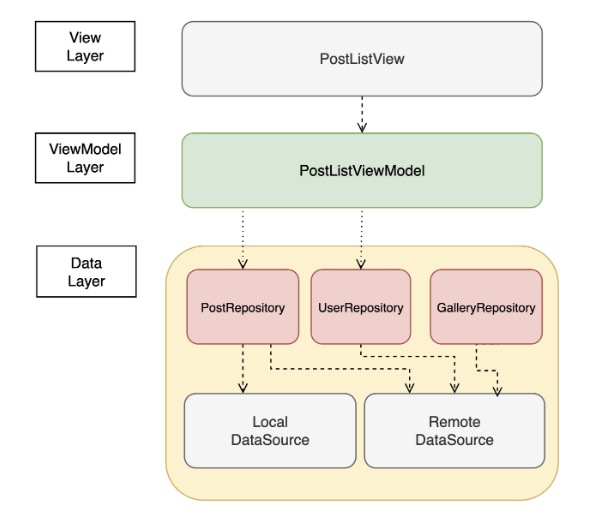

# MVVM 아키텍처


**Android MVVM**



### Flutter MVVM

**View Layer**

- UI 요소들로 다양한 위젯을 사용하여 화면을 구성
  - Widget의 build 과정을 통해 화면에 표시됨


**ViewModel Layer**

- View에 필요한 데이터들(State)을 유지하고, View와 연관된 비즈니스 로직을 처리
- 비즈니스 로직 처리 중 필요한 데이터는 Data Layer를 통해 받아오거나 저장

```
flutter 기술에서 가장 중요한 주제 중 하나인 state management는 이 ViewModel 부분과 관련된 기술들이라고 할 수 있다
```


**Data Layer**

- Local data source나 Remote data source에 저장된 정보를 가져오거나 갱신하는 역할
- Remote data source : API 서버와 통신을 의미
- Local data source : 로컬 파일이나 로컬 DB를 의미


**Flutter에서 MVVM에 대한 기본 관계**




**아키텍처에서 Data와 Action의 흐름**



```
아키텍처의 핵심은 단방향 의존성 그리고 Action과 Data의 명확하고 일관된 흐름에 있다.
```

---


## View Layer

- 유저에게 UI를 보여주는 곳으로, View 클래스 하나로 이루어져 있다.
- 기반이 되는 대표 Widget : StatefulWidget, StatelessWidget
- StatefulWidget은 자체적으로 state를 유지하고 관리하기 때문에 커스텀 위젯을 만드는데 주로 사용
- ViewModel에서 state를 관리할 경우에는 StatelessWidget으로 View를 만드는 것이 개념적으로 바람직


**예시) PostListView (post/post_list_view.dart)**

```dart
// 게시글 목록 View
class PostListView extends StatelessWidget {
  late PostListViewModel viewModel;
    
  @override
  Widget build(BuildContext context) {
    viewModel = Provider.of<PostListViewModel>(context);	// Provider로 viewModel을 가져옴
    return Scaffold(
      appBar: AppBar(title: Text('Post List')),
      body: _buildPostList(),
    );
  }
    
  Widget _buildPostList() {
    final items = viewModel.items;	// viewModel에 저장된 items
    final itemCount = items.length;
    return ListView.builder(
      itemBuilder: (context, index) {
        final item = items[index];
        return ListTile(title: Text(item.title));
      },
      itemCount: itemCount,
    );
  }
}
```


## ViewModel Layer

- View 단위의 비즈니스 로직을 처리하고 View 상태를 유지/관리하는 곳으로 ViewModel 클래스 하나로 이루어져 있다.
- provider를 사용한다면 ChangeNotifier를 mixin해서 viewModel을 만든다.


**예시) PostListViewMode (post/post_list_viewmodel.dart)**

```dart
// 게시글 viewModel
class PostListViewModel with ChangeNotifier {
  late final PostRepository _postRepository;
    
  List<Post> get items => _items;
  List<Post> _items = [];
    
  PostListViewModel() {
    _postRepository = PostRepository();
    _loadItems();
  }
    
  Future<void> _loadItems() async {
    _items = await _postRepository.getItems();
    notifyListeners();
  }
}
```

- viewModel 생성시 `_loadItems()` 함수를 호출하게 되고 이때 게시물 목록을 가져옴
- 게시물을 repository에서 가져오는 방법은 `async await`이기 때문에 비동기로 처리되고, 이 작업이 끝나면 `notifyListeners`를 호출해서 view가 다시 build되도록 한다.
- 생성자`PostListViewModel`에서 `_loadItems()` 함수를 호출할때 `await _loadItems()`가 아님에 유의! 생성자에서 `await`를 사용할 수 없다!
  - 원칙적으로 `future` 함수를 호출할때는 `await`로 호출해야 하지만, 생성자가 `_loadItems` 함수가 끝나기를 기다릴 필요가 없기 때문에 굳이 `await`로 함수를 호출할 필요가 없다.
  - `await` 없이 `Future` 함수를 호출하면 그냥 단순 `Future`가 반환되고, `main` 함수는 끝나지만 `Future` 함수의 내부 로직은 따로 수행됨


## Provider

- view와 viewModel을 만들었지만 이렇게 한다고 서로 연결되는 것은 아니다.
- 실제 view와 viewModel의 연결을 위해서는 `ChangeNotifierProvider`를 사용해서 view가 viewModel의 변화를 감지하고 사용할 수 있도록 해주어야 한다.


**예시) Page (post/post_pages.dart)**

```dart
class PostListPage extends StatelessWidget {
  @override
  Widget build(BuildContext context) {
    return ChangeNotifierProvider<PostListViewModel> (
      create: (_) => PostListViewModel(),
      child: PostListView(),
    );
  }
}
```


## Data Layer

- App 전체에 필요한 데이터를 제공하는 곳으로, Repository 패턴으로 구성되어 있다.
- 보통 ViewModel이 Repository에 필요한 정보를 요청하게 되고, RemoteDataSource, LocalDataSource를 통해 외부 혹은 내부 스토리지의 데이터를 가져오거나 갱신한다.



#### Repository

- 데이터 저장소라는 의미의 Repository는 실제 ViewModel에서 Data Layer에 접근하는 객체
- 보통 특정 도메인 별로 Repository를 만듦
  - ex) UserRepository, PostRepository 등
- ViewModel은 여러 Repository를 참조할 수 있으며, 각 Repository는 그 특성에 따라 LocalDataSource를 참조해서 사용하거나, RemoteDataSource를 참조할 수 있고, 둘 다 사용도 가능하다.


**예시) PostRepository (post_repository.dart)**

```dart
class PostRepository {
  final RemoteDataSource _remoteDataSource;
  final LocalDataSource _localDataSource;
    
  // 로컬에 캐싱된 게시물 목록을 가져옴
  Future<List<Post>> getCachedPosts() {
    return _localDataSource.getCachedPosts();
  }
    
  // 게시물 목록을 가져옴
  Future<List<Post>> getPosts() {
    return _remoteDataSource.getPosts();
  }
}
```


#### DataSource

- 실제로 사용할 데이터들이 모여 있는 곳으로 크게 로컬 파일이나 로컬 DB에서 저장된 정보를 사용하거나 API서버와 같은 원격저장소에 저장된 정보를 접근해서 사용하게 된다.


#### LocalDataSource

- 주로 로컬 DB 연결에 사용
- DB 라이브러리 종류 : Hive, Sqlite 등


**예시) LocalDataSource (local_data_source.dart)**

```dart
// Hive 사용
class LocalDataSource {
  // 캐싱한 게시물을 가져온다.
  Future<List<Post>> getCachedPosts() async {
    var postBox = await Hive.box<Post>('postBox');
    return postBox.values.toList();
  }
    
  // 기존에 캐싱된 게시물들을 모두 삭제하고 새로운 게시물을 캐싱한다.
  Future<void> updateCachedPosts(List<Posts> posts) async {
    var postBox = await Hive.box<Post>('postBox');
    await postBox.clear();
    await postBox.addAll(posts);
  }
}
```

- 위 코드는 LocalDataSource의 역할을 간단히 설명하기 위한 용도
- 사용하는 DB 라이브러리에 따라 함수 구현은 달라질 수 있지만 그 역할은 같을 것


#### RemoteDataSource

- 주로 API서버와 통신하는 부분
- 아래 코드는 http 모듈을 이용해서 API서버로 게시글 목록을 가져오는 예시 코드


**예시) RemoteDataSource (remote_data_source.dart)**

```dart
class RemoteDataSource {
  Future<List<Post>> getPosts() async {
    const path = '/api/posts';
    const params = <String, String>{};
    const uri = Uri.https("flutter_sample.com", path, params);
    final res = await http.get(uri);
    if (res.statusCode == HttpStatus.ok) {
      final data = _bytesToJson(res.bodyBytes) as List;
      return data.map((el) => Post.fromMap(el as Map)).toList();
    } else {
      throw Exception("Error on Server");
    }
  }
}
```

- 중, 소규모의 프로젝트는 RemoteDataSource나 LocalDataSource를 하나씩만 가지고 있어도 큰 문제는 X
  - DataSource 내부의 함수들은 서로 의존 관계를 가지지 않고, 서로 독립적으로 수행되기 때문에 도메인 별 클래스를 추가하기보다 하나의 클래스에 함수들을 늘려가는 방식으로 만들어도 무방
- 프로젝트 규모가 커지면 RemoteDataSource와 LocalDataSource도 도메인별로 따로 클래스를 만들어 사용하는 것이 좋을 수도 있다.

---


## MVVM 아키텍처 폴더구조

```
/data
	/model
		- post.dart
    /repository
    	- post_repository.dart
    /datasource
    	- local_datasource.dart
    	- remote_datasource.dart
/ui
	/post
		- post_list_view.dart
		- post_list_viewmodel.dart
		- post_detail_view.dart
		- post_detail_viewmodel.dart
		- post_pages.dart
```


#### /ui

- View와 ViewModel에 해당하는 파일들이 있으며, 하나의 주제 혹은 도메인 단위로 폴더를 생성


#### /ui/post (게시글)

- 일반적인 게시글의 목록과 상세정보를 보여주는 화면이 있다고 가정
- 게시글 목록은 list로 / 게시글 상세는 detail로 정의


**list (게시글 목록)**

- post_list_view.dart
  PostListView 클래스
- post_list_viewmodel.dart
  PostListViewModel 클래스


**detail (게시글 상세)**

- post_detail_view.dart
  PostDetailView 클래스
- post_detail_viewmodel.dart
  PostDetailViewModel 클래스


**page (게시글 관련 page들을 파일 하나에서 정의)**

1. post_pages.dart
   PostListPage / PostDetailPage


#### /data/model

- model 클래스 파일들이 위치
- 만약 게시글 model 클래스를 생성한다면 post.dart 파일에 Post 클래스가 될 것이다


#### /data/repository

- Repository 파일들이 위치하며, repository 파일은 각 도메인 별로 하나씩 생성
- 게시글에 대한 repository는 post_repository.dart 라는 이름으로 [도메인]_repository.dart 형태로 이름을 짓는다


**post (게시글 repository)**

- post_repository.dart
  PostRepository 클래스가 구현되어 있으며, ViewModel에서 post와 관련된 정보가 필요할때 이곳을 통해서 가져가게 된다.


#### /data/datasource

- RemoteDataSource와 LocalDataSource가 위치


**RemoteDataSource**

- remote_datasource.dart
  RemoteDataSource가 구현되어 있으며, API 서버와 통신에 필요한 모든 함수들이 구현되어 있다.

- local_datasource.dart
  LocalDatasource가 구현되어 있으며, 로컬에 저장된 정보를 가져오는 모든 함수들이 구현되어 있다.


#### 결론

- ui 폴더에는 view와 viewModel을 각 연관된 화면 단위로 하나의 폴더에 묶어서 배치
- data 폴더에는 도메인별로 구분된 repository와, remote/local datasource를 만들어 배치

---


## DI와 테스트코드

### DI (Dependency Injection)

- 단위 테스트가 가능한 코드 작성을 위해 DI는 필수
  - 테스트가 가능한 코드를 작성하려면 클래스간 결합도가 낮아야 하며, 의존성을 가진 다른 클래스의 구현 여부와는 상관없이 테스트 하고자 하는 클래스의 기능에 대해서만 테스트를 할 수 있어야 함
- 예시) PostRepository를 테스트
  - 이 클래스가 가지는 고유한 기능과 로직에 대해서만 테스트를 해야지 이 클래스가 의존하고 있는 LocalDataSource까지 테스트해서는 안된다.

```dart
// 올바르지 않은 테스트 : 내부에서 직접 RemoteDataSource를 생성해 사용하기 때문
class PostRepository {
  final _remoteDataSource = RemoteDataSource();
    
  Future<List<Post>> getPosts() async {
    final posts = await _remoteDataSource.getPosts();
    // do something
  }
}
```


```dart
// 올바른 테스트 : 외부에서 생성된 RemoteDataSource를 주입받는 형태
class PostRepository {
  final RemoteDataSource _remoteDataSource;
  
  PostRepository(RemoteDataSource remoteDataSource): _remoteDataSource = remoteDataSource;
    
  Future<List<Post>> getPosts() async {
    final posts = _remoteDataSource.getPosts();
  }
}
```

```dart
// viewModel
class PostListViewModel {
  final PostRepository _postRepository;
    
  PostListViewModel() {
    final remoteDataSource = RemoteDataSource();
    _postRepository = PostRepository(remoteDataSource);
  }
}
```


### DI 라이브러리 - GetIt

- 위 코드를 GetIt을 이용해서 변경한 코드

```dart
class PostRepository {
  final RemoteDataSource _remoteDataSource;
  final LocalDataSource _localDataSource;
    
  PostRepository({RemoteDataSource? remoteDataSource,
                 LocalDataSource? localDataSource})
      : _remoteDataSource = remoteDataSource ?? getIt.get<RemoteDataSource>(),
    	_localDataSource = localDataSource ?? getIt.get<LocalDataSource>();
}
```

- 생성자에서 remoteDataSource나 localDataSource가 외부에서 생성자에 전달되지 않은 경우, getIt에서 RemoteDataSource와 LocalDataSource를 가져다 사용하고 있다.
- 주의할 점)
  - 함수내부 코드 중간에 getIt.get<>으로 객체를 꺼내 쓰지 않고 꼭 생성자에서 필요한 것을 주입받아 사용할 수 있도록 해야함
  - 안하면 어디서 주입이 발생했는지 알 수 없고, 객체의 의존성을 확인하기 힘들어져 나중에 읽기 힘든 코드가 되기 때문


#### GetIt 설정

- 싱글턴으로 만든 RemoteDataSource와 LocalDataSource를 설정하는 코드

```dart
// /main.dart
void main() {
  setupGetIt();
  ...
  runApp(MyApp());
}

// /config/di.dart
final GetIt getIt = GetIt.instance;
void setupGetIt() {
  getIt.registerSingleton<RemoteDataSource>(RemoteDataSource());
  getIt.registerSingleton<LocalDataSource>(LocalDataSource());
}
```


#### 테스트 코드

```dart
// repository_test.dart
void main() {
  test('PostRepository getPosts 테스트', () async {
    final remoteDataSource = MockRemoteDataSource();
    final postRepository = PostRepository(remoteDataSource);
    final posts = await postRepository.getPosts();
    expect(posts.length, 10);
  });
}
```

- 위 코드에서 가장 중요한 부분은 `MockRemoteDataSource`를 생성해 사용한 부분
- Repository에 대한 테스트에만 집중해야 하기 때문에 `RemoteDataSource`를 주입하지 않고 `MockRemoteDataSource`를 주입해서 사용


아래 코드는 `RemoteDataSource`와 테스트용 `MockRemoteDataSource`의 예시

```dart
abstract class RemoteDataSource {
  Future<List<Post>> getPosts();
}

class RemoteDataSourceImpl implements RemoteDataSource {
  Future<List<Post>> getPosts() async {
    const path = '/api/posts';
    const params = <String, String>{};
    const uri = Uri.https("flutter_sample.com", path, params);
    final res = await http.get(uri);
    if (res.statusCode == HttpStatus.ok) {
      final data = _bytesToJson(res.bodyBytes) as List;
      return data.map((el) => Post.fromMap(el as Map)).toList();
    } else {
      throw Exception("Error on server");
    }
  }
}

class MockRemoteDataSource implements RemoteDataSource {
  @override
  Future<List<Post>> getPosts() {
    final posts = [];
    ...
    return posts;
  }
}
```

- 실제 프로젝트에서는 위처럼 `MockRemoteDataSource`를 직접 만들기보다는 [mockito](https://pub.dev/packages/mockito)와 같은 라이브러리를 사용해서 mock 오브젝트를 만들어 사용


#### 참고 사이트

https://ctoahn.tistory.com/15

