# 221028. Git


#### CLI(Command Line Interface)  vs  GUI(Graphic User Interface)


#### Git

- Repository
  - 특정 디렉토리를 버전 관리하는 저장소

```
새 폴더에서 git 사용하기
1. git init				# 깃 시작하기
2. touch readme.md		# readme 파일 만들기
```

- Git 기본기
  - Working Directory : 내가 작업하고 있는 실제 디렉토리
  - Staging Area : 커밋(Commit)으로 남기고 싶은, 특정 버전으로 관리하고 싶은 파일이 있는 곳
  - Repository : 커밋들이 저장되는 곳

```
- git add .					  # 수정/생성한 모든 파일을 Staging Area에 올림
- git add /폴더명		  	    # 해당 폴더 내에서 수정/생성한 모든 파일을 Staging Area에 올림
- git commit -m '~~'		  # commit

- git log					  # git 기록
- git log --oneline			  # git 기록 한눈에 보기
# dd95472 (HEAD -> master) add a.txt		--> Head : 깃발, master : Branch
# a3292bc add b.txt
# c845c69 add a.txt

- git restore a.txt		 	  # a.txt를 커밋하기 전 상태로 되돌림
```

```
- mkdir 폴더명					# 폴더 생성
- touch a.txt				  # a.txt 텍스트파일 생성

```

```
GitHub 연결하기
- git remote add origin master
- git push -u origin master			# origin : <repo_name>(별명), master : <local branch>
- git clone HTTPURL
- git pull origin master
```

```
Git 파일
- rm -rf *.*					# 모든 파일 삭제
- rm .git -rf					# .git 숨김 폴더 삭제 -> 더이상 git으로 관리하는 폴더가 아님
```

```
Git Branch
- git branch 브랜치명				# branch 생성
- git branch					   # 가지고 있는 branch 목록
- git switch 브랜치명				# 다른 branch로 이동
- git log --oneline --graph --all  # 그래프로 나타내기
- git branch -d 브랜치명			# 병합 후 브랜치 삭제
- git branch -D 브랜치명			# 브랜치 강제 삭제
```


#### Git undoing

- Working Directory 작업 단계
  - Working Directory에서 수정한 파일 내용을 이전 커밋 상태로 되돌리기
  - **git restore**
- Staging Area 작업 단계
  - Staging Area에 반영된 파일을 Working Directory로 되돌리기 (== Unstage)
  - root-commit이 없는 경우 : **git rm --cached**
  - root-commit이 있는 경우 : **git restore --staged**
- Repository 작업 단계
  - 커밋을 완료한 파일을 Staging Area로 되돌리기
  - **git commit --amend** 
    - 이전 커밋을 없애고 새로 커밋(덮어씀)
    - vim 명령창 뜸 -> i 눌려서 커밋 메시지 변경 -> ESC 눌린 후 :wq 입력 (w: 저장, q: 나가기)


#### Git reset 

- 시계를 마치 과거로 돌리는 듯한 행위로, 프로젝트를 특정 커밋(버전) 상태로 되돌림
- 특정 커밋으로 되돌아 갔을 때, 해당 커밋 이후로 쌓았던 커밋들은 전부 사라짐
- **git reset [옵션] {커밋 ID}**
  - 옵션 soft, mixed, hard 중 하나를 작성
    - soft : Staging Area로 돌아감 -> commit 하기 전으로 감 (다시 커밋 가능)
    - mixed : Working Directory로 돌아감 -> add 하기 전으로 감 (Unstaged) -> 기본값
    - hard : 되돌아간 커밋 이후의 파일들은 모두 Working Directory에서 삭제 -> 주의!!!
  - 커밋 ID는 되돌아가고 싶은 시점의 커밋 ID를 작성

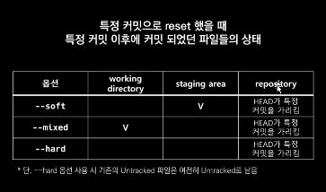

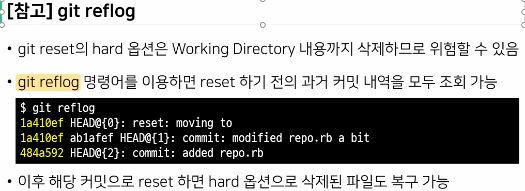


#### Git revert

- 과거를 없었던 일로 만드는 행위로, 이전 커밋을 취소한다는 새로운 커밋을 생성함
- **git revert {커밋 ID}**
  - 커밋 ID는 취소하고 싶은 커밋 ID를 작성

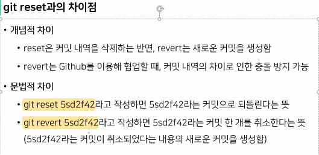


#### Git Branch

- 여러 갈래로 작업 공간을 나누어 독립적으로 작업할 수 있도록 도와주는 Git의 도구

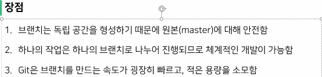

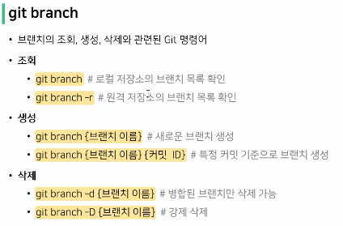

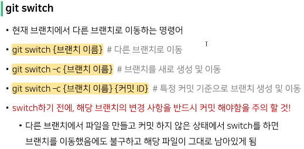


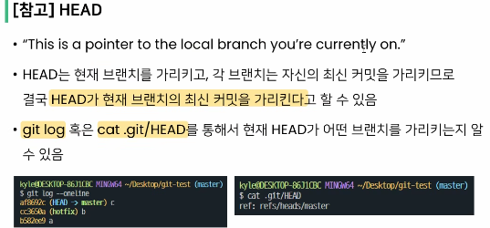


#### Git merge

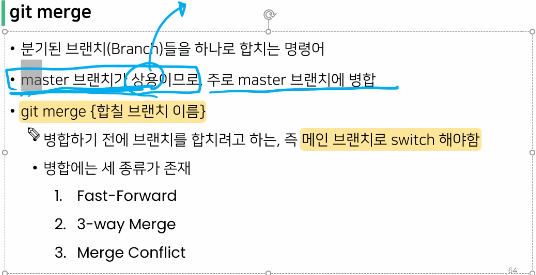

1. **Fast-Forward**

- 마치 빨리감기처럼 브랜치가 가리키는 커밋을 앞으로 이동시키는 방법

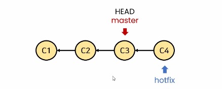

- `(master) $ git merge hotfix`

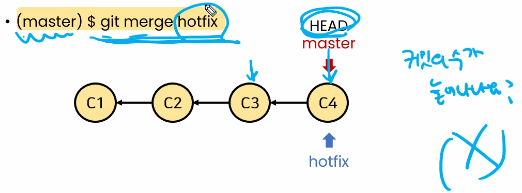

2. **3-way Merge**

- 각 브랜치의 커밋 두개와 공통 조상 하나를 사용하여 병합하는 방법

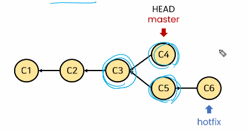

- `(master) $ git merge hotfix`

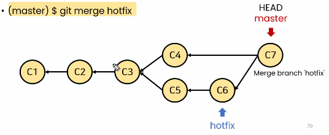

3. **Merge Conflict**

- master 브랜치와 hotfix 브랜치에서 같은 파일의 부분이 충돌이 발생함
- 충돌한 부분은 직접 수정함
- 충돌 해결 후, 병합된 내용을 기록한 Merge Commit 생성

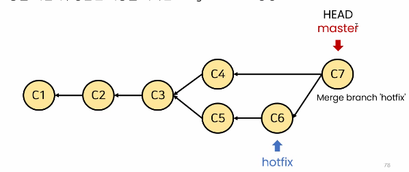


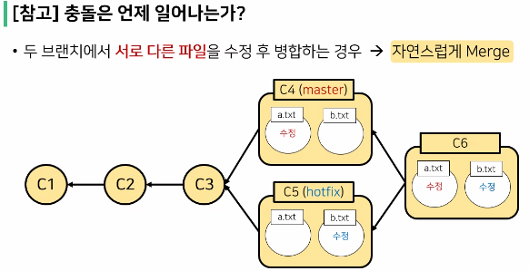

- 두 브랜치에서 같은 파일을 수정 후 병합하는 경우 -> 충돌 발생


#### Git workflow

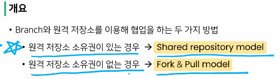

- 소유권이 없는 저장소 (ex. Django.github) => 내 github로 **fork** 해서 가져옴 => 로컬로 클론 가능


#### Shared repository model

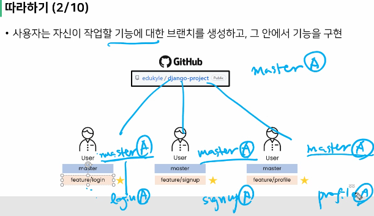


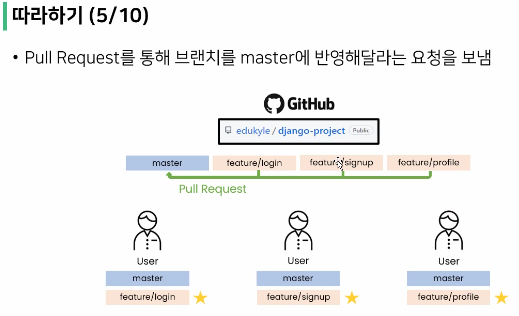


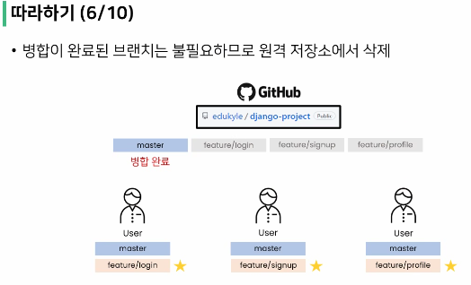


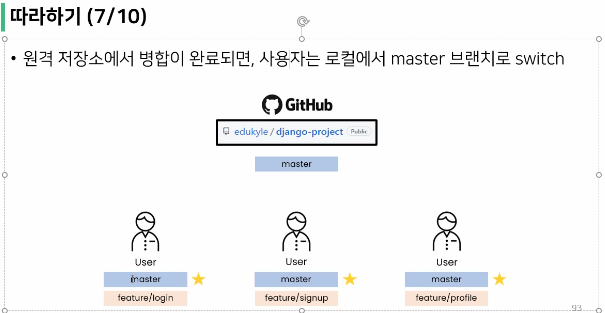


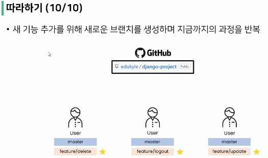


#### Fork & Pull model

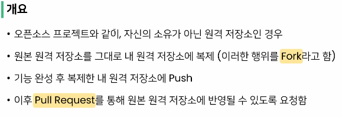


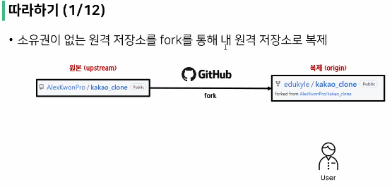

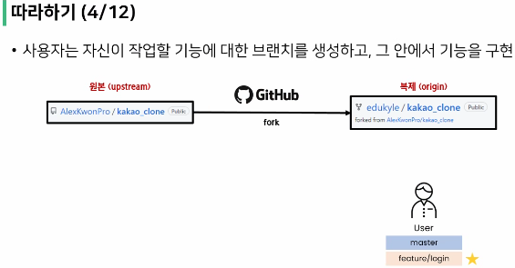

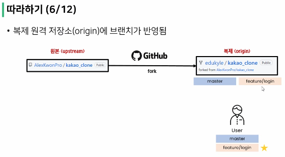

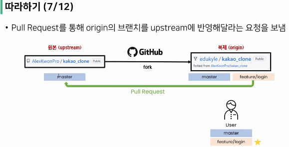

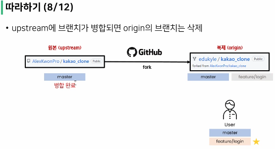

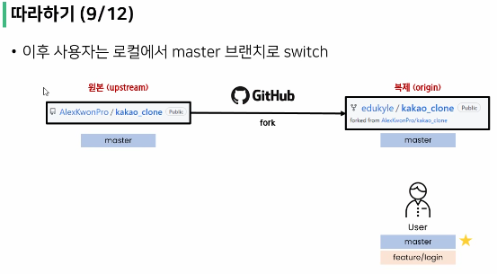

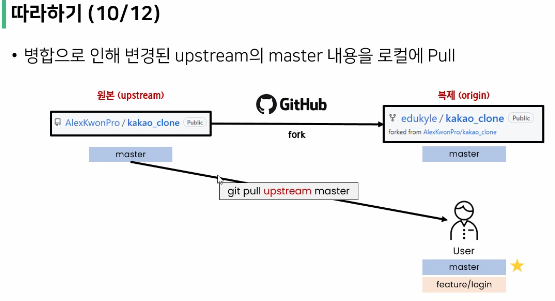

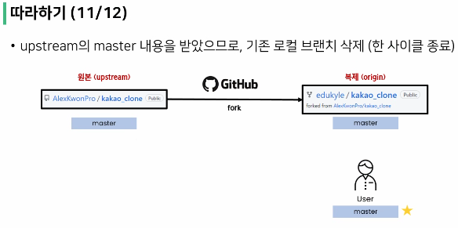

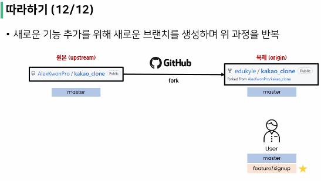


#### Git 브랜치 전략

- 배달의 민족

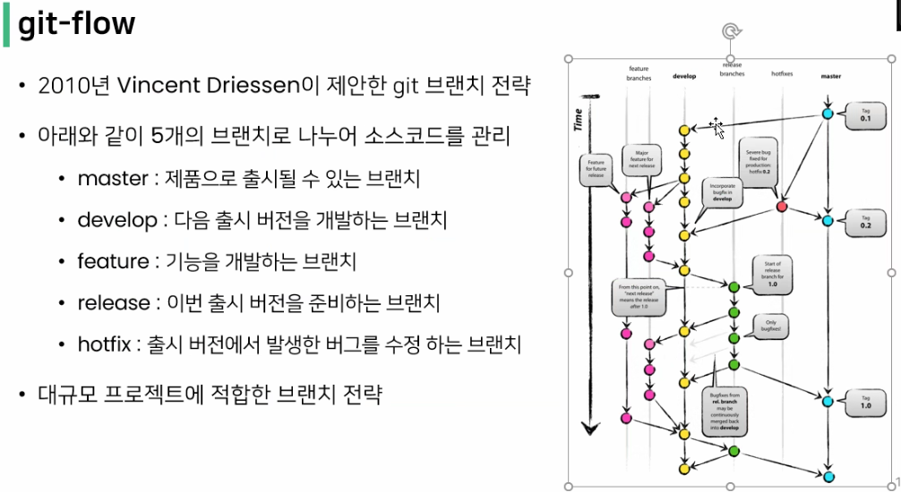


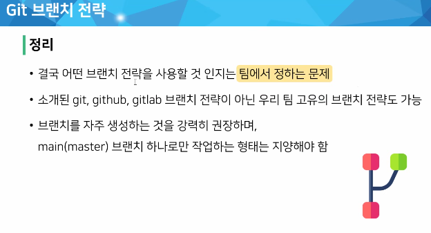
