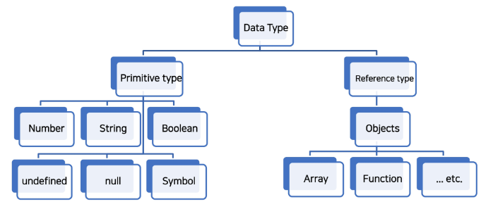

# 221019. JavaScript


## JavaScript를 배워야 하는 이유

#### 1. Web 기술의 기반이 되는 언어

- HTML 문서의 콘텐츠를 **동적으로 변경**할 수 있는 언어
- Web이라는 공간에서 채팅, 게임 등 다양한 동작을 할 수 있게 된 기반


#### 2. 다양한 분야로 확장이 가능한 언어

- 단순히 Web 조작을 넘어서 서버 프로그래밍, 모바일 서비스, 컴퓨터 응용프로그래밍, 블록체인, 게임 개발 등 **다양한 분야에서 활용이 가능한 언어**가 됨


## JavaScript의 역사

#### 웹 브라우저의 역할

- URL을 통해 Web(WWW)을 탐색함
- **HTML/CSS/JavaScript를 이해한 뒤 해석**해서 사용자에게 하나의 화면으로 보여줌
- 웹 서비스 이용 시 클라이언트의 역할을 함
- 즉, 웹 페이지 코드를 이해하고, 보여주는 역할을 하는 것이 바로 웹 브라우저


#### Script 언어

- 정적 웹페이지를 단순히 보여주는 용도에 그

- 소스 코드를 기계어로 바꿔주는 컴파일러 없이 바로 실행 가능한 언어 속도가 느리다는 단점이 있음

  

#### JavaScript의 역사 정리

- 웹 브라우저는 JavaScript를 해석하는 엔진을 가지고 있음
- 현재의 JavaScript는 이제 시장에서 자리를 잡은 언어이며, 개발에서 큰 축을 담당하는 언어
- 더 이상 jQuery 등의 라이브러리를 사용할 필요가 없음 (모든 웹 브라우저가 표준안을 따르기 때문에 각 브라우저마다 따로 변환을 할 필요가 없음)
- 특히, Chrome의 V8의 경우 JavaScript를 번역하는 속도가 매우 빠름
  - 물건인데? Web Browser에서만 사용하지 말고 다른 개발에서도 활용해보자!
  - node.JS, react.JS, electron 등의 내부 엔진으로 사용
  - 그 결과, back-end, mobile, desktop app 등을 모두 JavaScript로 개발이 가능해짐

---


## JavaScript 기초 문법

#### 세미콜론 (semicolon)

- 자바스크립트는 세미콜론을 선택적으로 사용 가능
- 세미콜론이 없으면 ASI에 의해 자동으로 세미콜론이 삽입됨
  - ASI (Automatic Semicolon Insertion, 자동 세미콜론 삽입 규칙)


#### 들여쓰기와 코드 블럭

- python은 4칸 들여쓰기를 사용했으나, **JavaScript는 2칸 들여쓰기를 사용**

- **블럭(block)**은 if, for, 함수에서 **중괄호** **{}** 내부를 말함

  - python은 들여쓰기를 이용해서 코드 블럭을 구분

  - JavaScript는 중괄호 {}를 사용해 코드 블럭을 구분

    ```js
    if (isClean) {  // 중괄호를 사용해서 코드 블럭 구분
      console.log('clean!')  // 2칸 들여쓰기
    }
    ```


#### 주석

- 한 줄 주석(`//`)과 여러 줄(`/* */`) 주석


#### 식별자 (identifier)

- 변수를 구분할 수 있는 변수명을 말함
- 식별자는 반드시 문자, 달러($) 또는 밑줄(_)로 시작
- 대소문자를 구분하며, 클래스명 외에는 모두 소문자로 시작
- 예약어 사용 불가능
  - 예약어 : for, if, function 등


#### 식별자 정의와 특징

- 카멜 케이스 (camelCase, lower-camel-case)
  - 변수, 객체, 함수에 사용
- 파스칼 케이스 (PascalCase, upper-camel-case)
  - 클래스, 생성자에 사용
- 대문자 스네이크 케이스 (SNAKE_CASE)
  - 상수(constants)에 사용
  - 상수 : 개발자의 의도와 상관없이 변경될 가능성이 없는 값을 의미


#### 변수 선언 키워드

- Python과 다르게 JanaScript는 변수를 선언하는 키워드가 정해져 있음
  1. **let**
     - 블록 스코프 지역 변수를 선언 (추가로 동시에 값을 초기화)
  2. **const**
     - 블록 스코프 읽기 전용 상수를 선언 (추가로 동시에 값을 초기화)
  3. **var**
     - 변수를 선언 (추가로 동시에 값을 초기화)


#### [참고] 선언, 할당, 초기화

- 선언 (Declaration)
  - 변수를 생성하는 행위 또는 시점
- 할당 (Assignment)
  - 선언된 변수에 값을 저장하는 행위 또는 시점
- 초기화 (Initialization)
  - 선언된 변수에 처음으로 값을 저장하는 행위 또는 시점

```js
let foo				// 선언
console.log(foo)	// undefined

foo = 11			// 할당
console.log(foo)	// 11

let bar = 0			// 선언 + 할당
console.log(bar)	// 0
```


#### [참고] 블록 스코프 (block scope)

- if, for, 함수 등의 중괄호 내부를 가리킴
- 블록 스코프를 가지는 변수는 블록 바깥에서 접근 불가능

```js
let x = 1

if (x === 1) {
  let x = 2
  console.log(x)	// 2
}

console.log(x)		// 1
```


#### 변수 선언 키워드

- **let**

  - 재할당 가능 & 재선언 불가능

  ```js
  let number = 10		// 1. 선언 및 초기값 할당
  number = 20 		// 2. 재할당
  let number = 20		// 3. 재선언 불가능!!
  ```

  - 블록 스코프를 갖는 지역 변수를 선언, 선언과 동시에 원하는 값으로 초기화 가능

- **const**

  - 재할당 불가능 & 재선언 불가능

  ```js
  const number = 10	// 1. 선언 및 초기값 할당
  number = 10			// 2. 재할당 불가능!!
  const number = 20	// 3. 재선언 불가능!!
  ```

  - **선언 시 반드시 초기값을 설정**해야하며, 이후 값 변경이 불가능

  - let과 동일하게 블록 스코프를 가짐

- **var**

  - 재할당 가능 & 재선언 가능
  - ES6 이전에 변수를 선언할 때 사용되던 키워드
  - **"호이스팅"** 되는 특성으로 인해 예기치 못한 문제 발생 가능
    - 따라서 ES6 이후부터는 var 대신 **const와 let을 사용하는 것을 권장**
  - 함수 스코프(function scope)를 가짐
  - **변수 선언 시 var, const, let 키워드 중 하나를 사용하지 않으면 자동으로 var로 선언됨!!**
    - 무조건 변수 선언 하기!!!!!!!!!!


#### [참고] 함수 스코프 (function scope)

- 함수의 중괄호 내부를 가리킴
- 함수 스코프를 가지는 변수는 함수 바깥에서 접근 불가능

```js
function foo() {
  var x = 5
  console.log(x)	// 5
}

console.log(x)		// ReferenceError: x is not defined
```


#### [참고] 호이스팅 (hoisting)

- 변수를 선언 이전에 참조할 수 있는 현상
- var 로 선언된 변수는 선언 이전에 참조할 수 있으며, 이러한 현상을 호이스팅이라 함
- 변수 선언 이전의 위치에서 접근 시 undefined를 반환

```js
console.log(name)		// undefined => 선언 이전에 참조

var name = '홍길동'	  // 선언
```

```js
// 위 코드를 암묵적으로 아래와 같이 이해함
var name				// undefined로 초기화
console.log(name)		

var name = '홍길동'
```

- 즉, JavaScript에서 변수들은 실제 실행시에 코드의 최상단으로 끌어 올려지게 되며(hoisted) 이러한 이유 때문에 var로 선언된 변수는 선언 시에 undefined로 값이 초기화되는 과정이 동시에 일어남
- 반면, let, const는 호이스팅이 일어나면 에러를 발생시킴 --> let, const를 사용해야 하는 이유!!
- 다만, 아직까지도 많은 기존의 JavaScript 코드는 ES6 이전의 문법으로 작성되어 있으므로 호이스팅에 대한 이해가 필요


| 키워드 | 재선언 | 재할당 |   스코프    |     비고     |
| :----: | :----: | :----: | :---------: | :----------: |
|  let   |   X    |   O    | 블록 스코프 | ES6부터 도입 |
| const  |   X    |   X    | 블록 스코프 | ES6부터 도입 |
|  var   |   O    |   O    | 함수 스코프 |    사용 X    |

- 어디에 변수를 쓰고 상수를 쓸지 결정하는 것은 프로그래머의 몫
- Airbnb 스타일 가이드에서는 기본적으로 **const 사용을 권장**
  - 재할당 해야 하는 경우만 **let**
    - ex) 반복문 같은 경우

---


## 데이터 타입

- JavaScript의 모든 값은 특정한 데이터 타입을 가짐
- 크게 원시 타입(Primitive type)과 참조 타입(Reference type)으로 분류됨



#### Number

- 정수 또는 실수형 숫자를 표현하는 자료형

```js
const a = 13
const b = -5
const c = 3.14		// float - 숫자표현
const d = 2.998e8	// 2.998 * 10^8
const e = Infinity
const f = -Infinity
const g = NaN		// Not a Number를 나타내는 값
```


#### NaN

- Not-A-Number (숫자가 아님)를 나타냄
- `Number.isNaN()`의 경우 주어진 값의 유형이 Number이고 값이 NaN이면 true, 아니면 false를 반환

```js
Number.isNaN(NaN)		// true
Number.isNaN(0 / 0)		// true

// isNaN() 으로는 True
Number.isNaN('NaN')		// false
Number.isNaN(undefined) // false
Number.isNaN({})		// false
Number.isNaN('blabla')	// false

// 이들 모두 false
Number.isNaN(true)
Number.isNaN(null)
Number.isNaN(37)
Number.isNaN('37')
Number.isNaN('37.37')
Number.isNaN('')
Number.isNaN(' ')
```


- NaN을 반환하는 경우
  1. 숫자로서 읽을 수 없음 (parseInt("어쩌구"), Number(undefined))
  2. 결과가 허수인 수학 계산식 (Math.sqrt(-1))
  3. 피연산자가 NaN (7 ** NaN)
  4. 정의할 수 없는 계산식 (0 * Infinity)
  5. 문자열을 포함하면서 덧셈이 아닌 계산식 ("가" / 3)


#### String

- 작은 따옴표 또는 큰 따옴표 모두 가능

- 곱셈, 나눗셈, 뺄셈은 안되지만 덧셈을 통해 문자열을 붙일 수 있음

  ```js
  const firstName = 'Tony'
  const lastName = 'stark'
  const fullName = firstName + lastName
  
  console.log(fullName)		// Tony Stark
  ```

- Quote를 사용하면 선언 시 줄 바꿈이 안됨

- 대신 escape sequence를 사용할 수 있기 때문에 \n를 사용해야 함

  ```javascript
  // Bad
  const word = "안녕
  하세요"	// Uncaught SyntaxError: Invalid or unexpected token
  
  // Good
  const word1 = "안녕 \n하세요"
  console.log(word1)
  ```

- Template Literal을 사용하면 줄바꿈이 되며, 문자열 사이에 변수도 삽입 가능 (백틱(`) 사용해야됨!!)

- (단, escape sequence를 사용할 수 없다) == Python의 "f-string"

  ```javascript
  const word2 = `안녕
  들 하세요`
  console.log(word2)
  
  const age = 10
  const message = `홍길동은 ${age}세입니다.`
  console.log(message)
  ```


#### Template literals (템플릿 리터럴)

- 내장된 표현식을 허용하는 문자열 작성 방식
- ES6+ 부터 지원
- Backtick(``)을 이용하며, 여러 줄에 걸쳐 문자열을 정의할 수도 있고 JavaScript의 변수를 문자열 안에 바로 연결할 수 있는 이점이 생김
- 표현식을 넣을 수 있는데, 이는 $와 중괄호 ($ {expression} )로 표기


#### Empty Value

- **null**과 **undefined**
- 동일한 역할을 하는 이 두개의 키워드가 존재하는 이유는 단순한 JavaScript의 설계 실수


#### null

- null 값을 나타내는 특별한 키워드
- 변수의 **값이 없음을 의도적으로 표현**할 때 사용하는 데이터 타입

```javascript
let lastName = null
console.log(lastName)		// null - 의도적으로 값이 없음을 표현함
```


#### undefined

- 값이 정의되어 있지 않음을 표현하는 값
- 변수 선언 이후 직접 값을 할당하지 않으면 **자동으로 할당**됨

```javascript
let firstName	// 선언만 하고 할당하지 않음
console.log(firstName)	// undefined
```


#### null 과 undefined

- null과 undefined의 가장 대표적인 차이점은 typeof 연산자를 통해 타입을 확인 했을 때 나타남

```javascript
typeof null			// "object"
typeof undefined	// "undefined"
```

- null이 원시 타입임에도 불구하고 object로 출력되는 이유는 JavaScript 설계 당시의 버그를 지금까지 해결하지 못한 것
- 쉽게 해결할 수 없는 이유는 이미 null 타입에 의존성을 띄고 있는 많은 프로그램들이 망가질 수 있기 때문 (하위 호환 유지)


#### Boolean

- true와 false
- 조건문 또는 반복문에서 유용하게 사용
  - 조건문 또는 반복문에서 boolean이 아닌 데이터 타입은 **자동 형변환 규칙**에 따라 true 또는 false로 변환됨

| 데이터 타입 |   false    |       true       |
| :---------: | :--------: | :--------------: |
|  undefined  | 항상 거짓  |        X         |
|    null     | 항상 거짓  |        X         |
|   Number    | 0, -0, NaN | 나머지 모든 경우 |
|   String    | 빈 문자열  | 나머지 모든 경우 |
|   Object    |     X      |     항상 참      |

---


## 연산자

#### 할당 연산자

```javascript
let c = 0

c += 10
console.log(c)	// 10

c -= 3
console.log(c)	// 7

c *= 10
console.log(c)	// 70
```


#### 비교 연산자

```javascript
3 > 2	// true
3 < 2	// false

'A' < 'B'	// true
'Z' < 'a'	// true
'가' < '나'	// ture
```

- 문자열은 유니코드 값을 사용하며 표준 사전 순서를 기반으로 비교
  - 알파벳 순서상 후순위가 더 크다
  - 소문자가 대문자보다 더 크다


#### 동등 연산자 (==)

```javascript
const a = 1
const b = '1'

console.log(a == b)		// true
console.log(a == true)	// true

// 자동 형변환 예시
console.log(8 * null)	// 0, null은 0
console.log('5' - 1)	// 4
console.log('5' + 1)	// '51'
console.log('five' * 2)	// NaN
```

- 두 피연산자가 같은 값으로 평가되는지 비교 후 **boolean 값을 반환**
- 비교할 때 **암묵적 타입 변환**을 통해 타입을 일치시킨 후 같은 값인지 비교
- 두 피연산자가 모두 객체일 경우 메모리의 같은 객체를 바라보는지 판별
- 예상치 못한 결과가 발생할 수 있으므로 특별한 경우를 제외하고 사용하지 않음


#### 일치 연산자 (===)

- 두 피연산자의 값과 타입이 모두 같은 경우 true를 반환
- 같은 객체를 가리키거나, 같은 타입이면서 같은 값인지를 비교
- 엄격한 비교가 이뤄지며 암묵적 타입 변환이 발생하지 않음
  - 엄격한 비교 : 두 비교 대상의 타입과 값 모두 같은 지 비교하는 방식

```javascript
const a = 1
const b = '1'

console.log(a === b) 	// false
console.log(a === Number(b))	// true
```


#### 논리 연산자

- 세 가지 논리 연산자로 구성
  - and 연산은 **'&&'** 연산자
  - or 연산은 **'||'** 연산자
  - not 연산은 **'!'** 연산자
- 단축 평가 지원


#### 삼항 연산자 (Ternary Operator)

- 3개의 피연산자를 사용하여 조건에 따라 값을 반환하는 연산자
- 가장 앞의 조건식이 참이면 : 앞의 값이 반환되며, 그 반대일 경우 뒤의 값이 반환되는 연산자
- 삼항 연산자의 결과 값이기 때문에 변수에 할당 가능

```javascript
true ? 1 : 2 	// 1
false ? 1 : 2	// 2

const result = Math.PI > 4 ? 'Yep' : 'Nope'
console.log(result) // Nope
```

---


## 조건문

#### 조건문의 종류와 특징

- if statement

  - 조건 표현식의 결과 값을 **boolean 타입으로 변환 후 참/거짓을 판단**
  - 조건은 **소괄호(condition)** 안에 작성
  - 실행할 코드는 **중괄호{}** 안에 작성
  - 블록 스코프 생성

  ```javascript
  const name = 'manager'
  
  if (name === 'admin') {
    console.log('관리자님 ㅎㅇ')
  } else if (name === 'manager') {
    console.log('매니저님 ㅎㅇ')
  } else {
    console.log(`${name}님 환영합니다.`)
  }
  
  ```

  

- switch statement

  - 조건 표현식의 결과값이 **어느 값(case)에 해당하는지 판별**
  - 주로 특정 변수의 값에 따라 조건을 분기할 때 활용
    - 조건이 많아질 경우 if문보다 가독성이 나을 수 있음
  - 표현식(expression)의 결과값을 이용한 조건문
  - 표현식의 결과값과 case문의 오른쪽 값을 비교
  - break 및 default 문은 [선택적]으로 사용 가능
  - break문이 없는 경우 break문을 만나거나 default문을 실행할 때까지 다음 조건문 실행
  - 블록 스코프 생성

  ```javascript
  const name = '홍길동'
  
  switch(name) {
    case '홍길동': {}
      console.log('관리자님 ㅎㅇ')
      break
  } 
    case 'manager': {
      console.log('매니저님 ㅎㅇ')
      break
  } 
    default: {
    console.log(`${name}님 환영합니다.`)
  }
  
  ```

  

#### if / switch

- 조건이 많은 경우 switch문을 통해 가독성 향상을 기대할 수 있음
- 일반적으로 중첩 else if문은 유지보수하기 힘들다는 문제도 있음

---


## 반복문

#### while

- 조건문이 참이기만 하면 문장을 계속해서 수행

```js
let i = 0

while (i < 6) {
  console.log(i)
  i += 1
}

// 0, 1, 2, 3, 4, 5
```


#### for

- 특정한 조건이 거짓으로 판별될 때까지 반복

```js
for (let i = 0; i < 6, i++) {
  console.log(i)
}

// 0, 1, 2, 3, 4, 5
```


#### for ... in

- 객체(object)의 속성을 순회할 때 사용
- 배열도 순회 가능하지만 인덱스 순으로 순회한다는 보장이 없으므로 권장하지 않음

```js
const fruits = { a: 'apple', b: 'banana' }

for (const key in fruits) {
  console.log(key)	// a, b
  console.log(fruits[key])	// apple, banana
}
```


#### for ... of

- 반복 가능한 객체를 순회할 때 사용
- 반복 가능한(iterable) 객체의 종류 : Array, Set, String 등

```js
const numbers = [0, 1, 2, 3]

for (const number of numbers) {
  console.log(number)	// 0, 1, 2, 3
}
```


#### for ... in 과 for ... of 차이

- for ... in 은 속성 이름을 통해 반복 --> 객체(object, =파이썬에서의 dictionary)
- for ... of 는 속성 값을 통해 반복 --> 나머지 

```js
const arr = [3, 5, 7]

for (const i in arr) {
  console.log(i)	// 0 1 2
}

for (const i of arr) {
  console.log(i)	// 3 5 7
}
```


#### for ... in (객체 순회 적합)

```js
// array
const fruits = ['딸기', '바나나', '메론']

for (let fruit in fruits) {
  console.log(fruit) // 0, 1, 2
}

// object
const capitals = {
  Korea: '서울',
  France: '파리',
  USA: '워싱턴 D.C.'
}

for (let capital in capitals) {
  console.log(capital)  // Korea, France, USa
}
```


#### For ... of (Iterable 순회 적합)

```js
// array
const fruits = ['딸기', '바나나', '메론']

for (let fruit of fruits) {
  console.log(fruit)  // 딸기, 바나나, 메론
}

// object
const capitals = {
  Korea: '서울',
  France: '파리',
  USA: '워싱턴 D.C.'
}

for (let capital of capitals) {
  console.log(capital)  // Uncaught TypeError: capitals is not iterable
}
```


#### [참고] for ... in, for ... of 와 const

- 일반적인 for문 for (let i = 0; i < arr.length; i++) { ... }의 경우에는 최초 정의한 i를 재할당 하면서 사용하기 때문에 const를 사용하면 에러 발생
- 다만 for ... in, for ... of의 경우에는 재할당이 아니라, 매 반복시 해당 변수를 새로 정의하여 사용하므로 에러가 발생하지 않음


#### 조건문과 반복문 정리

|   키워드   |  종류  |     연관 키워드      |   스코프    |
| :--------: | :----: | :------------------: | :---------: |
|     if     | 조건문 |          -           | 블록 스코프 |
|   switch   | 조건문 | case, break, default | 블록 스코프 |
|   while    | 반복문 |   break, continue    | 블록 스코프 |
|    for     | 반복문 |   break, continue    | 블록 스코프 |
| for ... in | 반복문 |      객체 순회       | 블록 스코프 |
| for ... of | 반복문 |    Iterable 순회     | 블록 스코프 |

---


## 함수

#### 함수 선언식 (Function declaration)

- 일반적인 프로그래밍 언어의 함수 정의 방식

```js
function add(num1, num2) {
  return num1 + num2
}

add(2, 7) // 9
```


#### 함수 표현식 (Function expression)

- 표현식 내에서 함수를 정의하는 방식
- 함수 표현식은 함수의 이름을 생략한 익명 함수로 정의 가능

```js
const sub = function (num1, num2) {
  return num1 - num2
}

sub(7, 2) // 5
```

- 표현식에서 함수 이름을 명시하는 것도 가능
- 다만 이 경우 함수 이름은 호출에 사용 되지 못하고 디버깅 용도로 사용됨

```js
const mySub = function namedSub(num1, num2) {
  return num1 - num2
}

mysub(1, 2) // -1
namedSub(1, 2) // ReferenceError: namedSub is not defined
```


#### 기본 인자 (Default arguments)

- 인자 적성 시 '=' 문자 뒤 기본 인자 선언 가능

```js
const greeting = function (name = 'Anonymous') {
  return 'Hi ${name}'
}

greeting() 	// Hi Anonymous
```


#### 매개변수와 인자의 개수 불일치 허용

- 매개변수보다 인자의 개수가 많을 경우

```js
const noArgs = function () {
  return 0
}

noArgs(1, 2, 3)		// 0

const twoArgs = function (arg1, arg2) {
  return [arg1, arg2]
}

twoArgs(1, 2, 3)	// [1, 2]
```


- 매개변수보다 인자의 개수가 적을 경우

```js
const threeArgs = function (arg1, arg2, arg3) {
  return [arg1, arg2, arg3]
}

threeArgs()		// [undefined, undefined, undefined]
threeArgs(1)	// [1, undefined, undefined]
threeArgs(1, 2)	// [1, 2, undefined]
```


#### Spread syntax (...)

- "전개 구문"

- 전개 구문을 사용하면 배열이나 문자열과 같이 반복 가능한 객체를 배열의 경우는 요소, 함수의 경우는 인자로 확장할 수 있음
  1. 배열과의 사용
  
     ```js
     let parts = ['shoulders', 'knees']
     let lyrics = ['head', ...parts, 'and', 'toes']
     // ['head', 'shoulders', 'knees', 'and', 'toes']
     ```
  
  2. 함수와의 사용 (Rest parameters)
  
     - The rest parameter syntax를 사용하여 정해지지 않은 수의 매개변수를 배열로 받을 수 있음
  
     ```js
     function func(a, b, ...theArgs) {
       //
     }
     ```
  
     ```js
     const restOpr = function (arg1, arg2, ...restArgs) {
      return [arg1, arg2, restArgs]
     }
     
     restArgs(1, 2, 3, 4, 5)	// [1, 2, [3, 4, 5]]
     restArgs(1, 2)	// [1, 2, []]
     ```

---

## 함수 표현 방식

```js
// 함수 표현식
const add = function (args) {}

// 함수 선언식
function sub(args) {}

console.log(typeof add) // function
console.log(typeof sub) // function
```


#### 함수 선언식

- 함수 선언식으로 정의한 함수는 var로 정의한 변수처럼 **호이스팅**이 발생
- 즉, 함수 호출 이후에 선언해도 동작
- **익명 함수 불가능**

```js
add(2, 7) // 9

function add (num1, num2) {
    return num1 + num2
}
```


#### 함수 표현식

- 함수 표현식으로 선언한 함수는 함수 정의 전에 호출 시 에러 발생 (**호이스팅 X**)
- 함수 표현식으로 정의된 함수는 변수로 평가되어 변수의 scope 규칙을 따름
- **익명 함수 가능**

```js
sub(7, 2) // Uncaught ReferenceError: Cannot access 'sub' before initialization

const sub = function (num1, num2) {
    return num1 - num2
}
```


#### 화살표 함수 (Arrow Function)

- "함수를 비교적 간결하게 정의할 수 있는 문법"
- function 키워드와 중괄호를 이용한 구문을 짧게 사용하기 위해 탄생
  1. function 키워드 생략가능
  2. 함수의 매개변수가 하나뿐이라면 '()' 도 생략 가능
  3. 함수의 내용이 한 줄이라면 '{}' 와 'return'도 생략 가능
- 화살표 함수는 항상 익명 함수
  - == 함수 표현식에서만 사용 가능

```js
const arrow1 = function (name) {
    return 'hello, ${name}'
}

// 1. function 키워드 삭제
const arrow2 = (name) => { return `hello, ${name}` }

// 2. 인자가 1개일 경우에만 ( ) 생략 가능
const arrow3 = name => { return `hello, ${name}` }

// 3. 함수 바디가 return을 포함한 표현식 1개일 경우에 { } & return 삭제 가능
const arrow4 = name => `hello, ${name}`
```


#### 화살표 함수 (Arrow Function) 응용

```js
// 1. 인자가 없다면? () or _ 로 표시 가능
let noArgs = () => 'No args'
noArgs = _ => 'No args'

// 2-1. object 를 return 한다면
let returnObject = () => { return { key: 'value'} }	// return 을 명시적으로 적어준다.

// 2-2. return 을 적지 않으려면 괄호를 붙여야 한다.
returnObject = () => ({ key: 'value' })
```


#### 즉시 실행 함수 (IIFE, Immediately Invoked Function Expression)

- 선언과 동시에 실행되는 함수
- 함수의 선언 끝에 '( )' 를 추가하여 선언되자마자 실행하는 형태
- '( )' 에 값을 넣어 인자로 넘겨줄 수 있음
- 즉시 실행 함수는 선언과 동시에 실행되기 대문에 같은 함수를 다시 호출할 수 없음
- 이러한 특징을 살려 초기화 부분에 많이 사용
- 일회성 함수이므로 익명함수로 사용하는 것이 일반적

```js
(function(num) { return num ** 3 })(2)	// 8
(num => num ** 3)(2)	// 8
```

---


## Array (배열)

- JavaScript의 데이터 타입 중 참조 타입(reference)에 해당하는 타입은 array와 object이며, 객체라고 말함
- 객체는 속성들의 모음(collection)
  - (참고) 객체 안쪽의 속성들은 메모리에 할당되어 있고 해당 객체는 메모리의 시작 주소 값을 가리키고 있는 형태로 이루어져 있다.


#### 배열 (Array)

- 키와 속성들을 담고 있는 참조 타입의 **객체(object)**
- 순서를 보장하는 특징이 있음
- 주로 대괄호를 이용하여 생성하고, 0을 포함한 양의 정수 인덱스로 특정 값에 접근 가능
- 배열의 길이는 array.length 형태로 접근 가능

```js
const numbers = [1, 2, 3, 4, 5]

console.log(numbers[0])		// 1
console.log(numbers[-1])	// undefined
console.log(numbers.length)	// 5
```

```js
const numbers = [1, 2, 3, 4, 5]

console.log(numbers[numbers.length - 1])	// 5
console.log(numbers[numbers.length - 2])	// 4
```


#### 배열 메서드 기초

|     메서드      |                         설명                         |           비고           |
| :-------------: | :--------------------------------------------------: | :----------------------: |
|     reverse     |     **원본 배열**의 요소들의 순서를 반대로 정렬      |                          |
|   push & pop    |    배열의 **가장 뒤에** 요소를 **추가 또는 제거**    |                          |
| unshift & shift |    배열의 **가장 앞에** 요소를 **추가 또는 제거**    |                          |
|    includes     | 배열에 특정 값이 존재하는지 판별 후 **참/거짓 반환** |                          |
|     indexOf     | 배열에 특정 값이 존재하는지 판별 후 **인덱스 반환**  | 요소가 없을 경우 -1 반환 |
|      join       |    배열의 **모든 요소를 구분자를 이용하여 연결**     | 구분자 생략 시 쉼표 기준 |

- `array.reverse()`

  ```js
  const numbers = [1, 2, 3, 4, 5]
  numbers.reverse()
  console.log(numbers)	// [5, 4, 3, 2, 1]
  ```

- `array.push() & array.pop()`

  ```js
  const numbers = [1, 2, 3, 4, 5]
  
  numbers.push(100)
  console.log(numbers)	// [1, 2, 3, 4, 5, 100]
  
  numbers.pop()
  console.log(numbers)	// [1, 2, 3, 4, 5]
  ```

- `array.includes(value)`

  ```js
  const numbers = [1, 2, 3, 4, 5]
  
  console.log(numbers.includes(1))	// true
  
  console.log(numbers.includes(100))	// false
  ```

- `array.indexOf(value)`

  ```js
  const numbers = [1, 2, 3, 4, 5]
  let result
  
  result = numbers.indexOf(3)		// 2
  console.log(result)	
  result = numbers.indexOf(100)	// -1
  console.log(result)
  ```

- `array.join([separator])`

  ```js
  const numbers = [1, 2, 3, 4, 5]
  let result
  
  result = numbers.join()		// 1,2,3,4,5
  console.log(result)
  
  result = numbers.join('')	// 12345
  console.log(result)
  
  result = numbers.join(' ')	// 1 2 3 4 5
  console.log(result)
  
  result = numbers.join('-')	// 1-2-3-4-5
  console.log(result)
  ```


#### 배열 메서드 심화

- **배열을 순회하며 특정 로직을 수행하는 메서드**
- 메서드 호출 시 인자로 **callback 함수**를 받는 것이 특징
  - **callback 함수** : 어떤 함수의 내부에서 실행될 목적으로 인자를 넘겨받는 함수

| 메서드  |                             설명                             |     비고     |
| :-----: | :----------------------------------------------------------: | :----------: |
| forEach |        배열의 각 요소에 대해 콜백 함수를 한 번씩 실행        | 반환 값 없음 |
|   map   |  **콜백 함수의 반환 값**을 요소로 하는 **새로운 배열 반환**  |              |
| filter  | **콜백 함수의 반환 값이 참인 요소들만** 모아서 **새로운 배열을 반환** |              |
| reduce  |  **콜백 함수의 반환 값들을 하나의 값(acc)에 누적 후 반환**   |              |
|  find   |      콜백 함수의 **반환 값이 참이면 해당 요소를 반환**       |              |
|  some   |  배열의 **요소 중 하나라도 판별 함수를 통과**하면 참을 반환  |              |
|  every  |    배열의 **모든 요소가 판별 함수를 통과**하면 참을 반환     |              |


#### forEach

```js
// 1. 일단 사용해보기
const colors = ['red', 'blue', 'green']

printFunc = function (color) {
    console.log(color)
}
colors.forEach(printFunc)
// red
// blue
// green

// 2. 함수 정의를 인자로 넣어보기
colors.forEach(function (color) {
    console.log(color)
})

// 3. 화살표 함수 적용하기
colors.forEach((color) => console.log(color))
```

- array.forEach(callback(element[, index[, array]]))
- 인자로 주어지는 함수(콜백 함수)를 배열의 각 요소에 대해 한 번씩 실행
  - 콜백 함수는 3가지 매개변수로 구성
    1. element : 배열의 요소
    2. index : 배열 요소의 인덱스
    3. array : 배열 자체
- **반환 값(return) 없음**


#### map

```js
// 1. 일단 사용해보기
const numbers = [1, 2, 3]

// 함수 정의 (표현식)
const doubleFunc = function (number) {
    return number * 2
}

// 함수를 다른 함수의 인자로 넣기 (콜백 함수)
const doubleNumbers = numbers.map(doubleFunc)
console.log(doubleNumbers)	// [2, 4, 6]

// 2. 함수 정의를 인자로 넣어보기
const doubleNumbers = numbers.map(function (number) {
    return number * 2
})
console.log(doubleNumbers)	// [2, 4, 6]

// 3. 화살표 함수 적용하기
const doubleNumbers = numbers.map((number) => number * 2)
console.log(doubleNumbers)	// [2, 4, 6]
```

- array.map(callback(element[, index[, array]]))
- 배열의 각 요소에 대해 콜백 함수를 한 번씩 실행
- **콜백 함수의 반환 값을 요소로 하는 새로운 배열 반환**
- 기존 배열 전체를 다른 형태로 바꿀 때 유용


#### filter

```js
// 1. 일단 사용해보기
const products = [
    { name: 'cucumber', type: 'vegetable'},
    { name: 'banana', type: 'fruit'},
    { name: 'carrot', type: 'vegetable'},
    { name: 'apple', type: 'fruit'},
]

// 함수 정의하고
const fruitFilter = function (product) {
    return product.type === 'fruit'
}

// 콜백으로 넘기고
const fruits = products.filter(fruitFilter)
console.log(fruits)	// [{name: 'banana', type: 'fruit'}, {name: 'apple', type: 'fruit'}]

// 2. 함수 정의를 인자로 넣어보기
const fruits = products.filter(function (product) {
    return product.type === 'fruit'
})

// 3. 화살표 함수 적용하기
const fruits = products.filter((product) => product.type === 'fruit')
```

- array.filter(callback(element[, index[, array]]))
- **콜백 함수의 반환 값이 참인 요소들만 모아서 새로운 배열 반환**
- 기존 배열의 요소들을 필터링할 때 유용


#### reduce

```js
const tests = [90, 90, 80, 77]

// 총합
const sum = tests.reduce(function (total, x) {
    return total + x
}, 0)	// 여기서 0 생략 가능

// 화살표 함수
const sum = tests.reduce((total, x) => total + x, 0)

// 평균
const sum = tests.reduce((total, x) => total + x, 0) / tests.length
```

- array.reduce(callback(acc, element, [index[, array]])[, initialValue])
- **콜백 함수를 배열의 각 요소에 대해 한 번씩 실행해서, 하나의 결과 값을 반환**
- 즉, 배열을 하나의 값으로 계산하는 동작이 필요할 때 사용(총합, 평균 등)
- map, filter 등 여러 배열 메서드 동작을 대부분 대체할 수 있음

```js
array.reduce((acc, element, index, array) => {
    // do something
}, initialValue)
```

- reduce 메서드의 주요 매개변수
  - acc
    - 이전 callback 함수의 반환 값이 누적되는 변수
  - initialValue(optional)
    - 최초 callback 함수 호출 시 acc에 할당되는 값, default 값은 배열의 첫 번째 값
- reduce의 첫번째 매개변수인 콜백함수의 첫번째 **매개변수('acc')는 누적된 값** (전 단계까지의 결과)
- reduce의 두번째 매개변수인 **'initialValue'는 누적될 값의 초기값**, 지정하지 않을 시 첫번째 요소의 값이 됨


#### find

```js
const avengers = [
    { name: 'Tony Stark', age: 45 },
    { name: 'Steve Rogers', age: 32 },
    { name: 'Thor', age: 40 },
]

const avenger = avengers.find(function (avenger) {
    return avenger.name === 'Tony Stark'
})

// refactoring
const avenger = avengers.find((avenger) => avenger.name === 'Tony Stark')
```

- array.find(callback(element[, index[, array]]))
- 콜백 함수의 반환 값이 참이면, **조건을 만족하는 첫번째 요소를 반환**
- 찾는 값이 배열에 없으면 undefined 반


#### some

```js
const arr = [1, 2, 3, 4, 5]

const result = arr.some((elem) => elem % 2 === 0)	// true
```

- array.some(callback(element[, index[, array]]))
- 배열의 **요소 중 하나라도** 주어진 판별 함수를 통과하면 참을 반환
- 모든 요소가 통과하지 못하면 거짓 반환
- 빈 배열은 항상 false 반환


#### every

```js
const arr = [1, 2, 3, 4, 5]

const result2 = arr.every((elem) => elem % 2 === 0)	// false
```

- array.every(callback(element[, index[, array]]))
- 배열의 **모든 요소**가 주어진 판별 함수를 통과하면 참을 반환
- 하나의 요소라도 통과하지 못하면 거짓 반환
- 빈 배열은 항상 true 반환


#### 배열 순회 비교

```js
const chars = ['A', 'B', 'C', 'D']

// for loop
for (let idx = 0; idx < chars.length; idx++) {
    console.log(idx, chars[idx])
}

// for ... of
for (const char of chars) {
    console.log(char)
}

// forEach
chars.forEach((char, idx) => {
    console.log(idx, char)
})

chars.forEach(char => {
    console.log(char)
})
```

|    방식    |                             특징                             |             비고             |
| :--------: | :----------------------------------------------------------: | :--------------------------: |
|  for loop  | - 모든 브라우저 환경에서 지원<br /> - 인덱스를 활용하여 배열의 요소에 접근<br />- break, continue 사용 가능 |                              |
| for ... of | - 일부 오래된 브라우저 환경에서 지원 X<br />- 인덱스 없이 배열의 요소에 바로 접근 가능<br />- break, continue 사용 가능 |                              |
|  forEach   | - 대부분의 브라우저 환경에서 지원<br />- break, continue 사용 불가능 | Airbnb Style Guide 권장 방식 |

---


## Object (객체)

- 객체는 속성(property)의 집합이며, 중괄호 내부에 key와 value의 쌍으로 표현
- **key는 문자열 타입**만 가능
  - key 이름에 띄어쓰기 등의 구분자가 있으면 따옴표로 묶어서 표현
- **value는 모든 타입(함수 포함)** 가능
- **객체 요소 접근**은 **점(.)** 또는 **대괄호([])**로 가능
  - key 이름에 띄어쓰기 같은 구분자가 있으면 대괄호 접근만 가

```js
// 객체 예시
const me = {
    name: 'jack',
    phoneNumber: '01012345678',
    'apple products': {
      buds: 'iPhon 13'
      airpod: 'AirPod 1'
    },
}

console.log(me.name)
console.log(me.phoneNumber)
console.log(me.['apple products'])
console.log(me.['apple products'].aripod)
```


#### 객체 관련 ES6 문법 익히기

- ES6에 새로 도입된 문법들로 객체 생성 및 조작에 유용하게 사용 가능

  1. 속성명 축약

     - 객체를 정의할 때 key와 할당하는 변수의 이름이 같으면 예시와 같이 축약 가능

     ```js
     const books = ['Title', 'Content']
     const magazines = ['Vogue', 'Science']
     
     // ES6+
     const bookShop = {
         books,					// 객체의 key와 할당하는 변수의 이름이 같으므로 축약
         						// 원래는 books: books, 가 되야 함
         magazines,
     }
     ```

  2. 메서드명 축약

     - 메서드 선언 시 function 키워드 생략 가능

     ```js
     // ESS
     var obj = {
         greeting: function () {
             console.log('Hi!')
         }
     }
     
     // ES6+
     const obj = {
         greeting() {
             console.log('Hi!')
         }
     }
     ```

  3. 계산된 속성 (Computed Property Name)

     - 객체를 정의할 때 key의 이름을 표현식을 이용하여 동적으로 생성 가능

     ```js
     const key = 'country'
     const value = ['한국', '미국', '일본', '중국']
     
     const myObj = {
         [key]: value,
     }
     
     console.log(myObj)	// {country: ['한국', '미국', ...]}
     console.log(myObj.country)	// ['한국', ...]
     ```

  4. 구조 분해 할당 (destructiong assignment)

     - 배열 또는 객체를 분해하여 속성을 변수에 쉽게 할당할 수 있는 문법

     ```js
     const me = {
         name: 'jack',
         phoneNumber: '01012345678',
         'apple products': {
           buds: 'iPhon 13'
           airpod: 'AirPod 1'
         },
     }
     
     const name = me.name		// 예전 스타일가이드
     const { name } = me			// 현재 스타일가이드 (구조 분해 할당)
     const { phoneNumber } = me
     ...
     ```

  5. Spread syntax (...)

     - 배열과 마찬가지로 전개구문을 사용해 객체 내부에서 객체 전개 가능
     - 얕은 복사에 활용 가능

     ```js
     const obj = {b: 2, c: 3, d: 4}
     const newObj = {a: 1, ...obj, e: 5}
     
     console.log(newObj)		// {a: 1, b: 2, c: 3, d: 4, e: 5}
     ```

     

#### JavaScriptON (JavaScript Object Notation, JSON)

- Key-Value 형태로 이루어진 자료 표기법
- JavaScript의 Object와 유사한 구조를 가지고 있지만 Object는 그 자체로 타입이고, JavaScriptON은 형식이 있는 문자열
- **즉, JavaScriptON을 Object로 사용하기 위해서는 변환 작업이 필요**
- Object -> JSON : `JavaScriptON.stringify(Object)`
- JSON -> Object : `JavaScriptON.parse(JSON)`

```js
const JavaScriptObject = {
    coffee: 'Americano',
    iceCream: 'Mint Choco'
}
```

```js
// Object -> JSON
const ObjToJson = JavaScriptON.stringify(JavaScriptObject)

console.log(ObjToJson)	// {"coffee":"Americano","iceCream":"Mint Choco"}
console.log(typeof ObjToJson)	// string

// JSON -> Object
const JsonToObj = JavaScriptON.parse(ObjToJson)

console.log(JsonToObj)	// { coffee: 'Americano', iceCream: 'Mint Choco'}
console.log(typeof JsonToObj)	// object
```


#### [참고] 배열은 객체다

- 키와 속성들을 담고 있는 참조 타입의 객체(object)
- 배열은 인덱스를 키로 갖고 있으며 length 프로퍼티를 갖는 특수한 객체

---


## 마무리

#### JavaScript 기초 문법

- 세미콜론
- 들여쓰기와 코드 블럭
- 스타일 가이드
- 변수와 식별자
- 타입과 연산자
  - 원시 자료형
- 조건문
- 반복문


#### 함수

- 선언식과 표현식
- 화살표 함수


#### Array와 Object

- 배열
  - Array Helper Method
- 객체
  - ES6+ 객체 문

---


#### JS 명령어들 모음

```js
사용자 입력 함수 : prompt() == input()

device 윈도우 팝업 함수 : alert()

브라우저 출력 : document.write()

object - 키:밸류 쌍으로 이루어짐 {key:value}
```


