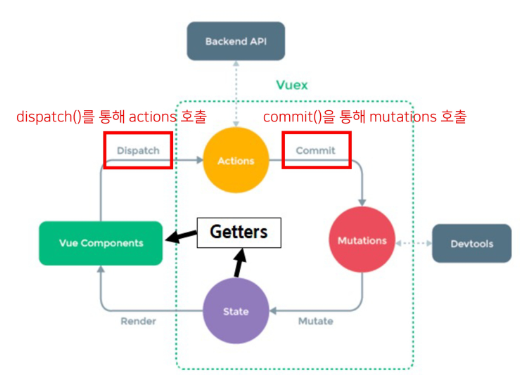

# 221107. Vuex


## State Management

- 상태(State)란?

  - **현재에 대한 정보(data)**

  - **현재 App이 가지고 있는 Data로 표현**

- 우리는 여러 개의 component를 조합해서 하나의 App을 만들고 있음

- 각 component는 독립적이기 때문에 각각의 상태(data)를 가짐

- **여러 개의 component가 같은 상태(data)를 유지할 필요가 있음**

  --> 상태 관리(State Management) 필요!


#### Pass Props & Emit Event

- 지금까지 props와 event를 이용해서 상태 관리를 해왔음
- 각 컴포넌트는 독립적으로 데이터를 관리
- **같은 데이터를 공유하고 있으므로,** 각 컴포넌트가 동일한 상태를 유지하고 있음
- 데이터의 흐름을 직관적으로 파악 가능
- 그러나 component의 중첩이 깊어지면 데이터 전달이 쉽지 않음
- 공통의 상태를 유지해야 하는 component가 많아지면 데이터 전달 구조가 복잡해짐


#### Centralized Store

- **중앙 저장소(store)에 데이터를 모아서 상태 관리**
- 각 component는 중앙 저장소의 데이터를 사용
- component의 계층에 상관없이 중앙 저장소에 접근해서 데이터를 얻거나 변경할 수 있음
- 중앙 저장소의 데이터가 변경되면 각각의 component는 해당 데이터의 변화에 반응하여 새로 변경된 데이터를 반영함
- 규모가 크거나 컴포넌트 중첩이 깊은 프로젝트의 관리가 매우 편리


#### Vuex

- "state management pattern + Library" for vue.js
  (상태 관리 패턴 + 라이브러리)
- 중앙 저장소를 통해 상태 관리를 할 수 있도록 하는 라이브러리
- 데이터가 예측 가능한 방식으로만 변경될 수 있도록 하는 **규칙을 설정하며, Vue의 반응성을 효율적으로 사용하는 상태 관리 기능**을 제공
- Vue의 공식 도구로써 다양한 기능을 제공


```
$ vue create vuex-app		// Vue 프로젝트 생성
$ cd vuex-app				// 디렉토리 이동
$ vue add vuex				// Vue CLI를 통해 vuex plugin 적용
```


#### 1. State

- Vue 인스턴스의 data에 해당
- **중앙에서 관리하는 모든 상태 정보**
- 개별 component는 state에서 데이터를 가져와서 사용
  - 개별 component가 관리하던 data를 중앙 저장소(Vuex Store의 state)에서 관리하게 됨
- state의 데이터가 변화하면 해당 데이터를 사용(공유)하는 component도 자동으로 다시 렌더링
- **$store.state**로 state 데이터에 접근


#### 2. Mutations

- **실제로 state를 변경하는 유일한 방법**
- vue 인스턴스의 methods에 해당하지만 Mutations에서 호출되는 핸들러(handler) 함수는 반드시 **동기적**이어야 함
  - 비동기 로직으로 mutations를 사용해서 state를 변경하는 경우, state의 변화의 시기를 특정할 수 없기 때문
- 첫 번째 인자로 **state**를 받으며, component 혹은 Actions에서 **commit()** 메서드로 호출됨


#### 3. Actions

- mutations와 비슷하지만 **비동기** 작업을 포함할 수 있다는 차이가 있음
- **state를 직접 변경하지 않고 commit() 메서드로 mutations를 호출해서 state를 변경함**
- context 객체를 인자로 받으며, 이 객체를 통해 store.js의 모든 요소와 메서드에 접근할 수 있음 
  (== 즉 state를 직접 변경할 수 있지만 하지 않아야 함)
- component에서 **dispatch()** 메서드에 의해 호출됨


#### Mutations & Actions

- vue component의 methods 역할이 vuex에서는 아래와 같이 분화됨



- Mutations
  - state를 변경
- Actions
  - state 변경을 제외한 나머지 로직


#### 4. Getters

- vue 인스턴스의 computed에 해당
- **state를 활용하여 계산된 값을 얻고자 할 때 사용**
  state의 원본 데이터를 건들지 않고 계산된 값을 얻을 수 있음
- computed와 마찬가지로 getters의 결과는 캐시(cache) 되며, 종속된 값이 변경된 경우에만 재계산됨
- getters에서 계산된 값은 state에 영향을 미치지 않음
- 첫번째 인자로 **state,** 두번째 인자로 **getter**를 받음


#### 그럼 이제 모든 데이터를 Vuex에서 관리해야 할까?

- Vuex를 사용한다고 해서 모든 데이터를 state에 넣어야 하는 것은 아님
- Vuex에서도 여전히 pass props, emit event를 사용하여 상태를 관리할 수 있음
- 개발 환경에 따라 적절하게 사용하는 것이 필요


#### 정리

- **state**
  - 중앙에서 관리하는 **모든 상태 정보**
- **mutations**
  - **state를 변경**하기 위한 methods (동기 작업)
- **actions**
  - **비동기 작업이 포함될 수 있는(외부 API와의 소통 등)** methods
  - state를 변경하는 것 외의 모든 로직 진행
- **getters**
  - state를 활용해 **계산한 새로운 변수 값**


- component에서 데이터를 조작하기 위한 데이터의 흐름
  - component => (actions) => mutations => state
- component에서 데이터를 사용하기 위한 데이터의 흐름
  - state => (getters) => component

---


## Lifecycle Hooks

- 각 Vue 인스턴스는 생성과 소멸의 과정 중 단계별 초기화 과정을 거침
  - Vue 인스턴스가 생성된 경우, 인스턴스를 DOM에 마운트하는 경우, 데이터가 변경되어 DOM를 업데이트하는 경우 등
- 각 단계가 트리거가 되어 특정 로직을 실행할 수 있음


#### created

- Vue instance가 생성된 후 호출됨
- data, computed 등의 설정이 완료된 상태
- 서버에서 받은 데이터를 vue instance의 data에 할당하는 로직을 구현하기 적합
- 단, mount 되지 않아 요소에 접근할 수 없음
  (= 아직 DOM과는 연결되지 않음 (HTML이 그려지기 전))

- JavaScript에서 학습한 Dog API 활용 실습의 경우 버튼을 누르면 강아지 사진을 보여줌
- 버튼을 누르지 않아도 첫 실행 시 기본 사진이 출력되도록 하고 싶다면?
  - created 함수에 강아지 사진을 가져오는 함수를 추가
- **axios**를 주로 쓰게 됨


#### mounted

- Vue instance가 요소에 mount된 후 렌더링
- mount 된 요소를 조작할 수 있음


#### updated

- 데이터가 변경되어 DOM에 변화를 줄 때 호출됨


#### Lifecycle Hooks 특징

- Lifecycle Hooks는 컴포넌트별로 정의할 수 있음
- 현재 해당 프로젝트는
  App.vue 생성 => ChildComponent 생성 => ChildComponent 부착 => App.vue 부착 => ChildComponent 업데이트 순으로 동작한 것
- 부모 컴포넌트의 mounted hook이 실행 되었다고 해서 자식이 mount 된 것이 아니고, 부모 컴포넌트가 updated hook이 실행 되었다고 해서 자식이 updated 된 것이 아님
  - 부착 여부가 부모-자식 관계에 따라 순서를 가지고 있지 않은 것
- **instance마다 각각의 Lifecycle을 가지고 있기 때문**

---


## Local Storage

- 브라우저의 **Local Storage**에 todo 데이터를 저장하여 브라우저를 종료하고 다시 실행해도 데이터가 보존될 수 있도록 하기


#### Window.localStorage

- 브라우저에서 제공하는 저장공간 중 하나인 Local Storage에 관련된 속성
- 만료되지 않고 브라우저를 종료하고 다시 실행해도 데이터가 보존됨
- 데이터가 문자열 형태로 저장됨
- 관련 메서드
  - **setItem(key, value)** - key, value 형태로 데이터 저장
  - **getItem(key)** - key에 해당하는 데이터 조회
- https://developer.mozilla.org/ko/docs/Web/API/Window/localStorage


#### vuex-persistedstate

- Vuex state를 자동으로 브라우저의 Local Storage에 저장해주는 라이브러리 중 하나
- 페이지가 새로고침 되어도 Vuex state를 유지시킴
- Local Storage에 저장된 data를 자동으로 state로 불러옴
- https://github.com/robinvdvleuten/vuex-persistedstate


- 설치

```
$ npm i vuex-persistedstate
```

- 적용

```js
import createPersistedState from 'vuex-persistedstate'

Vue.use(Vuex)

export default new Vuex.Store({
  plugins: [
    createPersistedState(),
  ],
})
```

---


#### Vuex, 언제 사용해야 할까?

- Vuex는 공유된 상태 관리를 처리하는 데 유용하지만, 개념에 대한 이해와 시작하는 비용이 큼
- 애플리케이션이 단순하다면 Vuex가 없는 것이 더 효율적일 수 있음
- 그러나 중대형 규모의 SPA를 구축하는 경우 Vuex는 자연스럽게 선택할 수 있는 단계가 오게 됨
- 결과적으로 역할에 적절한 상황에서 활용 했을 때 Vuex 라이브러리 효용을 극대화 할 수 있음
- 즉, 필요한 순간이 왔을 때 사용하는 것을 권장

