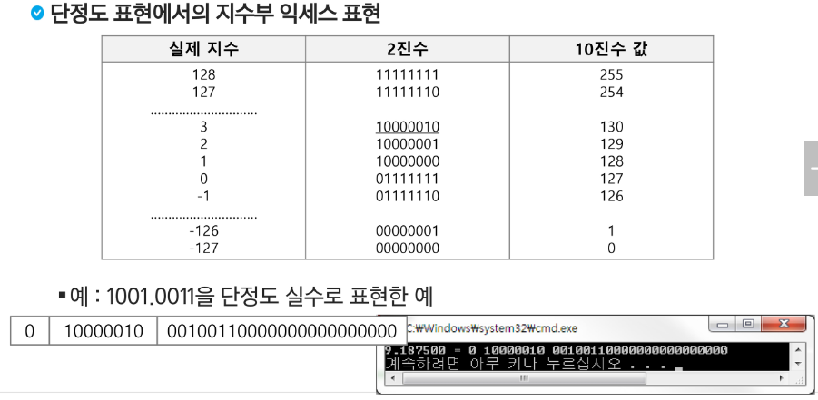

# 220919


#### SW 문제 해결 역량

프로그래머가 사용하는 언어나 라이브러리, 자료구조, 알고리즘에 대한 지식을 적재적소에 퍼즐을 배치하듯 이들을 연결하여 큰 그림을 만드는 능력


#### 문제 해결 과정

1. 문제를 읽고 이해한다
2. 문제를 익숙한 용어로 재정의한다
3. 어떻게 해결할지 계획을 세운다
4. 계획을 검증한다
5. 프로그램으로 구현한다
6. 어떻게 풀었는지 돌아보고, 개선할 방법이 있는지 찾아본다


#### 알고리즘의 효율

- 공간적 효율성 : 연산량 대비 얼마나 적은 메모리 공간을 요하는 가
- 시간적 효율성 : 연산량 대비 얼마나 적은 시간을 요하는 가
  - 하드웨어 환경에 따라 처리시간이 달라진다
    - 부동소수 처리 프로세서 존재유무, 나눗셈 가속기능 유무
    - 입출력 장비의 성능, 공유여부
  - 소프트웨어 환경에 따라 처리시간이 달라진다
    - 프로그램 언어의 종류
    - 운영체제, 컴파일러의 종류


#### 비트 연산

| 연산자 |                        연산자의 기능                         |
| :----: | :----------------------------------------------------------: |
|   &    | 비트단위로 AND 연산<br />(bit & 0 : 특정 비트를 0으로 만들 때)<br /> (bit & 1 : 비트 검사) |
|   \|   | 비트단위로 OR 연산<br />(bit \| 0 : 원래 bit 유지)<br />(bit \| 1 : 특정 bit을 1로 만들 때) |
|   ^    | 비트단위로 XOR 연산 (같으면 0 다르면 1)<br />(bit ^ 0 : 특정 bit을 반전) |
|   ~    | 단항 연산자로서 피연산자의 모든 비트를 반전시킴<br />예) ~num |
|   <<   | 피연산자의 비트 열을 왼쪽으로 이동<br />예) num1 << num2<br />=num1 * (2 ** num2) |
|   >>   | 피연산자의 비트 열을 오른쪽으로 이동<br />예) num1 >> num2<br />=num1 / (2 ** num2) |


- 1 << n
  - 2^n의 값을 갖는다
  - 원소가 n개일 경우의 모든 부분집합의 수를 의미
  - Power set (모든 부분 집합)
    - 공집합과 자기 자신을 포함한 모든 부분집합
    - 각 원소가 포함되거나 포함되지 않는 2가지 경우의 수를 계산하면 모든 부분집합의 수가 계산된다
- i & (1<<j) : i의 j번 비트검사
  - 계산 결과는 i의 j번째 비트가 1인지 아닌지를 의미

```python
# 비트 연산 예제1
def Bbit_print(i):
    output = ""
    for j in range(7, -1, -1):
        output += "1" if i & (1 << j) else "0"
    print(output)
    
for i in range(-5, 6):
    print("%3d = " % i, end='')
    Bbit_print(i)
    
'''
-5 = 11111011
-4 = 11111100
-3 = 11111101
-2 = 11111110
-1 = 11111111
 0 = 00000000
 1 = 00000001
 2 = 00000010
 3 = 00000011
 4 = 00000100
 5 = 00000101
'''
```

```python
# 비트 연산 예제2
def Bbit_print(i):
    output = ""
    for j in range(7, -1, -1):
        output += "1" if i & (1 << j) else "0"
    print(output)
a = 0x10
x = 0x01020304
print("%d = " % a, end='')
Bbit_print(a)
print()
print("0%x = " % x, end='')
for i in range(0, 4):
    Bbit_print((x >> i*8) & 0xff)	# 0xff = 11111111(2)
    
'''
16 = 00010000
01020304 = 00000100 00000011 00000010 00000001
'''
```


#### 엔디안(Endianness)

- 컴퓨터의 메모리와 같은 1차원의 공간에 여러 개의 연속된 대상을 배열하는 방법을 의미하며 HW 아키텍처마다 다르다
- 주의 : 속도 향상을 위해 바이트 단위와 워드 단위를 변환하여 연산할 때 올바르게 이해하지 않으면 오류를 발생시킬 수 있다

- 빅 엔디안(Big-endian) -> 낮은 자리 값이 나중 주소에 저장되는 방식
  - 보통 큰 단위가 앞에 나옴. 네트워크
- 리틀 엔디안(Little-endian) -> 낮은 자리 값이 빠른 주소에 저장되는 방식
  - 작은 단위가 앞에 나옴. 대다수 데스크탑 컴퓨터


```python
# 비트 연산 예제3
def ce(n):	# change endian
    p = []
    for i in range(0, 4):
        p.append((n >> (24 - i*8)) & 0xff)
    return p

x = 0x01020304
p = []
for i in range(0, 4):
    p.append((x >> (i*8)) & 0xff)
    
print("x = %d%d%d%d" % (p[0], p[1], p[2], p[3]))
p = ce(x)
print("x = %d%d%d%d" % (p[0], p[1], p[2], p[3]))
```

```python
# 비트 연산 예제4
def ce1(n):		# change endian
    return (n << 24 & 0xff000000 | (n << 8 & 0xff0000) | (n >> 8 & 0xff00) | (n >> 24 & 0xff))
```

- ff0000 : 3번째 byte만 놔두고 다 0으로 만들어!

- ff000000 : 4번째 byte만 놔두고 다 0으로 만들어!

  

  ​				01												02											03										04

  | b31                        b24 | b23                        b16 | b15                       b8 | b7                        b0 |
  | ------------------------------ | ------------------------------ | ---------------------------- | ---------------------------- |


```python
# 비트 연산 예제5
def Bbit_print(i):
    output = ""
    for j in range(7, -1, -1):
        output += "1" if i & (1 << j) else "0"
    print(output)
a = 0x86
key = 0xAA

print("a 	  ==> ", end='')
Bbit_print(a)

print("a^=key ==> ", end='')
a ^= key
Bbit_print(a)

print("a^=key ==> ", end='')
a ^= key
Bbit_print(a)

'''
a 	   ==> 10000110
a^=key ==> 00101100
a^=key ==> 10000110
'''
```


#### 진수

- 컴퓨터에서의 음의 정수 표현 방법

  - 1의 보수 : 부호와 절대값으로 표현된 값을 부호 비트를 제외한 나머지 비트들을 0은 1로, 1은 0으로 변환
    - -6 : 1 0 0 0 0 0 0 0 0 0 0 0 0 1 1 0 : 부호와 절대값 표현
    - -6 : 1 1 1 1 1 1 1 1 1 1 1 1 1 0 0 1 : 1의 보수 표현

  - 2의 보수 : 1의 보수방법으로 표현된 값의 최하위 비트에 1을 더한다 --> 현재 음의 정수를 표현하는 방법!!
    - -6 : 1 1 1 1 1 1 1 1 1 1 1 1 1 0 1 0 : 2의 보수 표현

```python
'''
-5 = 11111011  --> 음수는 숫자에서 1을 뺀 값을 2진수로 나타낸 것과 같이 표현됨
-4 = 11111100
-3 = 11111101
-2 = 11111110
-1 = 11111111
 0 = 00000000
 1 = 00000001
 2 = 00000010
 3 = 00000011
 4 = 00000100
 5 = 00000101
'''
```


#### 실수의 표현

- 컴퓨터는 실수를 표현하기 위해 부동 소수점(floating-point) 표기법을 사용
- 부동 소수점 표기 방법은 소수점의 위치를 고정시켜 표현하는 방식
  - 소수접의 위치를 왼쪽의 가장 유효한 숫자 다음으로 고정시키고 밑수의 지수승으로 표현
    - 1001.0011 --> 1.0010011 x 2^3


#### 실수를 저장하기 위한 형식

- 단정도 실수(32비트)
- 배정도 실수(64비트)
  - 가수부(mantissa) : 실수의 유효 자릿수들을 부호화된 고정 소수점으로 표현한 것
  - 지수부(exponent) : 실제 소수점의 위치를 지수 승으로 표현한 것


#### 단정도 실수의 가수 부분을 만드는 방법

- 예 : 1001.0011

  - 정수부의 첫 번째 자리가 1이 되도록 오른쪽으로 시프트

  - 소수점 이하를 23비트로 만든다

  - 소수점 이하만을 가수 부분에 저장

  - 지수 부분은 시프트 한 자릿수 만큼 증가 또는 감소

    ```markdown
    0001.0010011
    0001.00100110000000000000000
    00100110000000000000000
    
    -> 1.0010011 x 2^3
    ```

    

#### 단정도 실수의 지수 부분을 만드는 방법

- 지수부에는 8비트가 배정(256개의 상태를 나타낼 수 있음)
- 숫자로는 0-255까지 나타낼 수 있지만, 음수 값을 나타낼 수 있어야 하므로 익세스(excess) 표현법을 사용
  - 익세스 표현법 : 지수부의 값을 반으로 나누어 그 값을 0으로 간주하여 음수지수와 양수지수로 표현하는 방법




#### 컴퓨터는 실수를 근사적으로 표현

- 이진법으로 표현할 수 없는 형태의 실수는 정확한 값이 아니라 근사값으로 저장되는데, 이때 생기는 작은 오차가 계산 과정에서 다른 결과를 가져온다.

#### 실수 자료형의 유효 자릿수를 알아 두자.

- 32 비트 실수형 유효자릿수(십진수) --> 6
- 64 비트 실수형 유효자릿수(십진수) --> 15

#### 파이썬에서의 실수 표현 범위를 알아보자

- 파이썬에서는 내부적으로 더 많은 비트를 사용해서 훨씬 넓은 범위의 실수를 표현할 수 있다.
- 최대로 표현할 수 있는 값은 약 1.8 x 10^308 이고 이 이상은 inf로 표현
- 최소로 표현할 수 있는 값은 약 5.0 x 10^(-324) 이며, 이 이하는 0으로 표현

