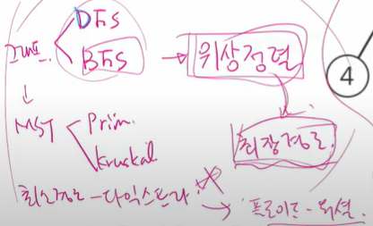

# 220928

## 그래프

#### 학습 목표

- 실 세계 문제를 그래프로 추상화해서 해결하는 방법을 학습한다.
  - 그래프 탐색 기법인 BFS와 DFS에 대해 학습한다.
  - 그래프 알고리즘에 활용되는 상호배타 집합(Disjoint-Sets)의 자료구조에 대해 학습한다.
  - 최소 신장 트리(Minimum Spanning Tree)를 이해하고 탐욕 기법을 이용해서 그래프에서 최소 신장 트리를 찾는 알고리즘을 학습한다.
  - 그래프의 두 정점 사이의 최단 경로(Shortest Path)를 찾는 방법을 학습한다.

## 서로소 집합(Disjoint-sets)

- 서로소 또는 상호배타 집합들은 서로 중복 포함된 원소가 없는 집합들이다. 다시 말해 교집합이 없다.
  - 상호배타 집합 : 연결 리스트, 트리
  - 상호배타 집합 연산
    - Make-Set(x)
    - Find-Set(x)
    - Union(x, y)
- 집합에 속한 하나의 특정 멤버를 통해 각 집합들을 구분한다. 이를 대표자(representative)라 한다.

#### 연결리스트

- 같은 집합의 원소들은 하나의 연결리스트로 관리한다
- 연결리스트의 맨 앞의 원소를 집합의 대표 원소로 삼는다
- 각 원소는 집합의 대표원소를 가리키는 링크를 갖는다

#### 트리

- 하나의 집합(a disjoint set)을 하나의 트리로 표현한다
- 자식 노드가 부모 노드를 가리키며 루트 노드가 대표자가 된다

#### 상호배타집합에 대한 연산

- 연산의 효율을 높이는 방법
  - Rank를 이용한 Union
    - 각 노드는 자신을 루트로 하는 subtree의 높이를 랭크(Rank)라는 이름으로 저장한다
    - 두 집합을 합칠 때 rank가 낮은 집합을 rank가 높은 집합에 붙인다
  - Path compression
    - Find-Set을 행하는 과정에서 만나는 모든 노드들이 직접 root를 가리키도록 포인터를 바꾸어 준다

---

### 최소 신장 트리(MST)

- 그래프에서 최소 비용 문제
  1. 모든 정점을 연결하는 간선들의 가중치의 합이 최소가 되는 트리
  2. 두 정점 사이의 최소 비용의 경로 찾기
- 신장 트리
  - n개의 정점으로 이루어진 무방향 그래프에서 n개의 정점과 n-1개의 간선으로 이루어진 트리
- 최소 신장 트리 (Minimum Spanning Tree)
  - 무방향 가중치 그래프에서 신장 트리를 구성하는 간선들의 가중치의 합이 최소인 신장 트리

#### Prim 알고리즘

- 하나의 정점에서 연결된 간선들 중에 하나씩 선택하면서 MST를 만들어 가는 방식
  1. 임의 정점을 하나 선택해서 시작
  2. 선택한 정점과 인접하는 정점들 중의 최소 비용의 간선이 존재하는 정점을 선택
  3. 모든 정점이 선택될 때까지 1), 2) 과정을 반복
- 서로소인 2개의 집합(2 disjoint-sets) 정보를 유지
  - 트리 정점들(tree vertices) - MST를 만들기 위해 선택된 정점들
  - 비트리 정점들(nontree vertices) - 선택되지 않은 정점들

#### KRUSKAL 알고리즘

- 간선을 하나씩 선택해서 MST를 찾는 알고리즘
  1. 최초, 모든 간선을 가중치에 따라 **오름차순**으로 정렬
  2. 가중치가 가장 낮은 간선부터 선택하면서 트리를 증가시킴
     - 사이클이 존재하면 다음으로 가중치가 낮은 간선 선택
  3. n-1개의 간선이 선택될 때 까지 2)를 반복

---

### 최단 경로

- 최단 경로 정의
  - 간선의 가중치가 있는 그래프에서 두 정점 사이의 경로들 중에 간선의 가중치의 합이 최소인 경로
- 하나의 시작 정점에서 끝 정점까지의 최단경로
  - 다익스트라(dijkstra) 알고리즘
    - 음의 가중치를 허용하지 않음
  - 벨만-포드(Bellman-Ford) 알고리즘
    - 음의 가중치 허용
- 모든 정점들에 대한 최단 경로
  - 플로이드-위샬(Floyd-Warshall) 알고리즘

#### Dijkstra 알고리즘

- 시작 정점에서 거리가 최소인 정점을 선택해 나가면서 최단 경로를 구하는 방식
- 시작정점(s)에서 끝정점(t)까지의 최단 경로에 정점 x가 존재한다
- 이때, 최단경로는 s에서 x까지의 최단 경로와 x에서 t까지의 최단경로로 구성됨
- 탐욕 기법을 사용한 알고리즘으로 MST의 Prim 알고리즘과 유사

#### 그래프 알고리즘 공부 순서

