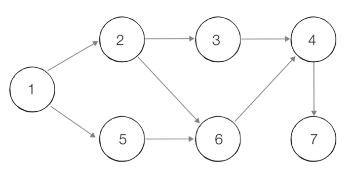

# [알고리즘] 위상 정렬 (Topological Sorting)

- 정렬 알고리즘의 일종으로, **순서가 정해져 있는 일련의 작업을 차례대로 수행해야 할 때** 사용할 수 있는 알고리즘
- 조금 더 이론적인 설명은, **사이클이 없는 방향 그래츠의 모든 노드를 '방향성에 거스르지 않도록 순서대로 나열하는 것'**을 의미

---

## 진입차수와 진출차수

- **진입차수 (Indegree)**
  - 특정한 노드로 들어오는 간선의 개수
- **진출차수 (Outdegree)**
  - 특정한 노드에서 나가는 간선의 개수


---

## 위상 정렬 알고리즘 동작 과정

```
1. 진입차수가 0인 노드를 큐에 넣는다.
2. 큐가 빌 때까지 다음의 과정을 반복한다.
	① 큐에서 원소를 꺼내 해당 노드에서 나가는 간선을 그래프에서 제거
	② 새롭게 진입차수가 0이 된 노드를 큐에 삽입
```

- 즉, **각 노드가 큐에 들어온 순서가 위상 정렬의 수행한 결과**

---

## 동작 과정



- 위 그림은 위상 정렬을 수행할 그래프
- 이때 위상 정렬을 수행할 수 있는 그래프는 **사이클이 없는 방향 그래프(DAG)여야 한다!**


**[step 0]** 진입차수가 0인 모든 노드를 큐에 삽입한다.


**[step 1]** 큐에 있는 1번 노드를 꺼낸 후 1번 노드와 연결되어 있는 간선들을 제거한다. 이후 진입차수가 0인 모든 노드를 큐에 다시 삽입한다.


**[step 2]** 큐에 있는 2번 노드를 꺼낸 후 2번 노드와 연결되어 있는 간선들을 제거한다. 이후 진입차수가 0인 모든 노드를 큐에 다시 삽입한다.


... 계속 반복

**[결과] 1 -> 2 -> 5 -> 3 -> 6 -> 4 -> 7** 


- 위상 정렬의 답안은 여러 가지가 될 수 있다는 점이 특징
- 따라서 **1 -> 5 -> 2 -> 3 -> 6 -> 4 -> 7** 도 하나의 답이 될 수 있다

---

## 위상 정렬의 특징

- 위상 정렬은 **사이클이 없는 방향 그래프 (DAG; Direct Acyclic Graph)**에 대해서만 수행 가능
- 위상 정렬에서는 여러 가지 답이 존재 가능
  - 한 단계에서 큐에 새롭게 들어가는 원소가 2개 이상인 경우가 있다면 여러가지 답이 존재할 수 있다는 의미
- **모든 원소를 방문하기 전에 큐가 비게 된다면 사이클이 존재**한다고 판단할 수 있다
  - 사이클에 포함된 원소 중에서 해당되는 어떠한 원소도 큐에 들어가지 못하게 되기 때문
- 보통 **큐**로 구현하나, **스택**을 이용한 DFS를 이용해 위상 정렬을 구현할 수도 있다
- **시간복잡도** : `O(V+E)`
  - V : 노드의 수
  - E : 간선의 수

---

## 위상 정렬 알고리즘 코드 (Python)

```python
import sys
from collections import deque

input = sys.stdin.readline
# 노드의 개수와 간선의 개수 입력
v, e = map(int, input().split())
# 모든 노드에 대한 진입차수는 0으로 초기화
indegree = [0] * (v + 1)
# 각 노드에 연결된 간선 정보를 담기 위한 연결 리스트
graph = [[] for _ in range(v + 1)]

for _ in range(e):
    a, b = map(int, input().split())
    graph[a].append(b)
    indegree[b] += 1


# 위상 정렬 함수
def topology_sort():
    result = []
    q = deque()

    for i in range(1, v + 1):
        if indegree[i] == 0:
            q.append(i)

    while q:
        now = q.popleft()
        result.append(now)
        # 해당 원소와 연결된 노드들의 진입차수에서 1빼기
        for g in graph[now]:
            indegree[g] -= 1
            if indegree[g] == 0:
                q.append(g)

    # 위상 정렬 수행한 결과 출력
    for res in result:
        print(res, end=' ')


topology_sort()

# sample input
# 7 8
# 1 2
# 1 5
# 2 3
# 2 6
# 3 4
# 4 7
# 5 6
# 6 4
```


---

#### 참고 사이트

- https://velog.io/@kimdukbae/%EC%9C%84%EC%83%81-%EC%A0%95%EB%A0%AC-Topological-Sorting