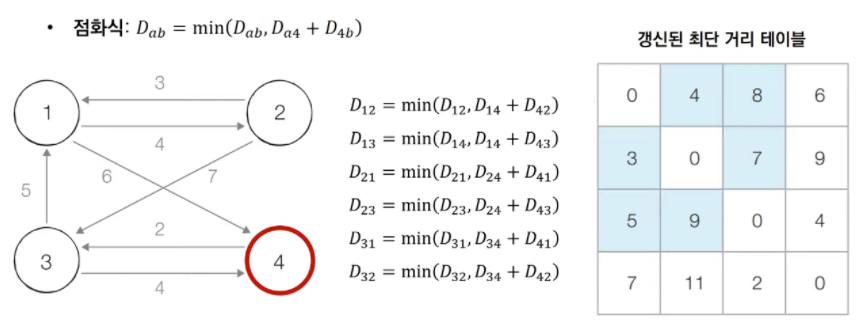

# [알고리즘] 플로이드 워셜 알고리즘(Floyd-Warshall)

- **'모든 지점에서 다른 모든 지점까지의 최단 경로를 모두 구해야 하는 경우'**에 사용하는 알고리즘
- 다익스트라
  - 단계마다 최단 거리를 가지는 노드를 하나씩 반복적으로 선택
  - 이후 해당 노드를 거쳐가는 경로를 확인하며 최단 거리 테이블을 갱신하는 방식으로 동작
  - 한 지점에서 다른 지점까지의 최단 거리이기 때문에 1차원 리스트에 저장
  - 그리디 알고리즘의 일종
- 플로이드 워셜
  - 단계마다 '거쳐 가는 노드'를 기준으로 알고리즘을 수행
  - 하지만, 매 단계마다 방문하지 않은 노드 중에서 최단 거리를 갖는 노드를 찾을 필요가 없음
  - 모든 지점에서 다른 모든 지점까지의 최단 거리를 저장해야 되기 때문에 2차원 테이블에 최단 거리 정보를 저장
  - DP 알고리즘의 일종

---

## 플로이드 워셜 알고리즘의 점화식


---

## 플로이드 워셜 알고리즘 동작 과정

**[step 0]** 그래프의 노드와 간선에 따라 최단 거리 테이블 갱신


**[step 1]** 1번 노드를 거쳐 가는 경우를 고려하여 테이블을 갱신


**[step 2]** 2번 노드를 거쳐 가는 경우를 고려하여 테이블을 갱신


**[step ~]** 3번, 4번, ... 노드를 거쳐 가는 경우를 고려하여 테이블을 갱신


**[결과]**



---

## 플로이드 워셜 알고리즘 코드 (Python)

- **시간복잡도** : `O(N^3)`
  - N : 노드 개수

```python
import sys

input = sys.stdin.readline
INF = int(1e9)

# 노드의 개수(n)과 간선의 개수(m) 입력
n = int(input())
m = int(input())

# 2차원 리스트 (그래프 표현) 만들고, 무한대로 초기화
graph = [[INF] * (n + 1) for _ in range(n + 1)]

# 자기 자신에서 자기 자신으로 가는 비용은 0으로 초기화
for a in range(1, n + 1):
    for b in range(1, n + 1):
        if a == b:
            graph[a][b] = 0

# 각 간선에 대한 정보를 입력받아, 그 값으로 초기화
for _ in range(m):
    # A -> B로 가는 비용을 C라고 설정
    a, b, c = map(int, input().split())
    graph[a][b] = c

# 점화식에 따라 플로이드 워셜 알고리즘을 수행
for k in range(1, n + 1):
    for a in range(1, n + 1):
        for b in range(1, n + 1):
            graph[a][b] = min(graph[a][b], graph[a][k] + graph[k][b])

# 수행된 결과를 출력
for a in range(1, n + 1):
    for b in range(1, n + 1):
        if graph[a][b] == INF:
            print('INFINITY', end=' ')
        else:
            print(graph[a][b], end=' ')
    print()

# sample input
# 4
# 7
# 1 2 4
# 1 4 6
# 2 1 3
# 2 3 7
# 3 1 5
# 3 4 4
# 4 3 2
```

